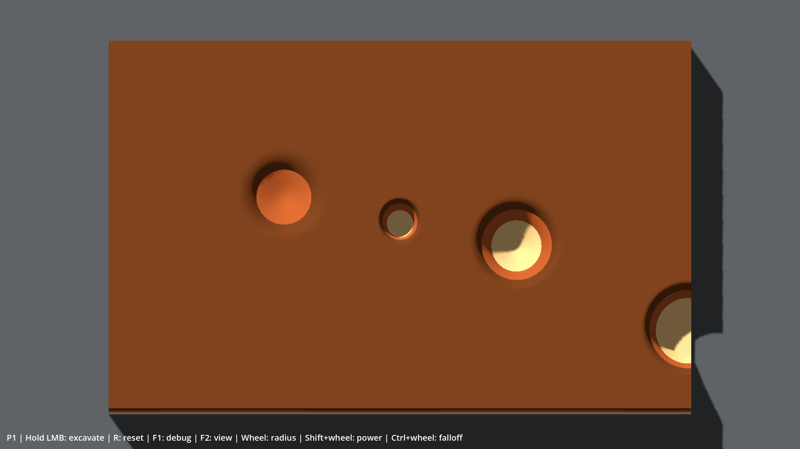

# Rapport P1 — Matière / relief excavable

Date : **2026-10-01**. Branche : **`prototype/p1-materials`**. Base : `main` / `52565321681dcaf1280b2ef80b3fde149a4efd77`.

Branche poussée ; **[PR #2](https://github.com/ezzerx/archaeology-game/pull/2)** ouverte en brouillon vers `main`, non mergée.

**Statut final : P1 VALIDÉ, MERGÉ, P2 AUTORISÉ.**

Antoine confirme le **2026-10-01** : « j'ai testé tout fonctionne ». C'est une validation globale du fonctionnement, sans défaut remonté ; la version livrée pour ce test est `b8a61661405b6413c4d4dbb385a72bbc007caac7`. La checklist ci-dessous est conservée pour les retests. Après cette validation, Antoine a explicitement autorisé le merge et le passage à P2. PR #2 mergée vers `main` au commit `960642c3fc6972bdb257c96abd43b90c148e632d`.

## Résultat visible

Le DebugExcavator creuse un volume 3D, traverse Loose Soil → Compact Clay → Sandstone et ralentit selon la matière. Le fond est borné, les parois prennent la lumière et le cercle de contact suit le relief. Les jupes périphériques descendent avec les bords creusés, au-dessus d'une base fixe.



Capture de vérification, sans retouche, issue du renderer réel. Les trous de plusieurs profondeurs et le bord excavé sont des fixtures de test ; le jeu démarre avec le bloc intact.

## Architecture livrée

| Élément | Responsabilité |
|---|---|
| `WorkingSurface` | Hauteurs float32 normalisées, footprint continu de P0, retrait local, saturation et reset |
| `Stratigraphy` | Deux frontières fixes légèrement ondulées, résolution du matériau, intégration du travail à travers les couches |
| `MaterialDefinition` + trois `.tres` | Identifiant, nom, résistance, couleur debug uniquement |
| `ReliefSurface` | Échantillonnage CPU, triangles du relief, parcours DDA du rayon et géométrie des côtés |
| `ExcavationBlock` | Mesh natif subdivisé, une texture hauteur dynamique, une texture de frontières statique, curseur et conversions monde/local |
| Shader spatial | Déplacement vertical des sommets, couleurs de couche, normales géométriques, cercle et vues debug |
| `ToolController` / scène | Entrées P0 conservées, re-picking après édition, timings, reset et éclairage greybox |

Décision et alternatives : [P1_RELIEF_DECISION](P1_RELIEF_DECISION.md). Pas de moteur voxel ni de reconstruction mesh/collider à chaque geste.

## Profondeur et volume

- Carte de hauteur **1024×640**, `1.0` intact / `0.0` profondeur minimale.
- Bloc **1,1×0,7 m**, dessus à **0,120 m**, fond à **0,018 m** : excavation maximale **102 mm**.
- Hauteur locale : `0.018 + normalized_height * 0.102`.
- `PackedFloat32Array` édité localement ; l'Image RF de staging est synchronisée après le segment. Le picking et l'upload lisent cette même Image. Ne pas éditer directement l'Image depuis un futur outil.
- Base avec fond et quatre faces latérales ; son cap supérieur est la surface excavable elle-même à profondeur minimale, sans faces coplanaires concurrentes.
- Une hauteur par colonne : aucune grotte, aucun surplomb. Reset exact pour les mêmes données et entrées.

## Stratigraphie et matériaux

Un seul bloc test, sans graine ni générateur de niveaux. Les seuils sont définis une fois par quelques sinus fixes dans les UV : Soil/Clay autour de **0,70 ±0,038**, Clay/Sandstone autour de **0,36 ±0,032**. Ils ne bougent pas pendant le jeu. Une texture RG float statique fournit les mêmes frontières au CPU et au shader.

| Matériau | Résistance | Couleur debug | Vitesse à puissance égale |
|---|---:|---|---|
| Loose Soil | 1 | Brun chaud | Référence, rapide |
| Compact Clay | 3 | Ocre rouge | 3 fois plus lent |
| Sandstone | 8 | Beige clair | 8 fois plus lent |

Le travail dépensé est `base_power * delta * falloff_weight`. Le retrait vaut travail/résistance. Lors d'une traversée de couche, seul le travail restant est transmis à la suivante : une grande durée ne contourne pas la résistance. Au seuil exact, la matière inférieure prend le relais.

Hard Rock n'est pas ajouté : facultatif, sans bénéfice nécessaire à cette preuve. Aucun profil d'outil final, son, particule ou fossile dans les Resources.

## Relief et picking

Le `PlaneMesh` comporte **1024×640 quads / 1 310 720 triangles**. Le GPU déplace ses sommets avec un échantillonnage bilinéaire de la hauteur RF. Le CPU reprend exactement ces sommets et la diagonale du mesh natif ; il n'intersecte pas une approximation bilinéaire entre les triangles.

Le rayon caméra est converti en espace local avec l'inverse affine du bloc. Après découpage par l'enveloppe, un parcours DDA visite les cellules en ordre et renvoie le premier triangle touché. Une entrée dans un côté solide est rejetée. Le résultat contient monde/local/UV/map/cell, hauteur, profondeur, matière et normale transformée par l'inverse transposée. Le collider boîte de P0 est conservé, mais ne fournit jamais le hit final.

Le cercle et son point central sont dans le shader de la surface. Un second picking après retrait les replace sur le relief qui sera affiché dans ce tick. Aucun marqueur 3D flottant. Les surfaces intactes, fonds profonds, pentes, transitions, coins, bords et transformations du bloc sont testés.

## Paramètres et commandes

| Paramètre | Défaut | Bornes |
|---|---:|---|
| Rayon | 40 texels | 1–128 |
| Puissance de base (`strength` hérité de P0) | 0,8 travail/s | 0,05–5 |
| Exposant de falloff | 1,5 | 0,25–8 |
| Simulation | 60 Hz | Fixe |
| Caméra | Orthographique, 84° | Fixe en jeu |

Clic gauche maintenu : creuser. Molette : rayon ; Shift+molette : puissance ; Ctrl+molette : falloff. **R** remet les hauteurs à 1, conserve la stratigraphie et interrompt le trait même si le clic reste maintenu. Les réglages de l'outil et la vue debug restent inchangés.

**F1** : FPS, hauteur, profondeur en mm, matériau/résistance, hit écran/monde/local/UV/map/cell, rayon/puissance/falloff, temps édition/upload/picking et nombre de cellules traversées.

**F2** : rendu éclairé → hauteur → couches sans éclairage → normales → rendu éclairé. La vue hauteur code `0.25 + 0.75 * hauteur` en gris pour éviter l'écrasement des noirs de Compatibility ; les vues debug suppriment aussi le spéculaire.

## Performances mesurées

PC local : **Ryzen 7 9800X3D / RTX 5080**, Windows, **Godot 4.7.2 stable `ed1daf0bf`**, Compatibility/OpenGL 3.3, pilote NVIDIA 610.88. Viewport réellement rendu : **1920×1080**, build éditeur/debug.

Entrées reproductibles exécutées à 60 Hz via le contrôleur de production. Mesure après chauffe, hors import/reset/capture. Le benchmark désactive VSync, mesure la marge sans plafond, puis applique un plafond moteur de 60 FPS pour deux phases et le creux stationnaire. Ces moyennes courtes ne remplacent pas un long playtest.

| Phase à plafond 60 FPS | Durée | FPS observés¹ | Frame P95 / max | Édition CPU moyenne / P95 | Upload CPU moyen | Picking CPU moyen |
|---|---:|---:|---:|---:|---:|---:|
| Courbe normale, rayon 40 | 6,0 s | 59,81 | 16,85 / 19,65 ms | 2,13 / 2,26 ms | 0,146 ms | 0,069 ms |
| Grands mouvements rapides (~200 texels/tick) | 3,0 s | 59,56 | 18,32 / 19,98 ms | 5,37 / 7,07 ms | 0,160 ms | 0,072 ms |
| Creux stationnaire profond | 8,0 s | 59,86 | 16,96 / 19,94 ms | 2,05 / 2,32 ms | 0,148 ms | 0,124 ms |

¹ Comptage des frames observées pendant la fenêtre : la première frame est exclue, d'où un léger biais sous 60. Les intervalles moyens correspondants sont 16,67–16,69 ms.

Sans plafond, courbe normale ≈1241 FPS (frame max 4,09 ms), grands mouvements rapides ≈976 FPS (frame max 8,78 ms). C'est une mesure locale de cette scène légère, pas une promesse pour d'autres GPU ni pour P2+.

**Limite explicite :** le stress artificiel alternant les deux coins du bloc à chaque tick touche ≈93 000 texels. Il coûte **29,84 ms d'édition moyenne**, P95 31,69 ms ; la boucle de rattrapage physique entraîne des frames jusqu'à **255,63 ms**, environ **28,12 FPS** sur cette phase. Il ne tient pas 60 FPS. Les traits restent continus, mais cette cadence extrême n'est pas fluide. Les rayons maximaux ne bénéficient pas d'une garantie de 60 FPS.

Une seule texture runtime dirty : RF **2,5 Mio**, au plus un upload par tick modifié, aucun upload à vide. La texture de frontières reste statique. Le temps d'upload indiqué est la soumission CPU, pas une mesure GPU isolée. Aucun mesh n'est reconstruit pendant le geste.

Données brutes versionnées : [p1-benchmark.json](evidence/p1-benchmark.json). Logs locaux : `work/test-logs/`, exclus de Git.

## Tests et résultats

Validation finale exécutée avec `tests/check_p1.ps1 -Graphical` :

- Import Godot : **PASS**, aucune erreur de script/shader dans le log final.
- Tests P0 : **45 checks, 0 failure**, fichier P0 conservé sans modification.
- Tests P1 : **52 checks, 0 failure** : états déterministes, couches, ratios de résistance, intégration traversant les interfaces, bornes, reset exact, empreinte optimisée contre oracle indépendant, continuité et bords.
- Picking : **180 rayons** confrontés à la topologie réelle du `PlaneMesh` via un oracle natif indépendant ; erreur maximale **0,00000020 m**. Vérifications supplémentaires dans la scène pleine résolution sur fond/pentes/coins/bords et bloc déplacé, tourné, mis à l'échelle non uniforme.
- Lancement de la scène headless : **PASS**, 120 frames.
- Lancements graphiques locaux et inspection des captures de cavités, trait normal et mouvements rapides : effectués.
- Lecture de **864 pixels GPU** en vue hauteur, comparée au picking : erreur max **0,00415** de hauteur normalisée (lecture couleur 8 bits, tolérance 0,01). Texture GPU relue **identique octet pour octet** à l'Image CPU.
- Console/log graphique final : **0 erreur**, benchmark **PASS**.

Rejouer sous Windows depuis le dépôt :

```powershell
.\tests\check_p1.ps1 -GodotBin 'C:\Users\antoi\Downloads\Godot_v4.7.2-stable_win64.exe\Godot_v4.7.2-stable_win64_console.exe' -Graphical
```

Adapter seulement le chemin du binaire sur un autre PC. Le script vérifie 4.7.2, les codes de sortie et les erreurs dans les logs. Pour conserver la scène de benchmark ouverte, lancer le script Godot `res://tests/run_graphical_benchmark.gd` avec arguments utilisateur `--inspect`.

## Limites, dette et risques P2

1. Le stress diagonal répété dépasse le budget ; une réduction ciblée du coût des très grandes empreintes ou de leur scheduling pourra être nécessaire. Pas de thread, moteur natif ou système de chunks ajouté sans mesure du besoin.
2. La copie de staging et l'upload sont complets pour chaque tick dirty. Ne pas multiplier naïvement les maps runtime en P2+.
3. L'intégration de travail du hot loop est spécialisée et comparée à `Stratigraphy.remove_work` par un oracle. Faire évoluer les deux ensemble si le modèle change.
4. Le collider boîte ne représente pas les cavités pour la physique. Un outil visuel P2 peut utiliser le hit précis ; des objets physiques nécessiteront une stratégie séparée.
5. Les ombres présentent encore des marches/pixels dans les fortes pentes ; palette et lumière restent du greybox. La hauteur initiale est plane, les frontières internes seules sont ondulées. Aucun art pass.
6. Les trajectoires restent des capsules linéaires entre ticks, comme P0. Le fonctionnement P1 est validé par Antoine ; l'envie de gratter durablement et les réglages finaux restent à tester sur la V0.1 complète.

**Aucun système P2+ commencé** : pas de Soft Brush, Chisel, Air Blower, poussière, particules, débris, audio, fossile, Bone detected/Condition, fragment, objectif, classification, musée, sauvegarde, économie ou Steam.

## Checklist humaine de référence pour retest

La validation globale d'Antoine est consignée en tête du rapport. Les cases ci-dessous servent à un futur retest ; elles ne sont pas un relevé détaillé de ses observations.

Ouvrir `project.godot` avec **Godot 4.7.2 Standard**, sur `prototype/p1-materials`, puis **F5**. Garder les paramètres par défaut pour les étapes 1–5.

1. [ ] Bloc intact : déplacer le curseur au centre, sur chaque bord et dans les quatre coins. Cercle/point au contact ; rien ne s'applique sur la table.
2. [ ] Maintenir le clic au même endroit **6–10 secondes**. Voir un creux descendre, puis brun → argile ocre → grès beige. Sentir les trois vitesses ; vérifier F1 : résistances **1 / 3 / 8**.
3. [ ] Continuer sur le fond : hauteur **0**, profondeur **102 mm** maximum ; aucune fuite sous le bloc, aucun scintillement gris du fond.
4. [ ] Déplacer le point dans le fond, sur les pentes et aux transitions, puis creuser à ces endroits. Le contact doit rester sous la souris, sans flottement ni décalage visible.
5. [ ] Creuser des courbes, spirales, diagonales rapides, un bord et un coin. Traits continus, côtés refermés sur la base ; geste normal fluide. Sortir puis rentrer clic maintenu : aucun pont parasite.
6. [ ] Tester molette, Shift+molette et Ctrl+molette. Comparer leurs effets ; revenir au rayon 40 pour juger la fluidité nominale.
7. [ ] F1 masque/réaffiche les données. F2 parcourt les quatre vues, dont relief/normales. Revenir au rendu éclairé.
8. [ ] **R pendant le clic maintenu** restaure le bloc intact et arrête le creusement jusqu'à un nouveau clic. Refaire une cavité : mêmes couches au même endroit.
9. [ ] Redimensionner la fenêtre et perdre/reprendre le focus : mapping correct, aucune fouille involontaire, console sans erreur.
10. [ ] Décider : « Je creuse un volume », « la souris reste précise », « les résistances se sentent ». Sinon demander les corrections P1. **Le merge et P2 nécessitent une demande explicite distincte.**


## Review après merge

La revue d'architecture ne relève aucun blocker pour P2.

Points particulièrement réussis :

- le picking utilise exactement la topologie rendue au lieu d'une approximation plane ;
- la stratigraphie reste statique et déterministe ;
- une seule map runtime de hauteur reste dirty ;
- le travail traverse correctement les interfaces sans contourner la résistance ;
- les tests comparent l'implémentation optimisée à des oracles indépendants.

Points à surveiller sans les traiter prématurément :

1. la grille représente environ **1,31 million de triangles** ; excellente précision pour le prototype, à benchmarker plus tard sur un matériel plus modeste ;
2. l'upload de la hauteur reste complet à chaque tick dirty ;
3. le stress synthétique extrême dépasse le budget 60 FPS ;
4. les valeurs de résistance actuelles servent de preuve de concept, pas de tuning final ;
5. le collider physique ne suit pas les cavités, ce qui reste acceptable avant d'introduire d'éventuels objets physiques.

Le choix d'omettre Hard Rock en P1 est confirmé : il aurait ajouté du scope sans mieux valider le relief ou la stratigraphie.

**P1 est fermé. P2 — Outils est autorisé.**
