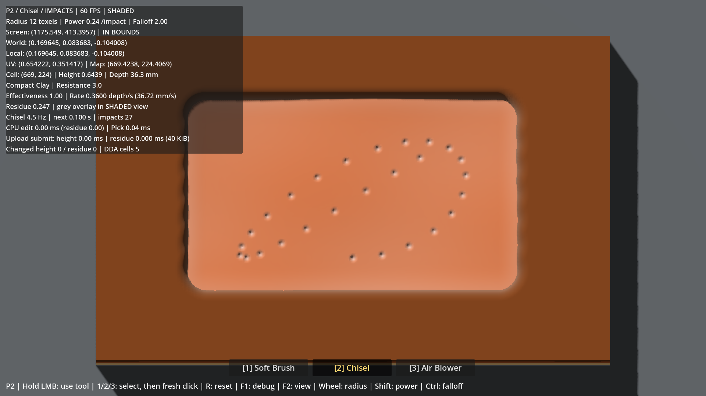
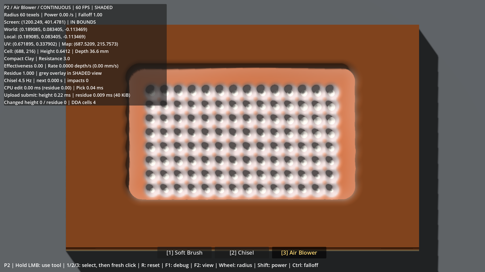
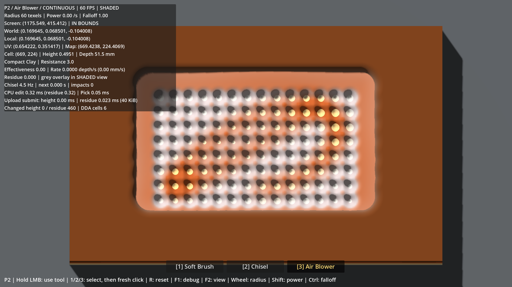

# Rapport P2 — Tool System

Date : **2026-10-01**. Branche : **`prototype/p2-tools`**. Base `main` : `749a1f605e4fcfe61ae8f8569625d90bfcb1e21c`.

**P2 implémenté et vérifié techniquement ; validation humaine en attente.** Branche poussée ; **[PR #3](https://github.com/ezzerx/archaeology-game/pull/3)** ouverte en brouillon vers `main`, **non mergée**. Aucun système P3. Les paramètres ci-dessous sont des propositions de tuning à tester par Antoine.

## Architecture

| Élément | Responsabilité |
|---|---|
| `ToolDefinition` + 3 Resources `.tres` | Identité, mode, rayon, puissance, falloff, cadence, efficacité matière et interaction résidu |
| `ToolController` | Sélection 1/2/3, routage du clic, annulation, cadence, choix de l'opération surface |
| `ImpactClock` | Premier impact immédiat puis instants `n / cadence`, indépendants du nombre de ticks |
| `WorkingSurface` | Une seule boucle d'excavation locale, utilisée par les traits et impacts ; intégration à travers les couches |
| `SurfaceResidue` | Accumulation scalaire grossière, nettoyage et staging R8 ; aucun relief ni collision |
| `ExcavationBlock` / shader | Upload dirty des deux états indépendants, cercle de contact et voile gris debug |
| Scène / UI | Trois boutons debug cliquables, outil actif doré, F1 étendu, quatre vues F2 conservées |

Le picking, la topologie, la height map RF 1024×640 et les frontières P1 restent inchangés. Les outils demandent `apply_continuous(from, to, tool, delta)` ou `apply_impact(point, tool)` ; ils ne possèdent pas de boucle de modification du terrain. Le Blower passe par la même requête continue mais saute entièrement l'excavation quand toutes ses efficacités sont nulles.

`DebugExcavator` et son ancienne Resource restent uniquement pour les régressions historiques. La scène jouable ne les utilise plus. Aucun inventaire ou framework de capacités n'est introduit.

## ToolDefinition et valeurs de départ

| Paramètre | Soft Brush | Chisel | Air Blower |
|---|---:|---:|---:|
| Mode | Continu | Impacts | Continu |
| Rayon en texels P1 | 40 | 12 | 60 |
| Puissance | 0,8 travail/s | 0,24 travail/impact | 0 |
| Exposant de falloff | 1,5 | 2 | 1 |
| Cadence | — | 4,5 Hz | — |
| Efficacité Soil / Clay / Sandstone | 1 / 0,06 / 0 | 0,12 / 1 / 1,5 | 0 / 0 / 0 |
| Résidu par unité de profondeur retirée | 1,25 | 8 | 0 |
| Nettoyage du résidu | 0,1/s | 0 | 2,5/s |

Les profils sont dupliqués à l'instanciation : les réglages debug ne modifient pas les fichiers `.tres`. Bornes : rayon 1–128, puissance 0–5, falloff 0,25–8, cadence 0,1–20, efficacités 0–8, génération 0–20 et nettoyage 0–10. La cadence est configurable dans la Resource ; la molette ne la modifie pas.

Molette : rayon ; Shift+molette : puissance ; Ctrl+molette : falloff. Les efficacités nulles empêchent le Blower d'excaver même si sa puissance debug est augmentée. `R` conserve l'outil et ses réglages ; relancer la scène restaure les profils par défaut.

## Formule outil × matériau

Pour une distance normalisée `t = distance / rayon` :

```text
w = (1 - t² × (3 - 2t)) ^ falloff, avec t borné à [0, 1]
travail = puissance × durée × w             (continu)
travail = puissance × w                     (impact)
retrait = travail × efficacité / résistance
```

Résistances P1 : **1 / 3 / 8**. Au passage d'une interface, le coût de la profondeur effectivement retirée est consommé et seul le travail restant atteint la couche suivante. Une efficacité nulle arrête le retrait à cette couche, y compris pour un très grand delta. Le centre donne ces taux nominaux, avant limitation par les interfaces et le fond :

| Outil | Soil | Clay | Sandstone |
|---|---:|---:|---:|
| Brush, profondeur normalisée/s | 0,8 | 0,016 | 0 |
| Chisel, profondeur/impact | 0,0288 | 0,08 | 0,045 |
| Chisel, moyenne profondeur/s à 4,5 Hz | 0,1296 | 0,36 | 0,2025 |
| Blower | 0 | 0 | 0 |

Le Brush est donc **50× plus rapide sur Soil que sur Clay**, et le Chisel **22,5× plus rapide que le Brush sur Clay** au centre. Une profondeur normalisée de 1 représente 102 mm. Ces taux ne prétendent pas décrire le temps de dégagement d'une large zone : le falloff et le déplacement du curseur comptent.

## Brush, Chisel et Blower

**Brush :** capsule continue entre deux positions valides de picking, calcul P0/P1 conservé. Chaque texel est traité au plus une fois par opération. Les mouvements rapides restent couverts, le maintien immobile agit et le rayon large s'atténue progressivement. Le Brush dégage vite Soil, ralentit fortement dans Clay et s'arrête sur Sandstone. Il génère un peu de résidu et en nettoie lentement.

**Chisel :** aucune position précédente n'est transmise à la surface. Chaque impact est un disque au hit précis courant. Le premier part au premier tick de clic ; les suivants suivent `n / 4,5`, soit des espacements de 13 ou 14 ticks à 60 Hz. La phase fractionnaire est conservée. Un gros delta émet les impacts échus une seule fois, sur le picking courant, sans inventer de positions historiques ; entre plusieurs impacts d'un même tick, le relief est repické. Le cercle orange blanchit 70 ms à chaque impact, uniquement pour lire la cadence en debug.

**Blower :** capsule continue de nettoyage ; aucun changement structurel et aucun upload de hauteur. Le voile gris se retire et la couleur de la matière réapparaît. Au centre, une cellule de résidu saturée peut se nettoyer en environ 0,4 s. Ce comportement ne dépend pas de la couche ou de sa résistance.

## Résidu minimal

- État scalaire borné `[0,1]`, initialement nul, déterministe, sans évolution autonome.
- **256×160 cellules**, une pour 4×4 texels de hauteur. Génération proportionnelle à la moyenne des profondeurs réellement retirées dans chaque cellule ; saturation à 1. Pas de résidu créé par une excavation inefficace.
- Accumulation CPU float32 **160 Kio** pour conserver les incréments inférieurs à un niveau R8. Buffer encodé et Image de staging **40 Kio chacun**, soit environ **240 Kio de données CPU persistantes**, hors en-têtes et temporaires.
- Texture GPU **R8, 40 Kio de payload**, sans mipmaps ; **64× moins de données** qu'une seconde texture RF 1024×640. Le pilote peut avoir ses propres allocations.
- Édition locale : dépôt pendant la boucle hauteur ; nettoyage et encodage seulement dans la région du geste. Un upload complet du petit R8 au plus par tick dirty, uniquement si les octets changent ; aucun upload à vide.
- Le shader interpole cette carte et applique un voile gris dans la vue éclairée seulement. F2 hauteur/couches/normales conserve les vues P1 ; F1 affiche le résidu sous la souris.
- Le résidu ne déplace aucun sommet, ne change aucune frontière, n'obstrue pas le picking et n'influe pas sur l'efficacité structurelle.

Une simple valeur globale ou des marqueurs ponctuels auraient rendu le nettoyage spatial peu testable. Cette petite carte suffit à distinguer les gestes sans dupliquer une grande map. C'est un placeholder logique : ni poussière finale, ni transport d'air, ni particule, ni débris, ni audio.

Formats et API vérifiés dans le binaire local ; références officielles : [Image / R8](https://docs.godotengine.org/en/stable/classes/class_image.html#enum-image-format) et [ImageTexture.update](https://docs.godotengine.org/en/stable/classes/class_imagetexture.html#class-imagetexture-method-update).

## Entrées et reset

- `1/2/3` (ou pavé numérique), ou clic sur la toolbar : sélection immédiate.
- **Changer d'outil pendant un clic annule l'interaction ; un nouveau clic démarre l'outil choisi.** Aucun pont, impact ou nettoyage hérité du précédent outil. La toolbar consomme son clic.
- Sortie du bloc : perte de l'ancre et de la phase du Chisel ; réentrée clic maintenu = nouvelle empreinte locale, sans pont.
- Perte du focus ou sortie de fenêtre : annulation du clic mémorisé. Retour sans reprise automatique, même si le relâchement s'est produit ailleurs.
- Resize : coordonnées actualisées, ancre et phase effacées.
- `R` : hauteur et résidu restaurés octet pour octet, fractions CPU effacées, compteur/phase d'impacts remis à zéro, frontières inchangées. Tant que le bouton reste maintenu, aucun geste ne reprend.

F1 ajoute l'outil, le mode, les paramètres, la compatibilité matière, le taux nominal au centre, le résidu, la cadence/prochain impact et les timings. Les timings affichés concernent le dernier tick : entre les impacts du Chisel ils peuvent être presque nuls. Le benchmark mesure aussi les seuls ticks actifs.

## Performances locales

Windows, **Godot 4.7.2 stable `ed1daf0bf`**, Compatibility/OpenGL 3.3, **RTX 5080 / Ryzen 7 9800X3D**, pilote 610.88. Viewport vérifié par readback : **1920×1080**. Version éditeur/debug, simulation 60 Hz, VSync désactivée et plafond moteur 60 FPS.

Mesures sur trajectoires déterministes via les entrées et le contrôleur de production. Chaque phase dure 6 s, la séquence combinée 9 s ; préparation, chauffe, reset et captures sont exclus. Les phases Chisel commencent sur une zone Clay préparée ; le Blower commence sur un champ de résidu créé par les opérations d'outils.

| Phase | FPS observés | Frame P95 / max (ms) | Édition moyenne / P95 (ms) | Upload résidu moyen (ms) |
|---|---:|---:|---:|---:|
| Brush normal | 59,80 | 17,08 / 21,74 | 3,589 / 3,923 | 0,0080 |
| Brush rapide | 59,76 | 19,48 / 24,74 | 9,332 / 12,274 | 0,0085 |
| Chisel immobile | 59,84 | 17,48 / 18,34 | 0,049 / 0,587 | 0,0009 |
| Chisel en mouvement | 59,84 | 17,45 / 18,28 | 0,047 / 0,584 | 0,0008 |
| Blower sur résidu | 59,83 | 16,71 / 17,80 | 0,299 / 0,337 | 0,0230 |
| Brush → Chisel → Blower | 59,89 | 17,02 / 21,63 | 1,217 / 3,698 | 0,0108 |
| Changements rapides | 59,83 | 17,37 / 22,04 | 1,262 / 3,855 | 0,0084 |

Les FPS comptent les frames observées pendant la fenêtre, avec la première exclue, comme P1 : environ 59,8 correspond ici à des intervalles moyens d'environ 16,67 ms. Les moyennes masquent des excursions ponctuelles ; voir P95 et maximum. Le seuil automatisé local est ≥58 FPS et P95 <20 ms par phase. Il ne garantit pas chaque frame sous 16,67 ms.

Pour le Chisel, un tick actif coûte **0,627 ms en moyenne immobile / 0,599 ms en mouvement**, avec 27 impacts par phase de 6 s ; la moyenne de tous les ticks est beaucoup plus basse. Le coût CPU « résidu » mesure son nettoyage/encodage ; le dépôt par texel fait partie du coût d'édition total. Les coûts d'upload sont les soumissions CPU, sans mesure GPU isolée.

Le Blower a réalisé **zéro upload de hauteur** et gardé sa height map identique octet pour octet pendant la phase mesurée. Une session mélangeant les trois outils conserve les deux uploads indépendants. Le Brush rapide reste le principal poste de coût ; les rayons maximums et le stress synthétique coin-à-coin ne sont pas une cible garantie. Aucun travail d'optimisation de ce stress n'a été entrepris.

Données exactes : [p2-benchmark.json](evidence/p2-benchmark.json). Les logs complets et autres captures restent dans `work/test-logs/`, exclus de Git. Ces sessions courtes sur ce PC ne remplacent pas le playtest humain ni une validation sur un GPU plus modeste.

## Tests et preuves

- Import et lancement headless : **PASS**.
- **P0 : 45 checks, 0 échec** ; fichier de test conservé sans modification.
- **P1 : 52 checks, 0 échec** ; fichier conservé, oracle picking 180 rayons, erreur maximale **0,00000020 m**.
- Script graphique P1 original également rejoué sans modification : **zéro échec**, oracle GPU 864 pixels / erreur 0,00415. Il pilote désormais le Brush de la scène P2 ; ses mesures ne constituent donc pas une nouvelle mesure du DebugExcavator P1. [Résultats du replay](evidence/p1-on-p2-benchmark.json).
- **P2 : 97 checks, 0 échec** : profils et bornes, touches/toolbar, compatibilités, oracle indépendant de capsule et d'intégration, cadence à 30/60/144 Hz, impacts sans pont, génération locale/déterministe, fractions et masse du résidu, nettoyage lent/fort, Blower sans hauteur, reset exact, changement pendant le clic, focus/fenêtre/réentrée/resize, uploads séparés.
- Benchmark graphique : sept phases, zéro échec. Textures hauteur **et résidu** relues sur GPU identiques aux Images CPU ; oracle de hauteur rendue sur **864 pixels**, erreur maximale **0,00442** pour une tolérance de 0,01 en hauteur normalisée (framebuffer 8 bits).
- Captures issues du rendu réel, inspectées : impacts séparés, toolbar active, résidu avant/après. Les larges zones préparées sont des fixtures du benchmark ; le jeu démarre intact.







Rejouer :

```powershell
.\tests\check_p2.ps1 -GodotBin 'C:\Users\antoi\Downloads\Godot_v4.7.2-stable_win64.exe\Godot_v4.7.2-stable_win64_console.exe' -Graphical
```

Le script vérifie la version, les codes de sortie et les erreurs des logs. Pour garder le benchmark ouvert, lancer `res://tests/run_p2_benchmark.gd` avec les arguments utilisateur `--inspect`. Le benchmark force le focus logique pour reproduire ses trajectoires ; les tests d'annulation du focus sont exécutés séparément, sans cette dérogation.

## Limites et dette

1. **Identité ressentie et tuning attendent Antoine.** Les rapports numériques et images prouvent des fonctions distinctes, pas à eux seuls l'envie de changer d'outil.
2. Résidu à résolution réduite, quantification R8 et interpolation : approximation assumée, surtout aux rayons debug très petits. Aucune simulation physique ou rendu de poussière final.
3. Le Chisel agit à la cadence de la simulation et au hit courant. Des ticks de rattrapage peuvent rapprocher des impacts affichés après un blocage ; pas de reconstruction d'historique de souris.
4. Dette P1 conservée : grille ~1,31 M triangles, upload hauteur complet de 2,5 Mio quand dirty, collider enveloppe, ombres greybox sur fortes pentes. Précision P1 conservée, pas de promesse de performance sur d'autres PC.
   Le replay du benchmark historique inclut le stress coin-à-coin : **14,72 FPS / 56,75 ms d'édition moyenne** avec le Brush et son résidu. Ce cas synthétique est plus coûteux qu'en P1 et reste hors budget ; l'usage normal/rapide conserve environ 60 FPS. Aucun chantier dédié à ce stress.
5. Le hot loop spécialisé et `Stratigraphy.remove_work` doivent rester cohérents ; les oracles de régression comparent leurs résultats. L'état résidu doit rester modifié via les opérations surface en production.
6. La modification locale préexistante de `project.godot` (réécriture par l'éditeur et omission de valeurs par défaut) a été préservée hors commits. Seul le nom P2 a été versionné dans ce fichier.

**Aucun système exclu ajouté :** fossile, détection/condition osseuse, fragments, classification, objectifs, particules, débris, audio, modèles d'outils finaux, mains, camera shake, UI finale, musée, sauvegarde, économie, Steam ou génération procédurale.

## Checklist exacte du test humain

Ouvrir `project.godot` sur **`prototype/p2-tools`**, avec **Godot 4.7.2 Standard**, puis **F5**. Relancer la scène pour partir des profils par défaut. Juger d'abord sans les chiffres : masquer F1. Laisser F2 sur le rendu éclairé pour voir le voile gris de résidu.

1. [ ] **Soil / Brush** : `1`, maintenir LMB au centre ~1 s. Le retrait est large, continu, rapide et atteint une couche ocre plus résistante. Tracer des courbes lentes, puis rapides ; pas de trous dans le trait.
2. [ ] **Clay / Brush** : poursuivre au même endroit quelques secondes. Le Brush devient clairement mauvais ; il ne doit plus donner le même rythme de creusement.
3. [ ] **Clay / Chisel** : relâcher, `2`, puis maintenir un nouveau clic. Voir/ressentir environ 4–5 petits impacts par seconde et une empreinte beaucoup plus concentrée. Clay descend nettement plus vite qu'avec le Brush.
4. [ ] **Chisel en mouvement** : sur une zone fraîche, déplacer lentement puis rapidement la souris clic maintenu. Les impacts rapides sont espacés ; aucune ligne excavée ne les relie automatiquement. Juger si la cadence est contrôlable.
5. [ ] **Sandstone** : insister au Chisel pour atteindre le grès beige ; s'il est masqué par le voile gris, passer brièvement au Blower. Comparer `1` puis `2` avec un nouveau clic : Brush ne creuse plus, Chisel reste utile. Vérifier aussi le curseur sur les parois et au fond.
6. [ ] **Blower / résidu** : produire du résidu au Chisel, relâcher, `3`, puis souffler en déplaçant le curseur. Le voile gris disparaît, la couleur revient, le relief reste fixe. Avec F1 et souris immobile, vérifier une hauteur stable et un résidu descendant vers 0.
7. [ ] **Sélection** : répéter `1→2→3` au clavier et en cliquant les trois boutons. L'outil actif est évident. Changer pendant LMB : sélection immédiate, arrêt du geste, puis reprise seulement après relâchement et nouveau clic ; aucun pont ou impact inattendu.
8. [ ] **Bords / fenêtre / focus** : avec chaque outil, sortir du bloc puis rentrer en maintenant LMB : nouvelle empreinte locale sans pont. Sortir de la fenêtre ou faire Alt+Tab pendant le clic, relâcher ailleurs, revenir : aucune reprise automatique. Redimensionner et vérifier l'alignement du curseur.
9. [ ] **Reset / debug** : `R` pendant LMB rend le bloc intact et le résidu nul sans réapplication. Refaire la même cavité : mêmes couches. F1 affiche/masque les données ; F2 parcourt bien les quatre vues et revient au rendu éclairé.
10. [ ] **Fluidité / verdict** : faire 2–3 minutes de Brush → Chisel → Blower aux réglages par défaut. Vérifier la fluidité proche de 60 FPS, l'absence de retard visible et de console en erreur. Répondre : « Je comprends l'utilité des trois outils et j'ai naturellement envie d'en changer selon la surface. » Sinon noter outil, matériau et geste problématiques.

**Arrêt à P2. Antoine valide le résultat et autorise explicitement tout merge ou passage à P3.**
