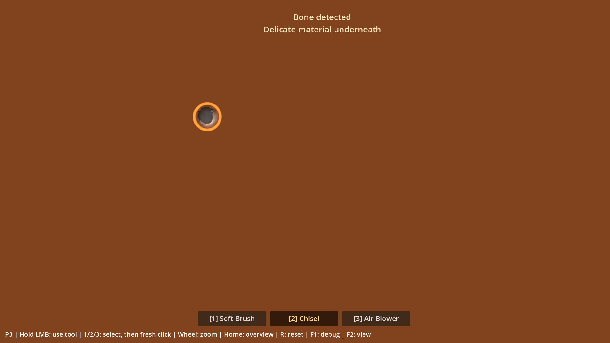
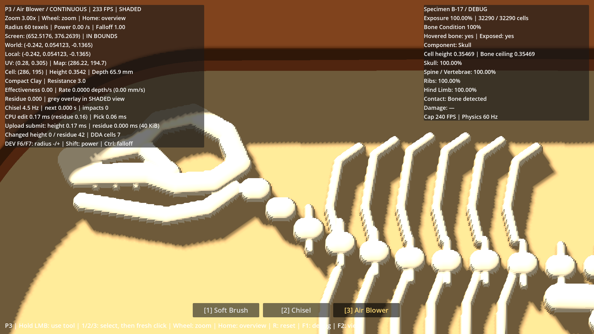

# Rapport P3 — Fossile et zoom de précision

Mise à jour : **2026-10-02**. Branche : **`prototype/p3-fossil`**. [PR #4](https://github.com/ezzerx/archaeology-game/pull/4) en brouillon, **non mergée**.

**Zoom validé humainement par Antoine le 2026-10-02 ; ergonomie debug vérifiée. PR non mergée, P4/P5 non commencés.** Source de vérité : [P3_DESIGN_FIXES](P3_DESIGN_FIXES.md). Antoine confirme explicitement le périmètre « zoom seul » ; la logique osseuse P3 initiale est conservée.

## Périmètre et condition osseuse

Antoine a validé le fonctionnement initial et confirmé que le GPU ne surchauffait plus. La revue produit confirme l'envie de poursuivre la découverte et le besoin de zoom. La distinction Bone/Clay, les ombres et les matériaux restent greybox ; leur solution complète est différée à P4/P6.

**L'équilibrage de Bone Condition n'est pas final. Une fouille attentive à 100 % de condition n'est pas un critère d'acceptation P3.** P4 devra réévaluer l'évitement des dégâts après les réactions de matière prévues : fissures, morceaux d'argile, détachement de blocs de grès, interaction du Chisel et débris. Aucune solution n'est retenue à l'avance.

La marge de 2 mm et le bonus Brush près des os ne font pas partie de cette livraison. Aucun son, VFX, système de fracture, progression, classification, fragment, musée ou sauvegarde n'a été ajouté.

## Comportement livré

B-17 contient **32 290 cellules** : Skull **7 756**, Spine / Vertebrae **7 243**, Ribs **10 771**, Hind Limb **6 520**. Composition déterministe et initialement invisible. Le champ RGF statique porte plafond et ID ; `FossilState` suit exposition, condition et événements. Le picking DDA et la géométrie de relief P1 restent en place.

Le retrait s'arrête exactement au sommet osseux. La matrice voisine reste excavable jusqu'au fond, ce qui fait émerger l'os. Le Chisel peut révéler un os caché : son premier contact est protégé. Un impact dont le centre est déjà exposé retire **3 points de condition**, au maximum un événement par impact, sans creuser l'os. Brush/Blower restent sûrs et leurs efficacités P2 restent inchangées : Brush Soil **1**, Clay **0,06**, Sandstone **0**.

L'exposition utilise les hauteurs RF réellement stockées et l'epsilon binaire **1/65536**, indépendamment du résidu. `Bone detected / Delicate material underneath` apparaît une fois par reset, pendant huit secondes. Les événements découplés, compteurs par composant et resets P3 sont conservés. Les fichiers de retrait, définitions d'outils, configuration Brush, bloc et tests osseux historiques sont identiques à ceux du P3 initial (`53ff0c7`).

### Zoom et entrées

- Molette seule : **zoom fluide 1× → 3×**, amplitude et pas configurables. Projection orthographique et orientation **84°** fixes.
- Le point 3D réellement touché sous le curseur reste ancré pendant l'interpolation. Hors du bloc, zoom autour du centre de la vue.
- **Home / Origine** rétablit la vue initiale sans modifier le terrain. **R** restaure terrain, fossile et vue 1×.
- Une commande de zoom annule le geste courant ; un nouveau clic permet de reprendre. Resize et perte de focus annulent également les gestes et figent l'interpolation.
- En debug : **Shift+molette** puissance (pas 0,1), **Ctrl+molette** falloff (0,25), **Alt+molette** rayon (2 texels). Monter augmente, descendre diminue ; facteur de molette respecté. Priorité des combinaisons : Shift > Ctrl > Alt. Aucun zoom déclenché. F6/F7 et leurs modificateurs Shift/Ctrl restent en secours. Aide dans F1 ; valeurs par défaut inchangées.

`PrecisionZoom` déplace uniquement le cadrage dans le plan caméra pour maintenir l'ancrage ; aucune rotation ni caméra libre. Le curseur est reprojeté pendant l'interpolation. Le contrôle de resize inclut la fenêtre native, car le viewport logique reste fixe en mode stretch. L'arrêt du zoom tient compte de la précision float32 pour éviter du picking perpétuel après convergence.

Décision d'architecture : [P3_FOSSIL_DECISION](P3_FOSSIL_DECISION.md).

## Vérifications fonctionnelles

**439 checks, zéro échec**, Godot **4.7.2 stable Standard** :

| Suite | Checks |
|---|---:|
| P0 | 45 |
| P1 | 52 |
| P2 | 97 |
| P3 historique, inchangée | 85 |
| Zoom / picking / entrées | 160 |

Les tests P3 historiques vérifient découverte, clamp même à très grande puissance, protection du premier contact, dégâts sur centre déjà exposé, Brush/Blower sûrs, matrice voisine, exposition et reset exact.

Le zoom est testé sur **4 432 rayons**, dont **528 sur os**, **676 sur fond** et **92 sur pentes**, aux facteurs **1 / 1,5 / 2 / 3**, au centre et aux bords. Quatre tailles de fenêtre native : **1920×1080, 1280×800, 800×1200, 2560×1080** ; viewport logique 1920×1080 conservé. Erreur maximale d'ancrage pendant interpolation **0,000367 pixel** ; aller-retour picking **0,000000479 m**. Orientation, limites de zoom, focus, resize, raccourcis, absence de reprise parasite et arrêt des mises à jour après convergence sont vérifiés.

Preuve : [p3-zoom-tests.json](evidence/p3-zoom-tests.json).

```powershell
& tests/check_p3.ps1 -GodotBin 'C:\Users\antoi\Downloads\Godot_v4.7.2-stable_win64.exe\Godot_v4.7.2-stable_win64_console.exe' -Graphical
```

Le script vérifie version, import, codes de sortie et erreurs des logs. Les benchmarks graphiques sont séquentiels. Logs et captures de travail : `work/test-logs/`, exclus de Git.

La passe debug du **2026-10-02** rejoue `tests/check_p3.ps1` sans `-Graphical` : **439 checks**, dont **160 input/zoom**, zéro échec. Couverture ajoutée : réglages dans les deux sens, absence de zoom sur modificateur, priorité des combinaisons, facteur de molette, annulation du geste, perte de focus et Resources par défaut intactes. Les mesures graphiques ci-dessous proviennent de la passe zoom précédente (`8a89844`), sans nouvelle mesure graphique pour ce changement de raccourcis.

## Performances et comparaison GPU / picking

RTX 5080, Ryzen 7 9800X3D, Compatibility, **1920×1080**, physique 60 Hz. Sept phases P3 de six secondes au cap **240** ; VSync désactivée uniquement pour le benchmark. Préparations et captures exclues du timing.

| Phase | FPS | Frame P95 / max (ms) | Édition CPU moyenne (ms) |
|---|---:|---:|---:|
| Brush dans la matrice | 239,76 | 8,209 / 10,549 | 3,651 |
| Chisel, révélation au bord du crâne | 239,89 | 4,307 / 6,287 | 0,052 |
| Même révélation à 3× | 239,89 | 4,300 / 5,420 | 0,050 |
| Chisel sur os exposé | 239,89 | 4,297 / 4,711 | 0,016 |
| Chisel sur os exposé à 3× | 239,89 | 4,336 / 4,735 | 0,017 |
| Brush sur os + résidu | 239,85 | 5,300 / 6,296 | 0,917 |
| Blower sur os + résidu | 239,88 | 4,546 / 5,619 | 0,205 |

Les budgets existants passent sans changement de seuils. La moyenne de 240 FPS n'implique pas toutes les frames à 4,17 ms : l'édition se fait à 60 Hz.

Le premier contact naturel à **2,5×** survient après **16 impacts Chisel par défaut** : **3 cellules exposées / 0,00929 %**, condition **100 %**, une notification. Le scénario de révélation prolongée expose **314 cellules** à 1× comme à 3× et termine à **22 %** : cette perte illustre l'équilibrage provisoire reporté à P4. Sur os déjà exposé, **27 impacts donnent 100 → 19**, à 1× et 3×, avec zéro upload de hauteur. Brush/Blower préservent la condition.

**Oracle GPU : 64 985 pixels par zoom** à 1× / 2× / 3×, soit **194 955 pixels**. Erreur maximale de hauteur normalisée **0,004826**, seuil 0,01 sur framebuffer 8 bits. Erreur de couleur ≤ **0,010883**, seuil 0,02. Les trois textures relues sont identiques au CPU.

La classification os/matrice est discontinue à la frontière d'un texel : **4 pixels à 2× et 4 à 3×** tombent sur cette frontière. L'oracle exige alors la couleur d'une cellule voisine réelle à **moins de 0,01 texel** (moins de 0,05 pixel écran à 3×). Aucun pixel n'est ignoré ; les seuils de hauteur/couleur restent inchangés. Écarts bruts et huit cas consignés dans le JSON.

Régressions graphiques P1/P2 : zéro échec. P2 reste à **59,76–59,89 FPS** au cap 60 ; Brush rapide : frame P95 **19,540 ms**, édition moyenne **9,624 ms**. La marge dépend de la charge du PC. Le stress synthétique extrême P1 reste hors budget (**12,57 FPS**, édition CPU moyenne **57,38 ms**) ; aucune optimisation de grille n'est engagée.

Le benchmark P1 réaffirme maintenant son maintien de clic simulé à chaque tick et refuse une phase d'excavation sans retrait : une perte de focus native pouvait auparavant transformer une phase en mesure au repos. Les tests dédiés de focus vérifient toujours l'annulation réelle du clic joueur.

Données : [P3 zoom](evidence/p3-zoom-benchmark.json), [P2 sur cette passe](evidence/p2-on-p3-zoom-benchmark.json), [P1 sur cette passe](evidence/p1-on-p3-zoom-benchmark.json).

## Cap runtime et reset

`application/run/max_fps=240` est conservé et observé dans les suites et benchmarks P3 ; physique **60 Hz** inchangée. P1/P2 peuvent explicitement modifier le plafond dans leur processus de benchmark. La VSync normale reste inchangée.

La [mesure initiale](evidence/p3-runtime.json) de deux minutes reste conservée : 120 relevés, compteur 240–241, cap moteur 240 ; GPU global au repos 27–32 % sur les 50 dernières secondes. Ce n'est pas une nouvelle mesure thermique du correctif. Antoine a ensuite confirmé l'absence de surchauffe.

`R` restaure les octets hauteur/résidu, fractions CPU du résidu, exposition 0 %, condition 100 %, événements/notice, vue initiale et absence de reprise du clic. L'outil sélectionné est conservé. Le champ fossile reste immuable. La réécriture locale préexistante de `project.godot` reste hors commits.

## Captures et limites





Captures du renderer, sans retouche. Le premier contact emploie le Chisel par défaut. La grande cavité est une fixture géométrique ; elle ne représente pas une extraction attentive à 100 %.

- Une hauteur par colonne : aucune excavation sous un os, aucun surplomb ou sous-face.
- Palette, ombres et contraste os/argile restent greybox ; traitement visuel différé à P4/P6.
- Grille dense (~1,31 M triangles), upload RF complet quand dirty et collider enveloppe hérités de P1. Le zoom n'ajoute aucune map ni texture.
- Pas de pan libre ; Home retrouve la vue d'ensemble.
- Le zoom est validé humainement le 2026-10-02 ; les nouveaux raccourcis debug sont vérifiés automatiquement.

## Checklist de référence — zoom validé le 2026-10-02

Ouvrir `project.godot` sur **`prototype/p3-fossil`**, Godot **4.7.2 Standard**, puis **F5**. F1 affiche les mesures ; F2 doit être sur **SHADED**. Relâcher puis cliquer après chaque changement d'outil.

1. [ ] Après `R`, pointer le haut du crâne vers UV **0,28 / 0,305** (28 % de la largeur, 30,5 % de la hauteur du bloc). Zoomer à 2–3× : point ancré, orientation fixe ; rayon, puissance et falloff inchangés.
2. [ ] Avec `2` Chisel, creuser jusqu'au premier **Bone detected** : premier contact protégé. Continuer ensuite volontairement sur une cellule indiquée `Exposed: yes` : la condition baisse de **3 points par impact**, sans creuser l'os.
3. [ ] Essayer `1` Brush et `3` Blower sur l'os : aucun dégât. Vérifier que la matrice voisine reste excavable.
4. [ ] Zoomer/dézoomer au centre, sur les bords, les pentes, le crâne et les côtes : le curseur reste sur la surface visée. Home retrouve la vue initiale sans effacer la fouille ; après un zoom pendant un geste, recliquer pour reprendre.
5. [ ] Pendant clic/zoom, redimensionner puis Alt+Tab, relâcher ailleurs et revenir : aucun geste ne reprend seul ; un nouveau clic vise correctement.
6. [ ] Après révélation et dégâts, maintenir le clic puis `R` : bloc intact, résidu nul, exposition **0 %**, condition **100 %**, vue **1×**, notification réarmée.
7. [ ] Fouiller **2–3 minutes** avec zoom : F1 indique **Cap 240 FPS / Physics 60 Hz** ; vérifier le confort et l'absence de surchauffe gênante.

**Le retest porte sur le zoom, le picking et la découverte P3 existante. Il ne demande pas encore une fouille complète à 100 % de condition. PR #4 reste non mergée ; P4 attend une nouvelle autorisation explicite.**
