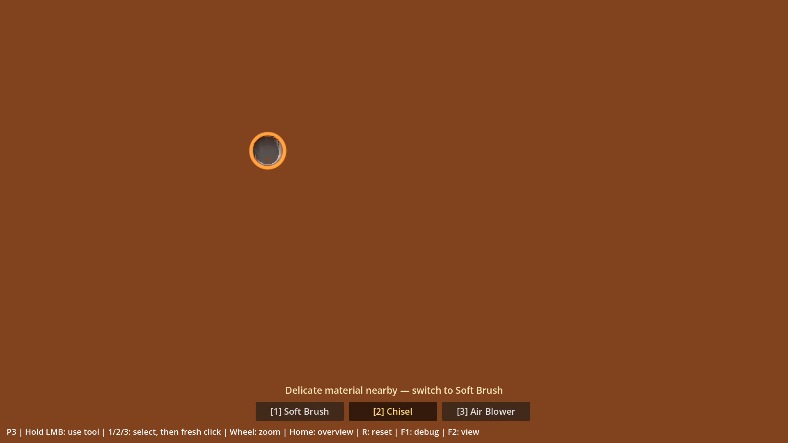
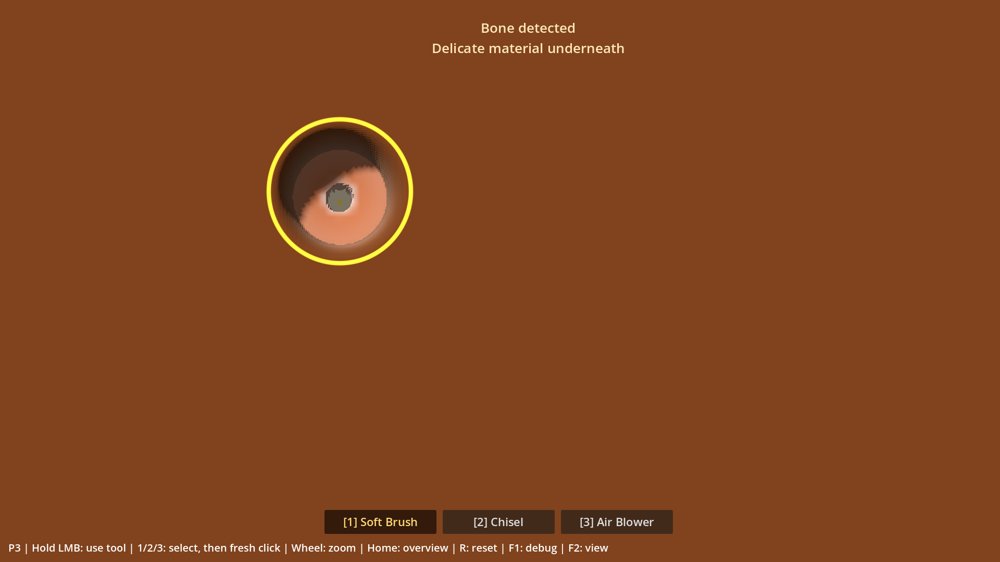

# Rapport P3 — Fossile et corrections de précision

Date : **2026-10-01**. Branche : **`prototype/p3-fossil`**. [PR #4](https://github.com/ezzerx/archaeology-game/pull/4) en brouillon, **non mergée**.

**Corrections implémentées et vérifiées techniquement ; retest humain Chisel → Brush requis avant clôture P3. P4/P5 non commencés.** Source de vérité de cette passe : [P3_DESIGN_FIXES](P3_DESIGN_FIXES.md). Code correctif : `79b3193` ; notes canoniques P0–P7 de `main` intégrées par `6692c8a`.

## Retour humain et périmètre

Antoine avait validé le fonctionnement initial et confirmé que le GPU ne surchauffait plus. La revue produit a ensuite confirmé l'envie de poursuivre la découverte, mais imposé deux corrections avant merge : zoom de précision et workflow d'exposition permettant de conserver 100 % de condition. Cette validation initiale ne vaut pas validation du nouveau workflow.

La distinction Bone/Clay, les ombres et les matériaux restent greybox. La solution visuelle complète est différée à P4/P6 ; aucun son, VFX, outil final, dossier, progression, classification, fragment, musée ou sauvegarde n'a été ajouté.

## Architecture et comportement livré

| Élément | Responsabilité |
|---|---|
| `FossilField` | Champ fixe 1024×640 : plafond float32 et ID, texture RGF statique |
| `FossilState` | Exposition, condition, événements et reset |
| `WorkingSurface` | Retrait P1/P2, marge du Chisel, finition locale du Brush, clamp osseux |
| `ExcavationBlock` / shader | Relief et picking exacts existants, matériau osseux sur texels exposés |
| `PrecisionZoom` | Zoom orthographique fluide ancré au point 3D sous le curseur |
| F1 / indications | Mesures, couverture restante, proximité et découverte |

B-17 contient **32 290 cellules** : Skull **7 756**, Spine / Vertebrae **7 243**, Ribs **10 771**, Hind Limb **6 520**. Composition déterministe et initialement invisible. Les plafonds normalisés vont de **0,236786 à 0,355**. L'os bloque le retrait ; la matrice voisine reste excavable jusqu'au fond, ce qui fait émerger l'os dans le relief.

### Chisel → Brush

- **Marge : 2,0 mm**, configurable sur `ExcavationBlock.precision_margin_mm`, convertie selon la profondeur excavable réelle du bloc. Aucune nouvelle map mutable.
- **Chisel sur os caché :** arrêt à `bone_ceiling + margin`. Les impacts suivants, même énormes, ne franchissent pas la marge. Une couverture déjà partiellement brossée n'est ni retirée ni remontée.
- **Brush dans la marge d'une cellule osseuse :** finition de **1,0 mm/s au centre**, modulée par le falloff, y compris à travers Clay/Sandstone. Réglage `precision_speed_mm_s` dans la Resource Brush. Clamp exact au sommet osseux et zéro dommage.
- **Brush ailleurs :** efficacité P2 conservée, Soil **1**, Clay **0,06**, Sandstone **0**. Clay était déjà très faiblement excavable ; la passe ne transforme pas le Brush en outil général pour les matières dures.
- **Chisel sur os déjà exposé :** **−3 points par impact centré dessus**, au maximum un événement de dégât. La hauteur de l'os ne change jamais. Un centre dans la matrice reste sûr même si le bord de l'outil recouvre de l'os.

Le message contextuel **Delicate material nearby — switch to Soft Brush** signale la couverture fine sous le curseur. La proximité est calculée, sans nouveau flag persistant. **Bone detected / Delicate material underneath** apparaît seulement lors de l'exposition réelle, une fois par reset, pendant huit secondes. Aucun effet P4.

L'exposition reste fondée sur les hauteurs RF stockées et l'epsilon binaire **1/65536**, indépendamment du résidu. Les cinq événements P3 sont conservés : `bone_first_contact`, `bone_cell_exposed`, `bone_component_exposure_changed`, `bone_condition_changed`, `specimen_reset`. Ils observent la surface synchronisée ; les changements de composants restent regroupés par opération.

### Zoom et entrées

- Molette normale, avec ou sans Shift/Ctrl : **zoom 1× → 3×**. Projection orthographique et orientation **84°** fixes, aucune rotation ni caméra libre.
- Le hit 3D sous le curseur reste ancré pendant l'interpolation. Hors du bloc, zoom autour du centre de la vue.
- **Home / Origine** rétablit la vue initiale sans modifier le terrain. **R** restaure le terrain, le fossile et la vue 1×.
- Le zoom annule le geste courant ; un nouveau clic permet de reprendre. Le resize et la perte de focus annulent également les gestes et figent l'interpolation en cours.
- Contrôles développeur, disponibles dans un build debug : **F6/F7** rayon −/+, **Shift+F6/F7** puissance, **Ctrl+F6/F7** falloff. Ils sont indiqués dans F1, sans conflit avec la molette.

Le contrôle de taille inclut la fenêtre native : son redimensionnement ne déclenche pas forcément `Viewport.size_changed` quand la résolution logique reste fixe. L'arrêt du zoom tolère la précision float32 de la caméra pour éviter des mises à jour et du picking perpétuels après convergence.

Détails : [P3_FOSSIL_DECISION](P3_FOSSIL_DECISION.md).

## Vérifications fonctionnelles

**500 checks, zéro échec** avec Godot **4.7.2 stable Standard** :

| Suite | Checks |
|---|---:|
| P0 | 45 |
| P1 | 52 |
| P2 | 97 |
| P3 historique | 87 |
| P3 précision / zoom | 219 |

Les assertions historiques sont conservées. Les fixtures de découverte P3 utilisent désormais Chisel puis Brush, avec deux assertions supplémentaires sur la marge. La fixture de nettoyage reçoit du résidu neuf puisque la finition l'avait déjà nettoyée. Le noyau géométrique sans règle d'outil reste utilisé pour les oracles de relief, jamais comme entrée joueur.

Les nouveaux tests couvrent Clay et Sandstone, deux profondeurs physiques de bloc, marge configurable, très gros impacts, finition partielle, clamp exact, efficacités P2 hors marge, matrice voisine, dégâts volontaires, reset et entrées.

**Workflow avec outils par défaut, sans préparation directe des hauteurs :** douze zones successives Chisel → Brush révèlent **1 698 cellules / 5,259 %** du spécimen, avec **100 % de condition**, **un premier contact** et **zéro dégât**. Un impact volontaire ensuite donne **97 %**. Cela prouve la possibilité mécanique ; le caractère naturel du geste reste à juger par Antoine.

**Zoom :** 4 432 rayons, dont 528 sur os, 676 sur fond et 92 sur pentes ; facteurs 1 / 1,5 / 2 / 3, centre et bords du bloc. Quatre tailles de fenêtre native (1920×1080, 1280×800, 800×1200, 2560×1080), viewport logique 1920×1080 conservé par stretch. Erreur maximale d'ancrage pendant interpolation : **0,000367 pixel** ; aller-retour picking : **0,000000479 m**. Orientation, focus, resize, raccourcis, absence de reprise parasite et arrêt des mises à jour après convergence sont vérifiés.

Preuve : [p3-precision-tests.json](evidence/p3-precision-tests.json).

```powershell
& tests/check_p3.ps1 -GodotBin 'C:\Users\antoi\Downloads\Godot_v4.7.2-stable_win64.exe\Godot_v4.7.2-stable_win64_console.exe' -Graphical
```

Le script vérifie version, import, codes de sortie et erreurs des logs. Les benchmarks graphiques sont séquentiels pour éviter leur interférence. Les logs et captures de travail restent dans `work/test-logs/`, exclus de Git.

## Performances et comparaison GPU / picking

RTX 5080, Ryzen 7 9800X3D, renderer Compatibility, **1920×1080**, physique 60 Hz. Six phases P3 de six secondes, cap **240**, VSync désactivée seulement pour le benchmark ; préparation et captures exclues du timing.

| Phase | FPS | Frame P95 / max (ms) | Édition CPU moyenne (ms) |
|---|---:|---:|---:|
| Brush dans la matrice | 239,77 | 8,244 / 11,502 | 3,698 |
| Brush, révélation au bord du crâne | 239,74 | 8,106 / 9,908 | 3,579 |
| Même finition au zoom 3× | 239,74 | 8,157 / 9,905 | 3,600 |
| Chisel sur os exposé | 239,89 | 4,290 / 5,455 | 0,017 |
| Brush sur os + résidu | 239,86 | 5,088 / 5,852 | 0,771 |
| Blower sur os + résidu | 239,88 | 4,552 / 5,411 | 0,204 |

La moyenne de 240 FPS n'implique pas toutes les frames à 4,17 ms : l'édition se fait à 60 Hz. Les phases passent les budgets existants, sans modification des seuils. Les deux phases de finition exposent **136 nouvelles cellules** à **100 %**. Les 27 impacts sur os exposé donnent **100 → 19**, sans upload de hauteur ; le Blower conserve également les hauteurs.

Le scénario graphique à **2,5×**, avec 80 impacts de préparation par le Chisel par défaut puis 3,5 s de Brush via les entrées de production, expose **134 cellules**, reste à **100 %**, puis descend à **97 %** après l'impact volontaire.

**Oracle GPU : 64 985 pixels par zoom** à 1× / 2× / 3×, soit **194 955 pixels** au total. Erreur maximale de hauteur normalisée **0,004826**, seuil 0,01 sur framebuffer 8 bits. Erreur de couleur ≤ **0,010883**, seuil 0,02. Les trois textures relues restent identiques au CPU.

La classification os/matrice est discontinue à la frontière d'un texel : **4 pixels à 2× et 4 à 3×** tombent sur cette frontière. L'oracle exige alors la couleur d'une cellule voisine réelle à **moins de 0,01 texel** (moins de 0,05 pixel écran à 3×). Aucun pixel n'est ignoré ; les seuils de hauteur et couleur restent inchangés. Les écarts bruts et ces huit cas sont enregistrés dans le JSON. L'ancrage et les hauteurs ne présentent pas de décalage perceptible.

Régressions graphiques : **P1 et P2 zéro échec**. P2 reste à environ 59,76–59,89 FPS au cap 60 ; Brush rapide : frame P95 **19,561 ms**, édition moyenne **10,019 ms**. P1 rapide au cap 60 : P95 **19,937 ms**. La marge reste étroite et dépend de la charge du PC. Le stress synthétique extrême P1 reste hors budget (**12,04 FPS**, CPU moyen **58,57 ms**) ; aucun chantier d'optimisation du mesh n'est engagé.

Données : [P3 précision](evidence/p3-precision-benchmark.json), [P2 sur cette passe](evidence/p2-on-p3-precision-benchmark.json), [P1 sur cette passe](evidence/p1-on-p3-precision-benchmark.json).

## Cap runtime et reset

`application/run/max_fps=240` est conservé et observé dans les nouvelles suites et tous les benchmarks P3 ; physique **60 Hz** inchangée. Les benchmarks P1/P2 peuvent explicitement modifier leur propre plafond. La VSync normale reste inchangée.

La mesure initiale de deux minutes sans override reste conservée : 120 relevés, compteur 240–241, cap moteur 240 ; GPU global au repos 27–32 % sur les 50 dernières secondes. Ce sont les [mesures initiales](evidence/p3-runtime.json), pas une nouvelle mesure thermique de cette passe. Antoine a confirmé ensuite l'absence de surchauffe. Le retest vérifiera également le confort en fouille avec zoom.

`R` restaure les octets de hauteur et résidu, les fractions CPU du résidu, exposition 0 %, condition 100 %, événements/notice réarmés, vue initiale et absence de reprise du clic. L'outil sélectionné est conservé. Le champ fossile reste immuable. La réécriture locale préexistante de `project.godot` reste hors commits ; aucun réglage runtime supplémentaire n'y est introduit.

## Captures et limites





Captures du vrai renderer, sans retouche. La préparation au Chisel utilise les outils par défaut, et la finition passe par le contrôleur joueur. Les grandes cavités des oracles GPU restent des fixtures de géométrie ; elles ne représentent pas une extraction humaine complète.

- Une hauteur par colonne : aucune excavation sous un os, aucun surplomb ou sous-face.
- Palette, marches d'ombre, contraste os/argile et résidu restent greybox ; ce retour visuel est conservé pour P4/P6.
- Grille dense (~1,31 M triangles), upload RF complet quand dirty et collider enveloppe hérités de P1. La passe n'ajoute aucune texture mutable ; le champ fossile initial occupe 5 Mio GPU / 8,75 Mio CPU persistants.
- Le zoom déplace uniquement le cadrage pour son ancrage. Il ne propose pas de pan libre ; utiliser Home pour revenir à la vue d'ensemble.
- Les tests automatiques ne concluent pas au plaisir ou au naturel du nouveau geste. **P3 attend le retest ci-dessous ; PR #4 non mergée, P4 bloqué.**

## Checklist exacte de retest pour Antoine

Ouvrir `project.godot` sur **`prototype/p3-fossil`**, Godot **4.7.2 Standard**, puis **F5** pour repartir des réglages par défaut. F1 affiche les mesures ; F2 doit être sur **SHADED**. Toujours relâcher puis cliquer après un changement d'outil.

1. [ ] **Vue et zoom.** Après `R`, pointer le haut du crâne vers UV **0,28 / 0,305** (28 % de la largeur, 30,5 % de la hauteur du bloc). Zoomer à 2–3× avec la molette : point visuellement ancré, orientation fixe. La molette ne modifie ni rayon, ni puissance, ni falloff.
2. [ ] **Approche sûre.** Sélectionner `2` Chisel et creuser au point visé. À **Delicate material nearby — switch to Soft Brush**, F1 doit montrer environ **2,00 mm** de couverture. Continuer quelques impacts au même point : aucun os exposé, aucune perte de condition, couverture conservée.
3. [ ] **Finition.** Relâcher, sélectionner `1` Brush, recliquer et maintenir environ **2–4 secondes**. La fine couverture part progressivement, **Bone detected** apparaît une seule fois, la condition reste à **100 %**. `3` Blower peut enlever le résidu sans changer exposition/hauteur/condition.
4. [ ] **Plusieurs zones.** Répéter Chisel → Brush sur un autre bord encore couvert, par exemple UV **0,31 / 0,36**, puis sur une côte. Garder le centre du Chisel hors des cellules déjà exposées. Les pourcentages augmentent et la condition peut rester à **100 %**.
5. [ ] **Matrice voisine.** Avec le centre du Chisel dans la matrice libre, creuser plus bas que l'os. L'os reste en place et dépasse du creux. Le Brush loin des os conserve ses limites P2 sur les matières dures.
6. [ ] **Erreur volontaire.** Poser le centre sur `Exposed: yes`, sélectionner Chisel puis donner un clic bref : **100 → 97**. Un deuxième clic séparé donne **94**. La hauteur de l'os reste inchangée ; le diamètre ne multiplie pas les dégâts.
7. [ ] **Picking et cadrage.** Zoomer/dézoomer au centre, sur les bords du bloc, les pentes et l'os. Le centre du curseur reste sous la souris. Home / Origine retrouve la vue initiale sans effacer la fouille. Après zoom pendant un geste, recliquer pour reprendre.
8. [ ] **Resize et focus.** Pendant un clic/zoom, redimensionner puis Alt+Tab, relâcher ailleurs et revenir. Aucun impact ni geste ne reprend seul ; un nouveau clic fonctionne au bon endroit.
9. [ ] **Reset.** Après plusieurs révélations et dégâts, maintenir le clic puis `R` : bloc intact, résidu nul, exposition **0 %**, condition **100 %**, vue **1×**, indications effacées. La découverte suivante réaffiche une seule notice.
10. [ ] **Runtime et verdict.** Fouiller **2–3 minutes** avec zoom : F1 indique **Cap 240 FPS / Physics 60 Hz**, sans retour de la surchauffe gênante. Confirmer surtout que passer du Chisel au Brush paraît naturel et permet de révéler plusieurs zones sans dégâts imposés.

**Le retest doit valider le workflow, pas seulement l'absence d'erreurs. Aucun merge ni P4 sans nouvelle autorisation explicite.**
