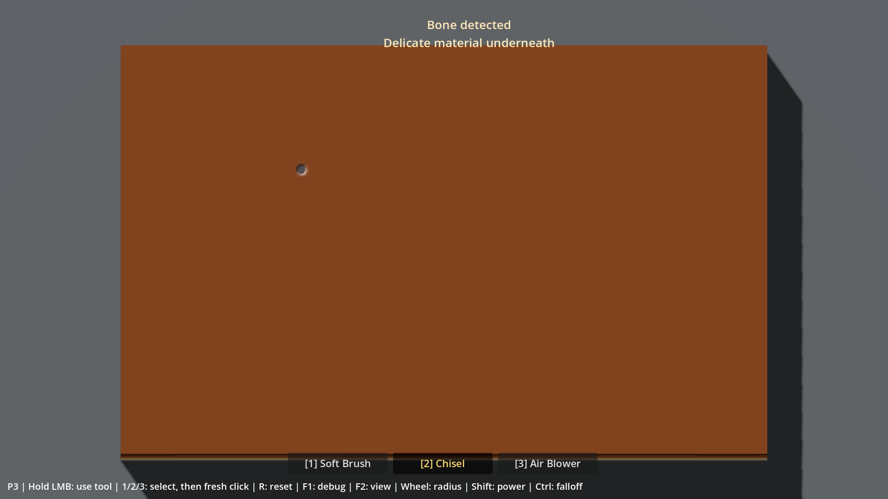
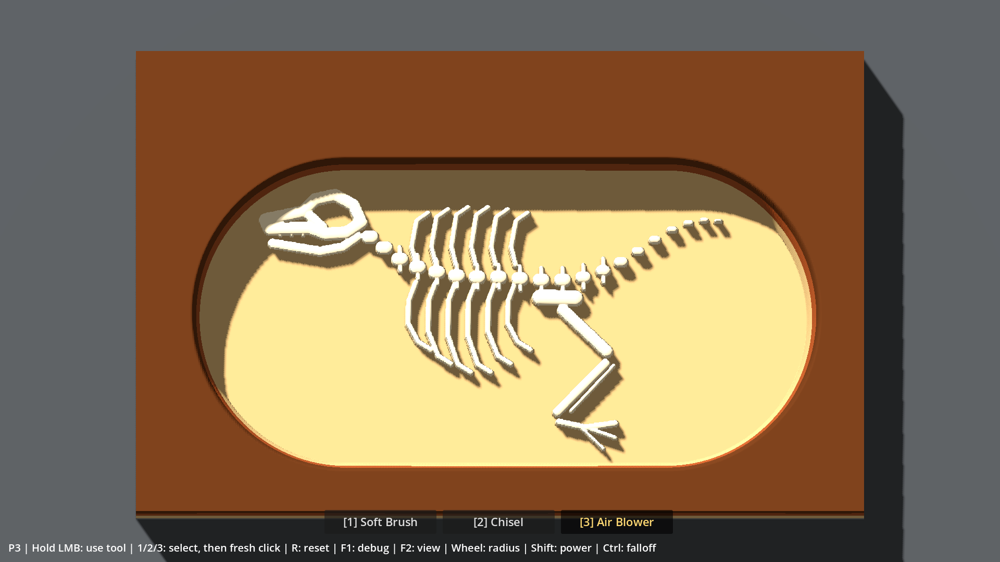

# Rapport P3 — Fossil / Exposure / Bone Contact

Date : **2026-10-01**. Branche : **`prototype/p3-fossil`**. Base initiale : `4472fef` après le merge P2 `9b8423f`. Documentation de `main` intégrée jusqu'à `f4e94fa` (roadmap ART0 et systèmes futurs, sans implémentation de ces étapes).

Livraison : [PR #4](https://github.com/ezzerx/archaeology-game/pull/4), en brouillon vers `main`, **non mergée**.

**Fonctionnement P3 validé par Antoine ; passe design à cadrer avec l'orchestrateur. Merge et P4/P5 non autorisés.**

## Retour humain — 2026-10-01

Antoine confirme : « Ok tout fonctionne et le GPU ne surchauffe plus. » Ce retour valide le fonctionnement du prototype et le confort GPU ressenti ; aucun nouveau relevé chiffré n'est fourni. Il souhaite discuter de quelques modifications design avec l'orchestrateur avant une nouvelle passe. Leur contenu reste à définir ; la PR demeure en brouillon, non mergée. La checklist ci-dessous est conservée pour les retests, sans attribuer au retour global des vérifications détaillées non rapportées.

## Résultat et architecture

Specimen B-17 est entièrement caché au lancement. La fouille découvre progressivement une matière ivoire ; les cellules d'os arrêtent le retrait, tandis que la matrice voisine peut descendre au fond du bloc. Le fossile ressort donc du creux, sans second mesh ni changement de picking.

| Élément | Responsabilité |
|---|---|
| `FossilField` | Composition fixe rasterisée une fois, plafonds float32 et IDs d'os, texture RGF statique |
| `FossilState` | Flags/counters d'exposition, condition, événements de contact et reset |
| `WorkingSurface` | Intégration P1/P2 puis clamp local au plafond osseux ; dégâts au centre avant l'impact |
| `ExcavationBlock` / shader | Rendu ivoire du texel exposé, relief et picking P1 conservés |
| F1 / notification | Mesures du spécimen et contact unique, sans dossier ni progression |

Décision exacte, stockage, alternatives et limites : [P3_FOSSIL_DECISION](P3_FOSSIL_DECISION.md).

Le fossile contient **32 290 cellules** : Skull **7 756**, Spine / Vertebrae **7 243**, Ribs **10 771**, Hind Limb **6 520**. Orbite ouverte, mâchoire, vertèbres séparées, queue courbe, cage partielle et patte repliée sont dessinées par coordonnées fixes. Aucun asset externe, modèle téléchargé, hasard ou classification.

## Plafond et matière osseuse

`surface_height >= bone_ceiling` est imposé dans la boucle d'édition. Les plafonds normalisés vont de **0,236786 à 0,355**, soit environ **24,2–36,2 mm au-dessus du fond excavable**. Le travail restant est abandonné à l'os. Les cellules libres restent excavables jusqu'à `0`.

La surface P1 garde ~1,31 M triangles. Le shader emploie les mêmes texels que le CPU pour décider de l'exposition ; la géométrie et les normales suivent toujours les triangles déplacés. Ivoire chaud, roughness **0,43**, specular **0,38**, aucune émission osseuse. Le voile de résidu P2 peut couvrir légèrement l'os puis être retiré au Blower. Le résidu ne change ni géométrie, ni exposition structurelle, ni condition, ni picking.

## Premier contact, condition et exposition

- Le premier impact révélant une cellule cachée est protégé, y compris après une découverte ailleurs sur le spécimen.
- Le Chisel examine **le centre avant excavation** : s'il est déjà exposé, **−3 points par impact**, au maximum une pénalité. Un centre dans la matrice reste sûr même si le bord du footprint touche de l'os.
- Condition initiale **100**, bornée à **0–100**. Brush/Blower sûrs ; aucune destruction, géométrie cassée ou fin de partie.
- `Bone detected` / `Delicate material underneath` apparaît **une fois par reset**, pendant huit secondes. Aucun son, effet ou musique ajouté.
- Exposition : hauteur RF de cellule ≤ plafond + **1/65536 ≈ 0,00001526**, epsilon exact en float32. Une cellule représente **0,00310 %** du spécimen. Pourcentages calculés sur les surfaces occupées globalement et par composant, sans dépendance au résidu.
- Événements découplés : `bone_first_contact`, `bone_cell_exposed`, `bone_component_exposure_changed`, `bone_condition_changed`, `specimen_reset`. Les changements de composant sont regroupés par opération et les événements sont émis après synchronisation de la height map.

F1 conserve outils/matériaux/perf et ajoute les quatre composants, le nombre de cellules, l'exposition, la condition, l'os sous le curseur, sa hauteur et son plafond, le contact et les derniers dégâts. Les quatre vues F2 existantes restent inchangées ; aucune silhouette cachée affichée par défaut.

`R` restaure les octets initiaux de hauteur et résidu (fractions CPU incluses), efface l'exposition globale/composants, rétablit 100 de condition et réarme la première découverte. Il annule le clic et la cadence du Chisel ; l'outil sélectionné est conservé.

## Cap runtime

**`application/run/max_fps=240`**, réglage officiel de Godot, actif sur les runs normaux/F5. **Physique : 60 Hz**. Les tests contrôlent à la fois `ProjectSettings` et `Engine`. VSync reste dans son état précédent et peut limiter plus bas. [Documentation officielle](https://docs.godotengine.org/en/stable/classes/class_engine.html#class-engine-property-max-fps).

Le benchmark P3 conserve ce cap ; l'option explicite `--uncapped` permet de mesurer la marge. P2 garde son cap de 60. Le benchmark P1 force désormais explicitement `Engine.max_fps=0` pendant ses phases historiques de marge, puis revient à 60 pour ses phases plafonnées et au réglage du projet à sa sortie. Aucun fichier de projet modifié par les benchmarks.

Le fichier `project.godot` comportait une réécriture locale préexistante par l'éditeur. Elle est préservée hors commits ; le nom P3 et le cap sont versionnés. La valeur physique 60 Hz déjà présente dans Git est explicitement rétablie dans la copie locale, où l'éditeur avait omis ce défaut.

Observation automatique séparée de la scène ordinaire, **sans override FPS/VSync** : **120 relevés sur deux minutes**, affichage compteur **240–241 FPS** (moyenne 240,04), cap moteur **240** et physique **60** à chaque relevé. Viewport 1920×1080, VSync réglé à 1. La fenêtre glissante du compteur explique l'arrondi ponctuel à 241. [Données runtime](evidence/p3-runtime.json).

Pendant les **50 dernières secondes** observées de ce runtime **au repos**, 53 relevés `nvidia-smi` indiquent **27–32 % GPU**, moyenne **28,72 %**, environ **92,2 W**. C'est la charge de **tout le GPU**, pas une attribution par processus ni un test humain en fouille. Le retour humain ultérieur sur le GPU est consigné séparément en tête de rapport. [Résumé](evidence/p3-gpu-summary.json), [relevés](evidence/p3-gpu-runtime.csv).

## Tests automatisés

**Godot réellement exécuté : 4.7.2 stable `ed1daf0bf`, Windows, Compatibility/OpenGL 3.3, RTX 5080 / Ryzen 7 9800X3D, pilote 610.88.**

- P0 **45**, P1 **52**, P2 **97**, P3 **85** : **279 checks, zéro échec**, y compris six cas à la frontière de l'epsilon float32.
- Les assertions historiques sont conservées. Une fixture P1 de fond profond est déplacée de la vertèbre centrale vers une zone libre ; le test vérifie toujours le fond physique, ses pentes et les transformations.
- Champ déterministe, bornes/IDs/plafonds, énormes deltas, voisin libre sous l'os, premier contact protégé, dégâts uniques au centre, outils sûrs, clamp de condition, événements uniques et reset exact.
- Oracle d'exposition indépendant : recomptage des données RF et IDs sur toute la carte, comparé aux caches/flags et aux quatre pourcentages en état intact, partiel, complet et remis à zéro.
- Entrées réelles dans la scène : Chisel sur os, changement pendant le clic, perte/reprise de focus, nouveau clic, `R` maintenu, notice et cadence remis à zéro. Les autres cas fenêtre/resize/toolbar restent couverts par P2.
- Picking P1 : oracle natif **180 rayons**, erreur maximale **0,00000020 m**. P3 : **493 roundtrips caméra**, dont 351 contacts osseux et 142 sur matrice, erreur maximale **0,00000351 m**, occlusions traitées.

Rejouer :

```powershell
.\tests\check_p3.ps1 -GodotBin 'C:\Users\antoi\Downloads\Godot_v4.7.2-stable_win64.exe\Godot_v4.7.2-stable_win64_console.exe' -Graphical
```

Cette commande contrôle version, import, codes de sortie et erreurs des logs, puis les benchmarks P2, P1 et P3. Logs et captures de travail : `work/test-logs/`, exclus de Git. Le benchmark P3 peut rester ouvert avec `-- --inspect` ; il remet alors le spécimen intact et restaure le cap 240.

## Mesures graphiques et preuves

Renderer réel **1920×1080**, simulation 60 Hz, VSync désactivée seulement dans les benchmarks. Cinq phases P3 de **6 secondes** via les entrées et le contrôleur de production, cap normal **240**, hors préparation/reset/chauffe/captures.

| Phase P3 | FPS observés | Frame P95 / max (ms) | Édition CPU moyenne (ms) | Édition par tick actif (ms) |
|---|---:|---:|---:|---:|
| Brush, matrice loin de l'os | 239,74 | 8,33 / 10,16 | 3,726 | 3,726 |
| Révélation au bord du crâne | 239,89 | 4,30 / 5,98 | 0,050 | 0,647 |
| Chisel répété sur os exposé | 239,89 | 4,30 / 6,03 | 0,016 | 0,185 |
| Brush sur os + résidu | 239,85 | 5,24 / 6,63 | 0,900 | 0,900 |
| Blower sur os + résidu | 239,88 | 4,54 / 5,75 | 0,204 | 0,204 |

La moyenne de 240 FPS n'implique pas toutes les frames à 4,17 ms : les ticks d'excavation sont plus longs, notamment au Brush. Les cinq phases passent le budget d'interaction existant (≥58 FPS, frame P95 <20 ms) et le contrôle du plafond. **Zéro erreur graphique.** Le Chisel sur os déjà entièrement dégagé et le Blower réalisent **zéro upload de hauteur**. La phase de révélation passe de 0 à **314 cellules** ; les 27 impacts directs sur os déjà exposé donnent **100→19** de condition. Brush/Blower conservent 100.

Le contact depuis un bloc intact avec le Chisel par défaut arrive après **16 impacts**, expose **3 cellules / 0,00929 %**, condition **100** et une seule notification. Cette fixture volontairement minuscule valide la protection sans surestimer l'exposition.

Oracle GPU P3 : **64 985 pixels** (6 864 os, 58 121 matrice), erreur maximale de hauteur normalisée **0,004679** pour une tolérance de 0,01 sur framebuffer 8 bits. Erreur maximale de couleur **0,010883** pour une tolérance de 0,02 : le matériau osseux rendu concorde avec les cellules structurellement exposées. Textures hauteur, résidu et champ fossile relues identiques au CPU.

Régressions graphiques : **P1 zéro échec** (864 pixels, erreur hauteur 0,004146), **P2 zéro échec** sur sept phases, environ **59,76–59,89 FPS** au cap 60. Le Brush rapide garde une marge étroite : **frame P95 19,859 ms**, édition moyenne **10,053 ms**. Deux premiers runs avaient dépassé 20 ms (20,351 puis 20,290) ; les lectures fossiles inutiles au-dessus des os ont été éliminées, sans baisser les seuils ni toucher au mesh. Ces mesures courtes restent sensibles à la charge du PC.

Le stress synthétique P1 coin-à-coin demeure hors budget : **11,26 FPS**, édition moyenne **62,50 ms**. Il n'est pas représentatif des gestes normaux et n'a pas fait l'objet d'un chantier d'optimisation.

Données brutes : [P3](evidence/p3-benchmark.json), [replay P2](evidence/p2-on-p3-benchmark.json), [replay P1](evidence/p1-on-p3-benchmark.json).





Captures du renderer, sans retouche. La grande cavité est une **fixture de vérification** créée par l'API d'excavation ; le jeu démarre toujours intact. Elle ne prétend pas représenter une session humaine.

## Limites conservées après validation fonctionnelle

1. Une hauteur par colonne : l'os est une colonne solide, sans sous-face ni excavation en dessous. Les bords s'interpolent sur environ un texel. Aucune promesse de géométrie anatomique finale.
2. Palette, ombres en marches sur pentes fortes, contours et résidu restent greybox. Le Brush ne retire toujours pas Sandstone : autour d'un os dans le grès, creuser prudemment au Chisel avec le centre dans la matrice, puis nettoyer au Blower.
3. Les premières cellules peuvent être minuscules et dans l'ombre d'une cavité étroite. La lisibilité et le plaisir de découverte doivent être jugés en manipulant la scène, pas seulement sur une capture dégagée.
4. Coûts hérités : grille dense, upload RF complet quand dirty, stress diagonal extrême hors budget, collider enveloppe. Aucun chantier d'optimisation du mesh n'a été entrepris.
5. Données nouvelles : RGF statique **5 Mio GPU**, données CPU persistantes **8,75 Mio**. Aucune nouvelle texture mutable ou reconstruction de mesh pendant les gestes.
6. Aucun système de classification, fragments, objectifs, dossier final, completion, audio/VFX, débris, caméra, outils finaux, mains, musée, sauvegarde, économie ou Steam.

**La validation humaine du fonctionnement est consignée en tête de rapport.** La passe design reste à cadrer ; le merge et P4/P5 demandent une nouvelle autorisation explicite d'Antoine.

## Checklist exacte pour Antoine — conservée pour retest

Ouvrir `project.godot` sur **`prototype/p3-fossil`** dans **Godot 4.7.2 Standard**, puis **F5**. Relancer pour restaurer les réglages par défaut. `1` Brush, `2` Chisel, `3` Blower ; toujours relâcher puis cliquer après un changement d'outil. F1 masque/affiche les deux panneaux ; F2 doit être en **SHADED**.

1. [ ] **Découverte initiale.** Vérifier qu'aucun os/squelette n'apparaît sur le bloc intact. Brosser, puis utiliser le Chisel lorsque l'argile résiste. Pour un test dirigé, le haut du crâne se trouve vers **28 % de la largeur / 30,5 % de la hauteur du bloc** (UV `0.28, 0.305` dans F1).
2. [ ] **Bone detected.** À l'apparition des premières cellules, observer la notification exacte. Continuer ailleurs : elle ne doit pas se répéter avant `R`. Souffler le résidu pour mieux distinguer l'ivoire.
3. [ ] **Premier contact protégé.** Après `R`, rejoindre à nouveau cette zone. À l'approche du plafond, donner des **clics brefs et séparés** au Chisel et relâcher dès le premier reveal : condition **100 %**. Un maintien prolongé peut déjà programmer l'impact suivant environ 0,22 s après.
4. [ ] **Dégâts contrôlés.** Avec le centre posé sur `Exposed: yes`, faire deux clics Chisel séparés : **100 → 97 → 94**. Le rayon ne multiplie pas les dégâts. Déplacer le centre dans la matrice voisine : aucun dommage même si le bord de l'outil recouvre l'os.
5. [ ] **Creuser autour.** Garder le centre du Chisel dans la matrice et descendre plus bas que l'os. L'os reste en place, dépasse du creux et prend la lumière ; aucun trou ou scintillement à son emplacement.
6. [ ] **Picking.** Balayer le sommet de l'os, son bord, les pentes et le fond adjacent. Le cercle et son centre restent au contact sous la souris, y compris après resize et près d'une occlusion.
7. [ ] **Outils sûrs et résidu.** Maintenir Brush puis Blower sur l'os : condition inchangée et os immobile. Le Blower retire le voile sans changer les hauteurs ni l'exposition ; le Brush peut travailler les matières compatibles dans son footprint.
8. [ ] **Exposition.** Dégager différentes portions de crâne, vertèbres, côtes et patte. F1 indique le bon composant et des pourcentages progressifs ; un petit contact ne révèle pas artificiellement la moitié du squelette.
9. [ ] **Reset.** Après exposition de plusieurs composants et dégâts, maintenir LMB puis presser `R` : bloc intact, résidu nul, exposition **0 %**, condition **100 %**, notice effacée. Rien ne reprend avant un nouveau clic ; une nouvelle découverte réaffiche une seule notice.
10. [ ] **Entrées.** Changer `1→2→3` pendant le clic ; aucune reprise automatique. Alt+Tab en maintenant le clic, relâcher ailleurs, revenir : aucun impact parasite. Vérifier aussi les boutons et la sortie/réentrée du bloc.
11. [ ] **Cap et GPU, 2–3 minutes.** Dans un F5 normal, F1 indique **Cap 240 FPS / Physics 60 Hz**. Observer FPS et charge GPU dans le Gestionnaire des tâches ou l'overlay NVIDIA pendant une fouille normale. Relever si la saturation précédente à 100 % diminue suffisamment ; un affichage ponctuel de 241 dû à la fenêtre de comptage n'est pas un cap désactivé.

Verdict attendu : « Je comprends immédiatement que je découvre un os, je peux creuser autour sans le traverser, et le changement de précaution est lisible. » Signaler sinon le geste, l'outil et l'endroit problématiques. **Ne pas lancer P4 sans nouvelle autorisation explicite.**
