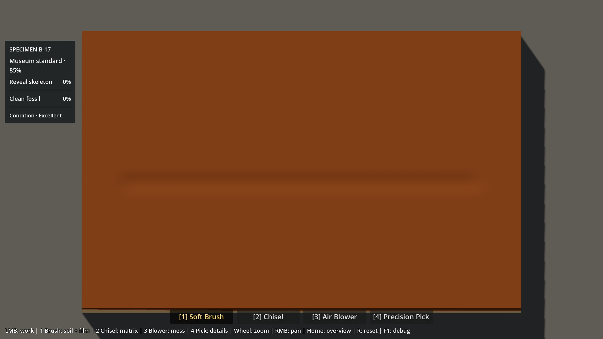
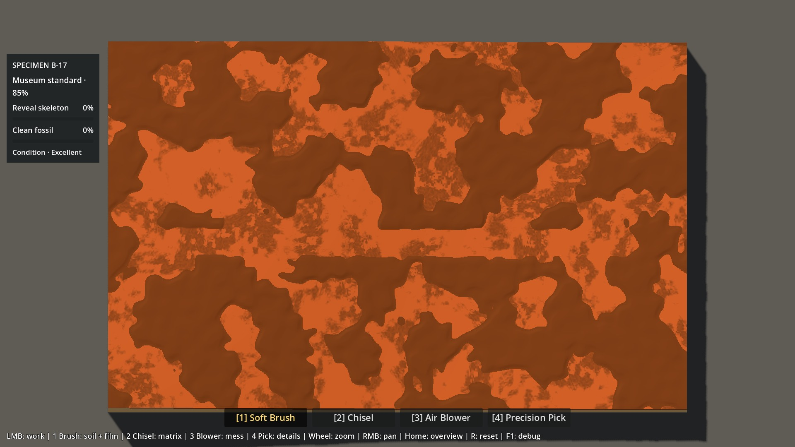
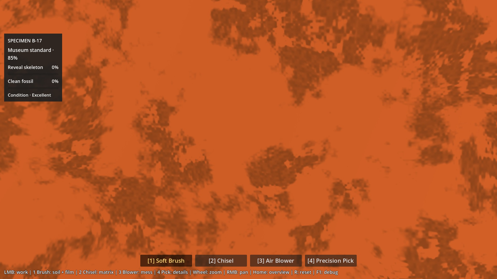
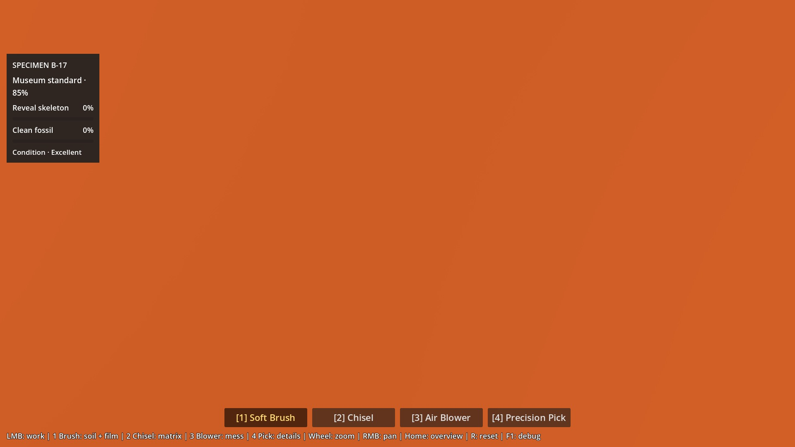
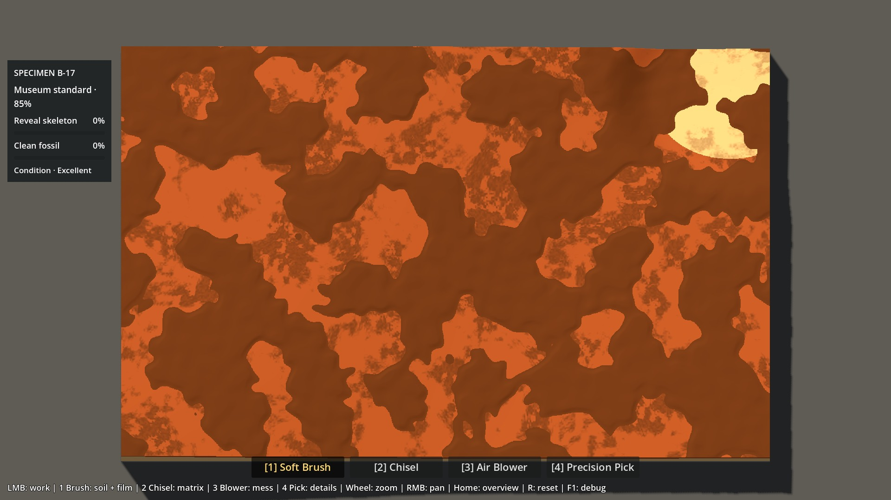
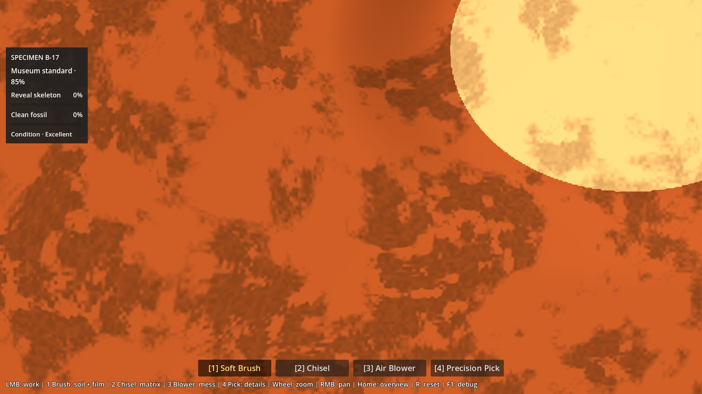

# P6A1.5 — Soil Foundation Spike

## Human verdict — recorded after this report

Antoine has now human-reviewed this spike and **prefers candidate B's semantics**:

- thin, partial, irregular Soil overburden;
- Soil follows the underlying matrix rather than forming an independent flat ceiling;
- Brush removes the superficial Soil; Clay/Sandstone is the structural work surface;
- contact patina = original material + irregular dirty deposits, never a uniform dark recolor.

The exact 0–2 mm / coverage values below remain spike calibration, not final production constants.

This human verdict is also recorded in `docs/brain/status.md` and `docs/brain/decisions.md`.

The next gate is P6A1.6 Natural Matrix Geometry; do not reopen this A/B unless new evidence requires it.

2026-10-06 · `prototype/p6a-visual-spike` · PR #9 DRAFT.

## Résultat à examiner

**B prouve la faisabilité d’un Soil mince, partiel, qui suit la matrice existante.** Recommandation technique : préférer cette sémantique pour la suite, sous réserve du test humain de vitesse/lecture. Aucune adoption de B ni validation visuelle n’est déduite des tests. Le statut et la prochaine autorisation vivent dans [status.md](../brain/status.md).

Le spike change uniquement les conditions initiales dans une scène séparée. Aucun script de gameplay P4/P5, ressource outil, fossile, shader de production ou scène normale n’a été modifié. Aucun asset, éclairage, particule, grain persistant, jacket ou système de géologie supplémentaire.

## Essai humain — deux minutes

Lancer `Launch-Soil-Lab.ps1`, ou ouvrir `scenes/p6a15_soil_lab.tscn` dans Godot 4.7.2 et F6. La scène démarre en **A**.

1. Brosser une bande en A ; **F8** passe à B et réinitialise toute la fouille en conservant la vue. Refaire le geste : Soil paraît-il superficiel, moins plat, conforme au relief et assez rapide à retirer ?
2. Sur B, passer au **Chisel/Pick** : la matrice révélée devient-elle clairement le vrai chantier ? Le passage Brush → outils structurels est-il logique ?
3. **F9** montre la matrice commune sans Soil ; basculer la patine ON/OFF. Clay reste-t-elle orange, avec des dépôts discontinus plutôt qu’une bande sombre ? Choisir le témoin Sandstone pour juger aussi sa lisibilité.
4. **R** restaure le départ du mode sélectionné et la vue. Choisir explicitement **A, B ou correction nécessaire**, avant P6A2.

**H** masque le panneau, **Home** restaure la vue, **1–4** gardent les outils habituels. En vue « matrice nue », F8 compare cette même matrice nue ; R revient au départ avec Soil. Changer A/B ou le témoin efface l’essai en cours (débris, film, progression compris). Ce sont des essais contrôlés, pas deux sauvegardes de partie.

## A/B et données communes

| | A — actuel | B — couverture mince |
|---|---|---|
| Heightfield initial | `1.0` partout | `surface matrice + épaisseur locale` |
| Soil, B-17 original | 16,32–43,86 mm | 0–2 mm |
| Couverture initiale | 100 % | 56,60 % ; 43,40 % de matrice nue |
| Relief initial, max–min | 0 mm | 29,54 mm |
| Brush | ressource P4 intacte | même ressource, même résistance Soil |
| Géologie/Bone du témoin principal | production P5 exacte | identique à A |
| Rendu | palette P5 + patine ponctuelle | strictement le même shader |

La différence de géométrie supérieure est précisément la variable testée. Caméra, lumière, triangulation, données sous-jacentes et trajectoire de test restent communes. Désactiver la patine restitue le rendu P5 de référence ; aucune texture du Material Lab n’est chargée par le Soil Lab.

### Règle exacte du candidat

`SoilFoundationProfile` construit deux caches une fois à l’ouverture. `h_matrix` est la limite Soil/Clay existante, normalisée sur **102 mm** excavables. Les mêmes valeurs gouvernent le retrait CPU, le picking interpolé et les interfaces du shader.

Deux bruits Simplex Smooth sans fractale, fréquence 1, seeds fixes 61715 et 1726, sont échantillonnés aux coordonnées UV multipliées respectivement par `(6.6, 4.2)` et `(25.3, 16.1)` : `b` et `m`.

```text
coverage = smoothstep(-0.10, 0.22, b + 0.28*m)
thickness_mm = 2 * coverage * (0.55 + 0.45*clamp(0.5 + m, 0, 1))
h_initial = h_matrix + thickness_mm / 102
```

Ce bruit distribue seulement le dépôt Soil ; il ne génère ni matrice ni fossile. Pas de plan supérieur indépendant, de remplissage jusqu’à une altitude commune ou de plafond artificiel. Les pentes sous-jacentes sont conservées ; les zones planes du substrat P5 restent planes entre les dépôts. Aucune accumulation liée à la courbure n’est simulée.

Mesure exhaustive : minimum 0, maximum 2 mm à l’arrondi RF près (écart maximal observé 0,000006 mm sur le témoin secondaire). Couverture mesurée avec la tolérance d’interface P5 inchangée de 0,000102 mm. Aucun Bone initialement exposé, aucun plafond Bone déplacé ou traversé.

### Témoin Sandstone, explicitement pré-dégagé

Le départ P5 original ne contient pas de Sandstone à la surface de la matrice. Pour tester du Soil directement sur Stone sans refondre les couches, le second témoin retire préalablement la Clay dans un coin sans Bone : ellipse centrée en UV `(0.94, 0.12)`, rayons `(0.20, 0.25)` ; retrait complet pour `r≤0.60`, raccord `1-smoothstep(0.60,1,r)`.

La limite supérieure est interpolée vers la limite Sandstone d’origine, sans modifier cette dernière. Le noyau comprend **27 933 cellules Stone**. Il est partagé par A/B ; seule la couverture Soil diffère. Le retrait futur sous cette surface garde exactement la résistance Clay/Stone originale. Aucun masque Bone n’a servi à dessiner le coin ; le test vérifie ensuite que tout le substrat reste au-dessus des plafonds.

**Limite :** ce témoin représente une surface pré-creusée, pas une nouvelle géologie naturelle ni un départ de production. En A, reposer le sommet à 1.0 y produit un Soil encore plus épais. Le témoin principal reste l’oracle du comportement actuel.

## Patine corrigée

Le shader du spike adapte le shader P5 par trois points d’insertion contrôlés ; sa fonction de déplacement des sommets et ses masques de couche/Bone/film restent intacts. Le shader de P6A-1 n’est pas modifié : son ancien traitement reste une preuve historique, pas la nouvelle cible.

La nouvelle patine mélange la couleur d’origine avec la couleur Soil assombrie uniquement dans des îlots : bruit déformé à trois échelles (37, 9 et 2,3 cellules), seuils doux et sous-masque d’interruption. **Entre les îlots, le poids de mélange vaut réellement zéro.** Dans les taches, opacité variable, maximum théorique 0,62 sur Clay et 0,3224 sur Stone. Rugosité locale interpolée vers 0,97. Pas de teinte brune minimale appliquée à toute la surface.

La patine s’efface visuellement avec l’excavation entre 0,10 et 1 mm sous le contact ; cela n’ajoute ni épaisseur, ni résistance, ni picking. Stone utilise le contact Soil du témoin ou sa propre interface Clay/Stone, avec intensité réduite à 52 %. Bone est exclu de ce traitement.

Ce n’est **pas** un second Bone Film : aucune quantité de saleté, map dynamique, interaction Brush/Blower, récompense de nettoyage ou dépendance au film osseux. Le Brush retire le Soil réel ; la patine adhérente reste jusqu’à l’excavation de la matrice. Cette distinction doit être jugée humainement pour éviter une apparence de « saleté encore brossable » trompeuse.

## Vérifications et performance

Preuves brutes reproductibles : [tests](evidence/p6a15/tests.json), [GPU/captures](evidence/p6a15/visual.json), [24 scénarios performance](evidence/p6a15/benchmark.json).

- Tests Soil : **64 contrôles**, aucun échec. Toutes les cellules respectent épaisseur/relief/couverture/plafonds ; reset déterministe, masque géologique commun, Brush arrêté sur Clay et sur le témoin Stone, puis Pick actif dans Stone.
- Régressions existantes P0–P5 : **2 243 contrôles**, répétitions incluses, plus les sondes de scène/coût/déterminisme ; zéro échec. Material Lab : **220 contrôles**, zéro échec. [Synthèse des logs](evidence/p6a15/regression.json). Une interpolation PowerShell `${Mode}` a été corrigée dans le lanceur P6A, sans toucher au jeu.
- Trajet natif Brush de deux secondes, 120 ticks à 60 Hz, de `(100,350)` à `(924,350)` : B passe de **496 à 0 cellules Soil** sur les 785 cellules centrales évaluées ; A reste **785/785** Soil. C’est un trajet local, pas un temps de nettoyage du bloc complet.
- Replay préparé autour de Bone avec les quatre outils : état final exact de la scène P5 originale pour A et B (hauteur, fracture, poussière/débris, film, protections, Condition et progression).
- Au repos : aucun changement de carte/état, upload de relief ou reconstruction du profil pendant 120 frames. Le code de profil ne possède aucune boucle par frame.
- **24 contrôles graphiques**, zéro échec : masques de couche, d’exposition Bone et de Bone Film du GPU identiques au pixel au shader P5 sur une zone de 1 100×680. La patine laisse 334 343 pixels sans dépôt dans la zone témoin, avec 268 879 pixels tachés et 55 978 intermédiaires. Les 24 scénarios perf passent **64 contrôles**, sans échec.

Machine : RTX 5080 / Ryzen 7 9800X3D, Godot 4.7.2 Compatibility, pilote NVIDIA 610.88, viewport **1920×1080**, cap **240 FPS**, physique **60 Hz**. 180 ticks mesurés par scénario après chauffe, zooms 1×/3×, poses A/B identiques. GPU et CPU de rendu via timers natifs du viewport ; CPU d’édition et de picking mesurés séparément. Aucun autre test lancé simultanément au benchmark.

| Mesure moyenne | A 1× | B 1× | A 3× | B 3× |
|---|---:|---:|---:|---:|
| GPU au repos (ms) | 0,845 | 0,930 | 0,500 | 0,539 |
| CPU rendu au repos (ms) | ≈0,29 | ≈0,29 | ≈0,29 | ≈0,29 |
| CPU édition Brush Soil (ms/tick) | 3,656 | 3,790 | 3,413 | 3,813 |
| Frame P95 sous Brush Soil (ms) | 8,256 | 8,345 | 7,984 | 8,394 |

42 appels de dessin au repos pour les deux versions. Le coût GPU A/B change aussi parce que B affiche davantage de Clay/patine ; ces chiffres n’isolent pas le coût du shader de patine. Hors Soil, résultats de gameplay des replays A/B exactement identiques et coûts GPU proches. Picking moyen inférieur à 0,12 ms. Pire frame observée : **11,698 ms** ; frame moyenne ≈4,16 ms, mais **pas de 240 FPS verrouillés à chaque frame** pendant les ticks d’édition. Aucun résultat garanti sur GPU moins puissant.

Construction unique des deux profils : **≈277 ms** CPU sur ce run. Caches de données supplémentaires : **20 MiB** (deux jeux : limites RG float32 + substrat RF + départ RF). Les resets recopient les caches et réutilisent les textures GPU existantes ; aucune nouvelle texture dynamique, reconstruction de mesh ou pass de rendu. Ce stockage est acceptable pour un spike à deux témoins, pas une décision de format pour plusieurs blocs.

Rejouer : `tests/check_p6a15.ps1 -GodotBin <console Godot> -Regression -Graphical -Benchmark`. Export compact : `--headless --script tests/export_p6a15_evidence.gd`. Les PNG GPU non retouchés restent dans `work/test-logs/p6a15/`; les JPEG de revue et JSON sont versionnés ici.

## Captures comparées

| Départ A | Départ B |
|---|---|
|  |  |
|  |  |

| Clay, patine active | Clay, patine désactivée |
|---|---|
|  |  |

| Témoin Sandstone | Patine Clay/Stone |
|---|---|
|  |  |

[Contrôles](evidence/p6a15/controls-B-start.jpg) · [Bone/cavité](evidence/p6a15/bone-and-cavity.jpg).

## Limites et décision attendue

- À 71,4 mm/s théoriques au centre du Brush actuel, 2 mm partent en **deux ticks de 60 Hz au plus**. La périphérie de l’empreinte prend davantage de temps. Le retrait peut paraître trop immédiat : le spike ne retune pas la puissance P4 pour compenser.
- La forme initiale reprend la pente P5 (27,54 mm de relief de matrice), pas un relief géologique plus riche. La caméra quasi verticale et la lumière P5 rendent sa lecture assez subtile ; l’ajout de petits dépôts rend surtout leurs bords visibles.
- Grosses plages Soil, transitions de matériau nettes, palette P5 et patine procédurale restent des visuels de test. Ils ne prouvent pas le look final et peuvent encore évoquer du camouflage. Aucun travail P6A2 de texture/lumière n’a été ajouté.
- Pas de simulation d’accumulation dans les creux, ni de patine brossable, ni de particules/grains persistants. Pas d’évaluation globale de durée d’une nouvelle session complète.
- Le Soil Lab conserve le Bone Film original, y compris couleur, densité et dessin des taches. Le projet normal démarre toujours dans la scène P5.

La question de revue reste : **le rôle « nettoyage superficiel → vraie matrice → excavation » est-il préférable à A, avec cette épaisseur et cette vitesse ?** Une réponse humaine est nécessaire avant de définir la base P6A2.


## Human verdict — 2026-10-06

Antoine prefers **B — thin irregular overburden** over the former thick Soil baseline.

Human observations:
- the irregular distribution gives the block more life;
- removing only a thin superficial layer feels better than clearing several centimeters of Soil;
- the corrected patina reads better as dirt/deposit rather than a full uniform color change;
- visual quality is still placeholder and not approved as final art.

The test also exposed the next foundation issue:
> after Soil removal, the underlying Clay/Sandstone top still reads as a broad horizontal plane.

Decision:
- accept the **Soil semantics** of B as the direction for P6A;
- keep exact thickness/coverage tunable;
- do not start P6A2 yet;
- next run P6A1.6 Natural Matrix Geometry to add believable deterministic macro relief/cavities to the underlying matrix.

Current live state remains authoritative in `docs/brain/status.md`.
