# P6A1.6 — Natural Matrix Geometry Spike

## Retour humain et correction structurée — 2026-10-06

Antoine juge le premier B encore trop lisse : les plis/ondulations ne portent pas assez la structure sous la caméra quasi top-down. Il demande des masses et plaques imbriquées, des marches naturelles adoucies et des poches ouvertes, par la géométrie elle-même. Cette première proposition B n’est donc **pas validée**.

La correction et son nouvel A/B sont documentés dans [P6A16_STRUCTURED_MATRIX_REPORT.md](P6A16_STRUCTURED_MATRIX_REPORT.md). Les résultats et captures ci-dessous restent ceux de la **première livraison `9bfd0d7`**, conservés comme historique ; ils ne décrivent pas le B corrigé.

## Première livraison

Rapport technique du 2026-10-06. Le [statut canonique](../brain/status.md) conserve la gate et la prochaine action autorisée. Brief : [P6A1.6](P6A16_NATURAL_GEOMETRY_BRIEF.md).

## Résultat et proposition

Le lab compare **A : Soil mince validé sur la matrice d’origine** à **B : exactement le même Soil sur cinq macroformes géologiques**. B déplace réellement les limites Clay/Sandstone et le heightfield ; rendu, picking et outils lisent ces mêmes données. A n’est pas l’ancien Soil épais.

**Proposition : préférer B comme base de travail à soumettre à Antoine**, sans validation artistique ni canonisation. Le relief est plus varié sans ajouter de bruit fin. Point de décision essentiel : il réduit le travail médian de 24,6 %, et de 45,8 % sur Skull. Les plafonds de difficulté sont respectés, mais cela ne prouve pas que la durée ou la répartition du plaisir restent préférables. Aucun outil n’a été renforcé pour compenser.

## Architecture et périmètre réel

- `scenes/p6a16_natural_matrix_lab.tscn` hérite de la scène jouable P5. `natural_matrix_lab.gd` réutilise le Soil Lab, ses contrôles, son reset et sa patine. Deux petits points d’extension du Soil Lab permettent un autre profil et un nombre de fixtures de cache ; ses valeurs par défaut restent identiques.
- `scripts/p6a/natural_matrix_profile.gd` contient toutes les formes. Il construit une fois les caches A/B, puis copie la version choisie dans les cartes existantes : hauteur RF 1024×640 et limites RGF. Le mesh dense, les triangles, le shader de déplacement et le picking DDA sont inchangés. Aucun recalcul géologique par frame ou par action.
- Le calcul B ne lit ni masque ni plafond Bone. Un second build sans `FossilField` donne les mêmes octets. Bone intervient ensuite dans les validations et dans les outils natifs, pas dans l’écriture du relief initial.
- Soil : même quantité locale que le candidat mince P6A1.5, translatée au-dessus du nouveau substrat, 0–2 mm, mêmes trous. Aucune remise à niveau des cuvettes, aucun dépôt supplémentaire au fond. Écart A/B de quantité inférieur à 0,00002 mm, limité par RF float32.
- Couleurs, lumière, caméra, outils, résistances, fracture, débris, Bone Film, protections et progression P5 sont conservés. La patine reste « couleur originale + dépôts irréguliers », uniquement visuelle. Le shader du Soil Lab est réutilisé sans changement.
- Rectangle et altitude de base inchangés. Cuvettes ouvertes seulement ; aucun surplomb, tunnel, jacket, seed ou nouvelle anatomie. Le lancement normal du projet conserve la scène P5.

## Paramètres exacts

Coordonnées UV dans le rectangle 1,1 × 0,7 m ; les rayons sont des demi-axes UV **avant rotation**. Amplitudes en mm, normalisées par la profondeur existante de 102 mm. B commence par un décalage global de la surface de matrice de **−4 mm**, sans décalage global de l’interface Clay/Sandstone.

| Forme | Centre UV | Rayons UV | Angle | Surface mm | Interface mm | Plateau intérieur |
|---|---|---|---:|---:|---:|---:|
| Bassin | 0,32 ; 0,32 | 0,22 ; 0,23 | −12° | −20 | −0,6 | 0,45 |
| Crête oblique | 0,66 ; 0,44 | 0,28 ; 0,09 | −24° | +12 | −0,8 | 0 |
| Creux aval | 0,63 ; 0,76 | 0,25 ; 0,205 | +14° | −10 | −0,5 | 0 |
| Palier | 0,79 ; 0,18 | 0,18 ; 0,22 | +18° | −10 | −0,4 | 0,50 |
| Butte basse | 0,18 ; 0,73 | 0,20 ; 0,24 | −16° | +5 | 0 | 0 |

Pour chaque forme : `q = rotate(uv − centre, −angle) / rayons`, `r = length(q)`. Influence nulle si `r >= 1`. Sinon `w = (1 − r²)²`, remplacé pour bassin/palier par `1 − smoothstep(plateau_intérieur, 1, r)`. Les influences s’additionnent aux interfaces P4 existantes. Aucun clamp géologique ne cache une inversion ou une rencontre avec Bone.

| Mesure sur toutes les cellules | A | B |
|---|---:|---:|
| Surface de matrice, mm au-dessus de la base | 58,14–85,68 | 44,14–86,28 |
| Étendue du relief, mm | 27,54 | 42,14 |
| Épaisseur Clay, mm | 11,22–40,98 | 4,73–38,13 |
| Pente médiane / P95 / max | 1,09° / 4,55° / 4,85° | 3,64° / 14,05° / 21,76° |
| Distance minimale matrice → Bone, mm | 31,33 | 14,99 |
| Sandstone au-dessus de Bone, médiane / P95 / max, mm | 11,59 / 17,12 / 21,49 | 11,10 / 16,89 / 21,35 |

Le décalage macro échantillonné va de −24,00 à +7,96 mm. Une grille très grossière 33×21 explique ce champ avec une erreur RMS de 0,344 mm : la variation vient des formes larges, pas d’une microtexture. La distance minimale interface Sandstone → Bone reste 1,48 mm. Zéro inversion sur 655 360 cellules ; zéro Bone initialement exposé.

## Travail au-dessus de Bone

Oracle relatif P4 : **Clay ×3 + Sandstone ×5,333…**. Unités de travail pondéré, pas des secondes ni une prédiction de durée. Mesuré sur les 32 290 cellules Bone, mêmes IDs et plafonds exacts. Médiane usuelle, percentiles au rang supérieur.

| Population | Cellules | A médiane / P90 / P95 / max | B médiane / P90 / P95 / max | Δ médiane |
|---|---:|---|---|---:|
| Tous les os | 32 290 | 147,28 / 170,32 / 175,70 / 199,65 | 111,05 / 153,06 / 159,17 / 187,55 | −24,6 % |
| Skull | 7 756 | 150,49 / 173,70 / 178,96 / 195,84 | 81,57 / 113,09 / 121,58 / 156,02 | −45,8 % |
| Spine | 7 243 | 133,41 / 157,40 / 162,58 / 182,74 | 122,67 / 145,42 / 149,17 / 166,44 | −8,0 % |
| Ribs | 10 771 | 158,72 / 175,09 / 180,19 / 199,65 | 143,50 / 162,27 / 167,66 / 187,55 | −9,6 % |
| Hind Limb | 6 520 | 134,73 / 151,30 / 154,65 / 167,68 | 107,44 / 123,48 / 130,78 / 159,12 | −20,3 % |

Budgets absolus P4 conservés : travail global P95 ≤180 et max ≤205 ; Sandstone P95 ≤18 mm et max ≤22 mm. Garde supplémentaire du spike : aucun des quatre indicateurs par population ne dépasse A de plus de 10 % ; **tous diminuent ici**. Ce plafond teste l’absence de surcharge, pas l’équivalence des durées. La cuvette est définie géologiquement en UV, mais recouvre fortuitement une partie du crâne : son allègement marqué doit être jugé humainement. Réduire sa profondeur serait une correction de géométrie possible après revue, pas un retuning des outils.

## Fixtures et preuves visuelles

Chaque bascule A/B réinitialise **la fixture courante**, film, débris et progression, en gardant la caméra. Les états préparés emploient la même séquence d’actions ou la même coupe ; le résultat excavé peut différer puisque la quantité de matrice diffère.

1. **Départ** : Soil mince, aucun os visible.
2. **Matrice nue** : Soil retiré exactement jusqu’à la limite réelle.
3. **Trajet contrôlé** : 72 impacts Chisel natifs entre les cellules (180,225) et (815,285), à espacement constant ; traverse bassin, raccord et crête.
4. **Préparation Bone** : zone `Rect2i(222,208,106,87)`, raster Pick tous les 7 pixels, 4 impacts par position. Plus de 600 cellules Bone exposées, Condition 100, plafonds et film natifs respectés. Ce n’est pas une fouille complète.
5. **Interface** : coupe de diagnostic elliptique UV (0,80 ; 0,30), rayons (0,17 ; 0,16), fond normalisé 0,36 et raccord `smoothstep(0,55,1,r)`. Seule cette fixture pré-creusée est bornée aux plafonds Bone, comme toute préparation sûre ; ce n’est pas le générateur B.

Captures GPU 1920×1080, caméra A recopiée exactement pour B à chaque couple fixture/zoom. JPEG de revue ci-dessous ; PNG originaux dans `work/test-logs/p6a16/` ignoré par Git. Patine OFF sert uniquement à isoler la forme, sans nouvelle lumière.

| Vue | A | B |
|---|---|---|
| Départ |  | 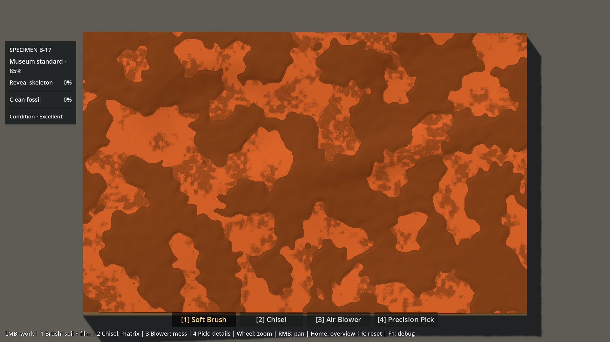 |
| Matrice nue | 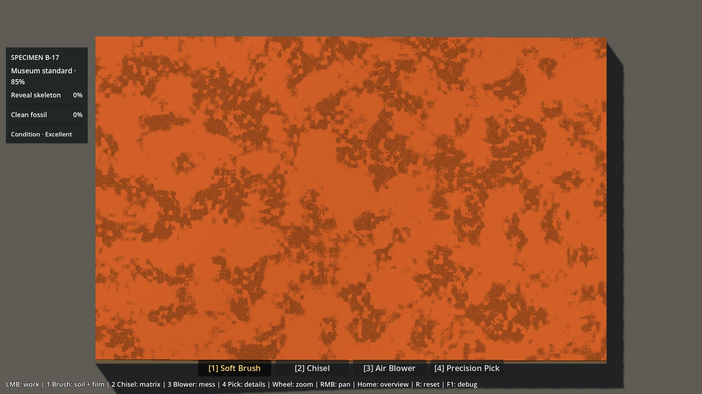 | 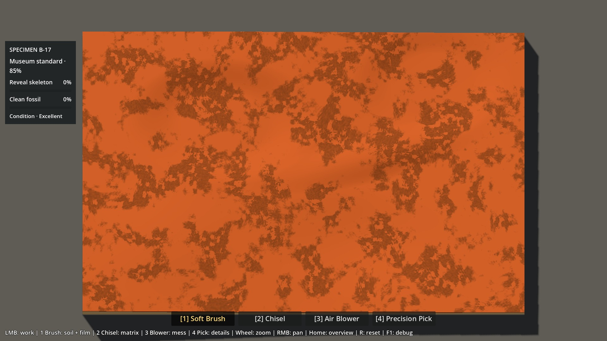 |
| Forme sans patine |  | 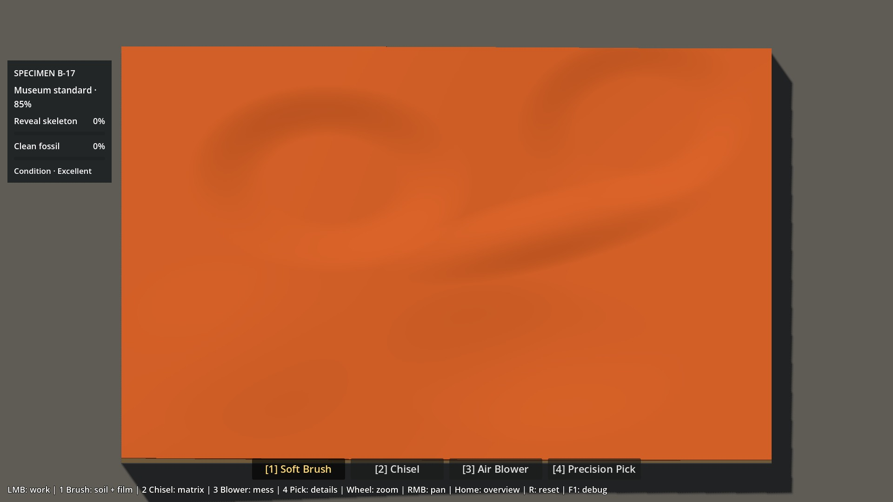 |
| Relief 3×, sans patine |  | 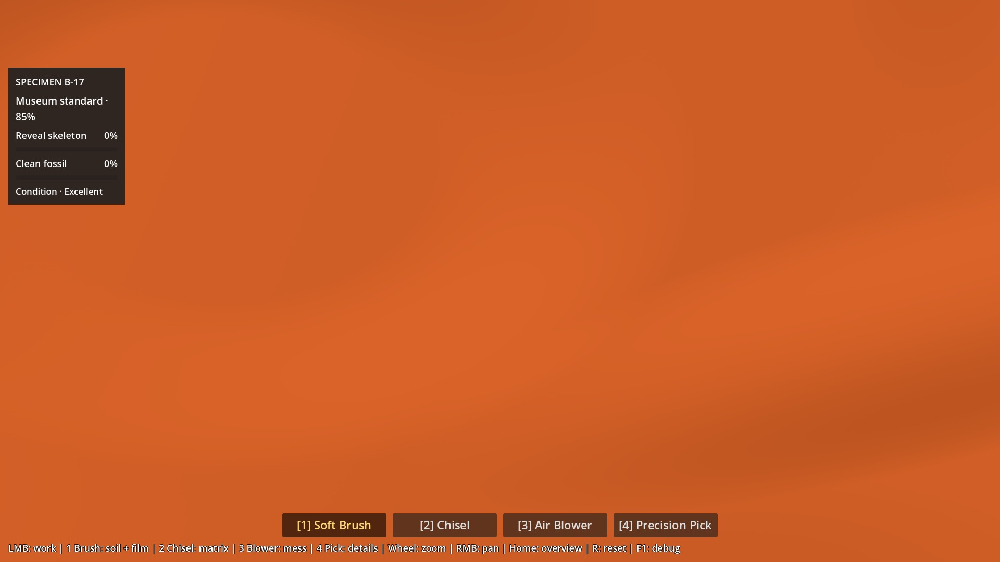 |
| Trajet Chisel | 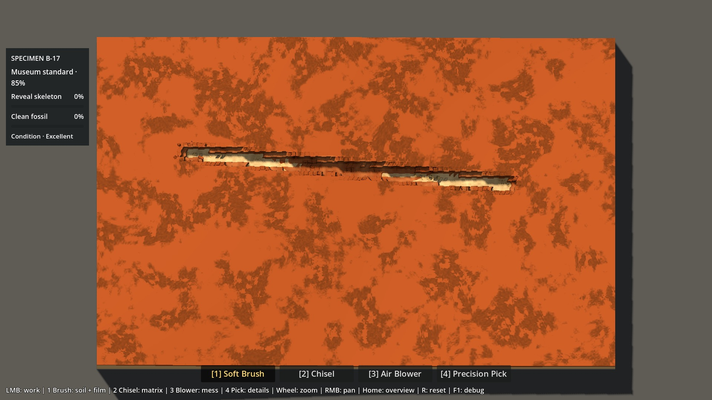 | 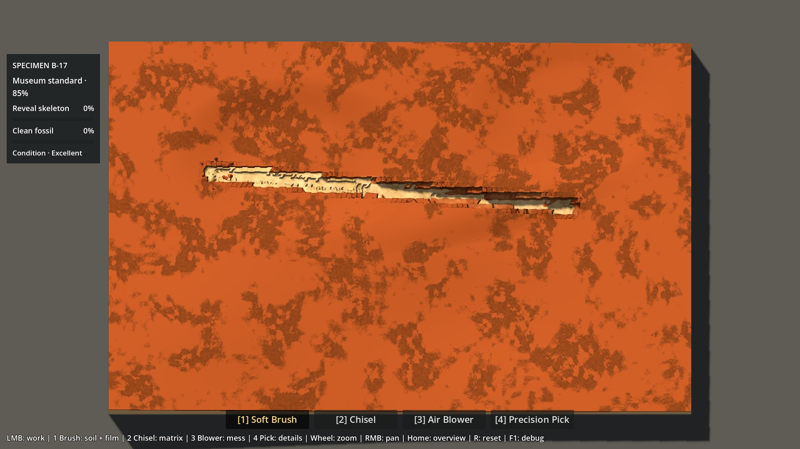 |
| Bone 3× | 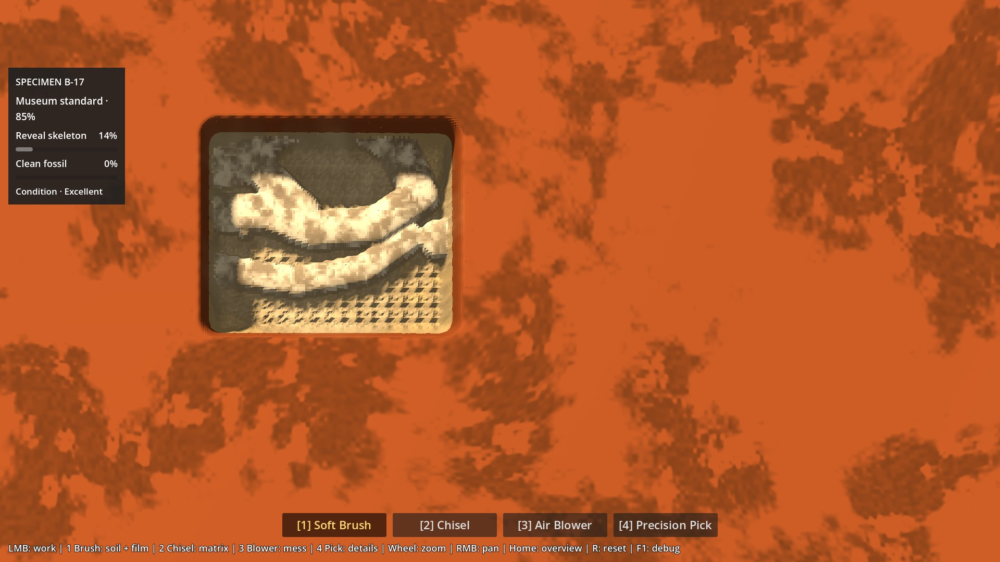 | 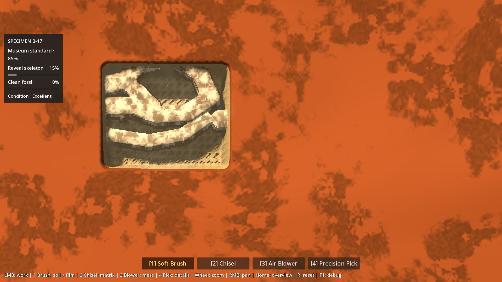 |
| Interface 3× | 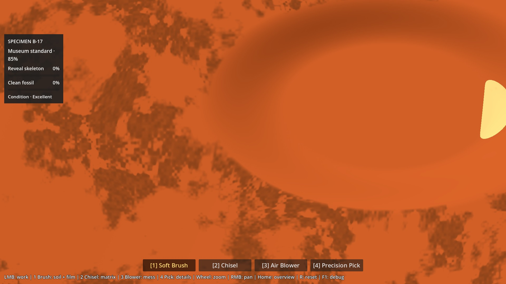 | 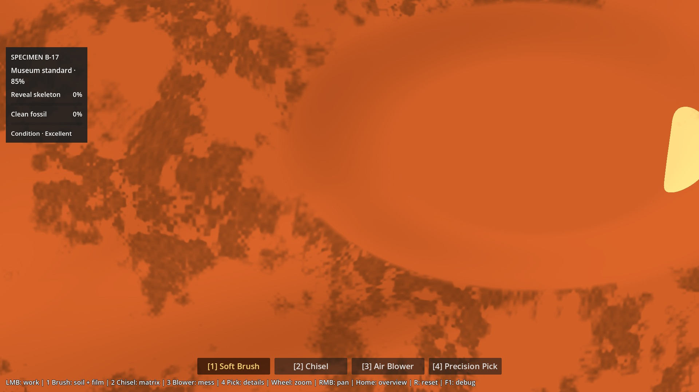 |

[Contrôles du lab](evidence/p6a16/controls-B.jpg). Les autres vues 1×/3× sont répertoriées dans [visual.json](evidence/p6a16/visual.json).

## Vérifications et performances

- **78 contrôles géométriques**, **43 contrôles graphiques** (23 captures + caméras + oracles), **84 contrôles benchmark** : zéro échec.
- Régression : **2 243 assertions P0–P5**, replays interprocessus inclus ; Material Lab **220**, Soil Lab **64 + 24 graphiques**. Import et scène de smoke test passent ; aucun `SCRIPT ERROR`, `ERROR` ou échec de shader dans la chaîne. [Résumé des suites](evidence/p6a16/regression.json).
- Reset déterministe, zéro Bone au départ, cartes fossile/plafonds/IDs identiques, Soil conforme, Brush arrêté à la matrice, Chisel/Pick natifs, film/exposition cohérents, Condition intacte au Pick, milestones 85/95 et Archive/réarmement P5 vérifiés. Aucun rebuild/upload au repos.
- **16 637 rayons GPU/CPU** à 1×/3× sur A/B et états départ/nue/Chisel/Bone. Erreur maximale **0,00887 mm**, après la tolérance spatiale historique ±0,01 texel appliquée à deux rayons de rasterisation (maximum brut 0,01942 mm). Oracle natif indépendant sur les 16 rayons successivement les plus défavorables : écart max **0,000112 mm**, sous le seuil historique de 0,005 mm.
- Le test GPU conserve le vertex shader réel et encode la hauteur dans trois canaux de 6 bits décalés en tons moyens, précision 0,000389 mm. Un premier encodage 16 bits utilisant du noir produisait une fausse erreur de 1,60 mm à cause de la conversion des basses couleurs de Compatibility, déjà documentée dans `surface_debug.gdshader`. Correction du **test uniquement**, aucun changement du picking ou du rendu de jeu. [Résultats graphiques](evidence/p6a16/visual.json), [géométrie complète](evidence/p6a16/tests.json).

Machine : **Ryzen 7 9800X3D / RTX 5080 / NVIDIA 610.88**, Godot **4.7.2 stable**, Compatibility OpenGL 3.3, viewport **1920×1080**, cap **240 FPS**, physique **60 Hz**. 28 cas : deux candidats × deux zooms × sept usages. 45 frames de chauffe puis 180 ticks physiques (3 s) par cas ; contrôleur réel, cadrage A copié sur B. Les shaders et textures sont identiques. Les mesures incluent le comportement natif des outils et FX ; elles ne représentent pas une session complète.

| Zoom / usage | Frame P95 A / B (ms) | GPU moyen A / B (ms) | Édition CPU P95 A / B (ms) |
|---|---:|---:|---:|
| 1× départ au repos | 4,317 / 4,332 | 0,983 / 0,989 | 0,000 / 0,000 |
| 1× matrice au repos | 4,318 / 4,322 | 1,021 / 1,021 | 0,000 / 0,000 |
| 1× Brush Soil | 8,447 / 8,393 | 0,992 / 0,986 | 4,094 / 4,142 |
| 1× Chisel | 4,649 / 4,708 | 1,021 / 1,022 | 4,990 / 4,684 |
| 1× Pick | 4,568 / 4,586 | 1,022 / 1,018 | 1,372 / 1,382 |
| 1× Blower | 6,857 / 7,434 | 1,006 / 1,015 | 0,475 / 0,502 |
| 1× Brush Bone Film | 9,775 / 9,811 | 1,009 / 1,004 | 3,755 / 3,688 |
| 3× départ au repos | 4,323 / 4,317 | 0,549 / 0,544 | 0,000 / 0,000 |
| 3× matrice au repos | 4,346 / 4,328 | 0,584 / 0,581 | 0,000 / 0,000 |
| 3× Brush Soil | 8,412 / 8,480 | 0,538 / 0,545 | 4,080 / 4,193 |
| 3× Chisel | 4,634 / 4,703 | 0,581 / 0,582 | 4,883 / 4,640 |
| 3× Pick | 4,576 / 4,601 | 0,583 / 0,582 | 1,367 / 1,425 |
| 3× Blower | 6,816 / 7,525 | 0,581 / 0,586 | 0,473 / 0,478 |
| 3× Brush Bone Film | 9,797 / 9,859 | 0,567 / 0,575 | 3,778 / 3,702 |

Le CPU d’édition est échantillonné par tick ; les outils à impacts incluent donc des ticks sans frappe. Le CPU de rendu (mesure Godot, pas CPU total) reste à **0,333–0,390 ms P95**, le picking à **0,058–0,134 ms P95**. Construction initiale des deux profils : **0,952 s** dans le run headless ; pas de construction pendant la fouille. Temps de frame maximal observé : **12,342 ms** ; P95 maximal **9,859 ms**, donc des pointes au-dessus des 4,167 ms d’un 240 FPS strict, déjà présentes dans A. Aucun changement de cap ni promesse de 240 FPS sans variation.

**Impact observé de B :** GPU moyen presque identique (écart absolu inférieur à 0,009 ms dans chaque paire) ; frame P95 Blower +0,58 ms à 1× et +0,71 ms à 3×, avec des amas préparés différents. Pas de test statistique multi-runs pour isoler une causalité fine. Les draw calls au repos sont identiques (42) ; ils peuvent différer en action car la quantité excavée/les débris diffèrent. [28 mesures détaillées et hashes avant/après](evidence/p6a16/benchmark.json).


Reproduction :

```powershell
.\tests\check_p6a16.ps1 -GodotBin "C:\Users\antoi\Downloads\Godot_v4.7.2-stable_win64.exe\Godot_v4.7.2-stable_win64_console.exe" -Regression -Graphical -Benchmark
```

## Limites et coût de production

- C’est un prototype géométrique d’un seul B-17, pas un générateur de blocs. Les formes elliptiques peuvent encore paraître trop régulières ; leur naturel reste à juger.
- La caméra quasi verticale et la lumière P5 atténuent le volume. La patine peut masquer les pentes. La comparaison sans patine rend la géométrie plus facile à évaluer ; elle ne constitue pas une nouvelle DA.
- Palette, grain, patine procédurale, Soil et Bone Film, bords rectangulaires, outils visuels et UI sont des placeholders ou baselines conservés. Aucune texture, lumière, jacket ou silhouette de production n’a été créée.
- Pas de test de durée d’une session complète, ni preuve automatique du plaisir ou de l’accessibilité de chaque poche. Les pentes initiales sont bornées et les outils restent sûrs ; la sensation à la souris reste une décision humaine.
- Aucun asset externe requis. Itération : modifier cinq entrées et le biais central, relancer le lab pour rebâtir le cache, puis rejouer mesures, captures et budgets Bone. Caches A/B : 20 MiB bruts au total ; aucune texture GPU additionnelle ni draw call propre aux macroformes. La construction est ponctuelle ; reset/bascule recopient les cartes. Le volume excavé peut changer le coût CPU des actions et le nombre de débris, même avec le même mesh.

## Retest humain court

Depuis la racine du dépôt :

```powershell
.\Launch-Natural-Matrix-Lab.ps1
```

Scène exacte : `res://scenes/p6a16_natural_matrix_lab.tscn` (F6 dans Godot). Le lanceur utilise Godot 4.7.2 dans Downloads ; sinon passer `-GodotBin`.

1. Au départ, comparer **A/B avec F8**, sans changer la vue. Les deux ont le Soil mince accepté. Brosser quelques passages.
2. **F9** : matrice nue. Alterner A/B ; désactiver puis réactiver la patine dans le panneau. Zoomer avec la molette jusqu’à 3×, déplacer avec RMB. Home restaure la vue.
3. Dans la liste, essayer **Trajet Chisel**, **Préparation Bone**, puis **Interface**. F8 recharge exactement chaque préparation sur l’autre géométrie. Continuer librement avec les outils 1–4.
4. **R** restaure le départ du candidat courant et la vue. **H** masque le panneau ; il ne change aucun matériau.

Questions de verdict :

1. B paraît-il immédiatement moins plat ?
2. Le bloc semble-t-il plus naturel avant les textures finales ?
3. Cuvettes, crêtes et paliers sont-ils crédibles plutôt que bruités/procéduraux ?
4. Le Soil mince gagne-t-il en vie en suivant ce relief ?
5. Après retrait du Soil, la matrice ressemble-t-elle à une vraie surface irrégulière à travailler ?
6. La fouille reste-t-elle lisible et satisfaisante ?
7. Certaines poches ou pentes sont-elles gênantes ou inaccessibles ?
8. Le relief suggère-t-il trop la forme du fossile caché ?
9. Cette géométrie est-elle une base suffisamment variée pour P6A2 ?
10. Choix : **A / B / correction ciblée** ?

Les résultats techniques ne valent pas verdict humain. La recommandation B reste une proposition.
