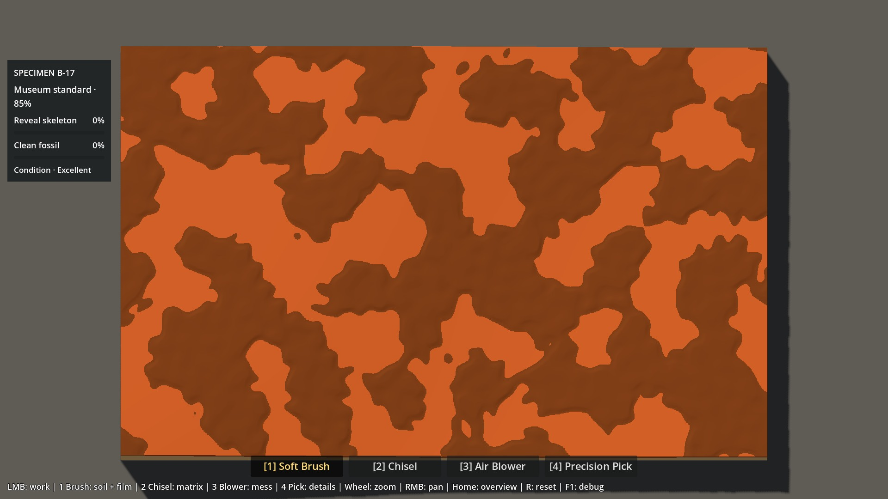
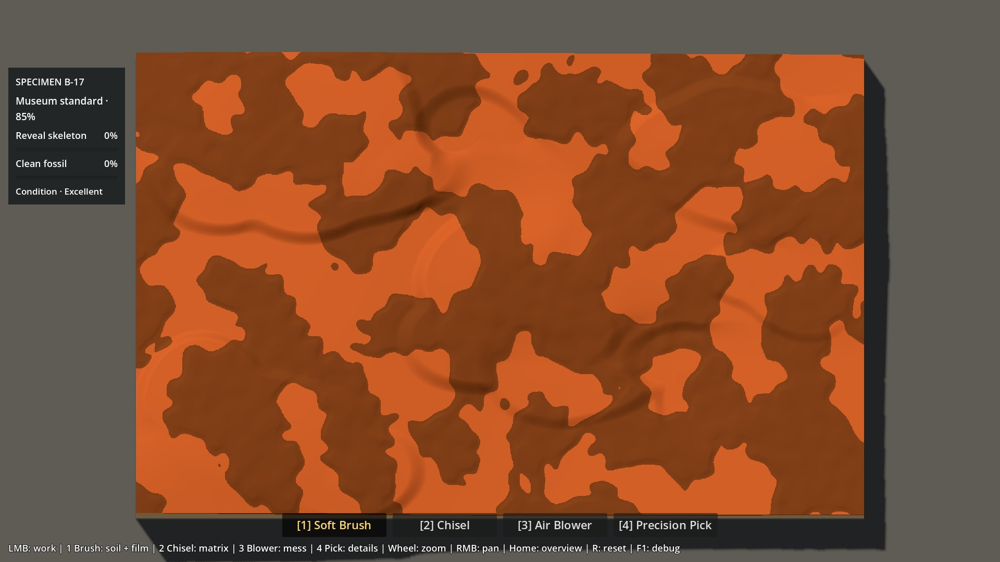
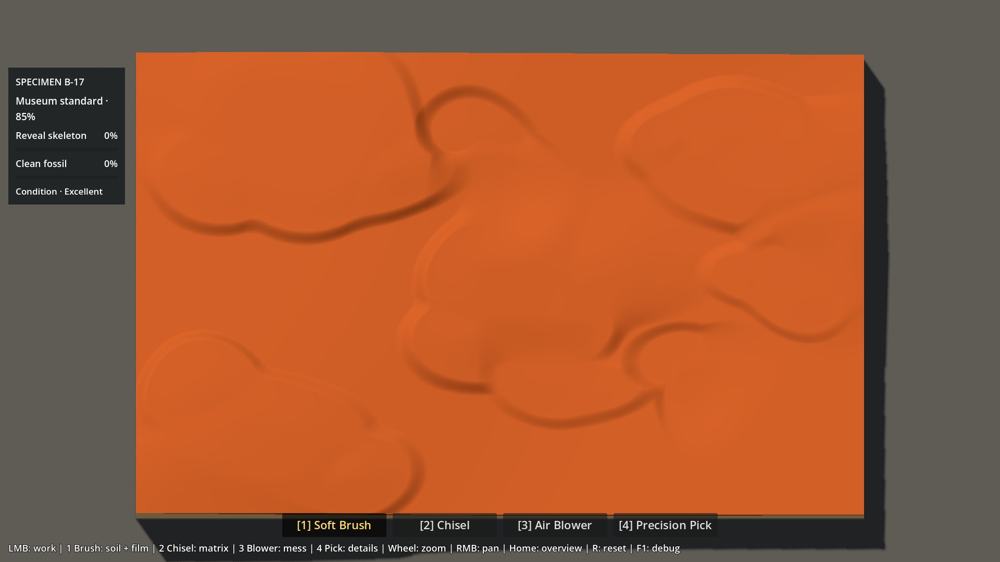
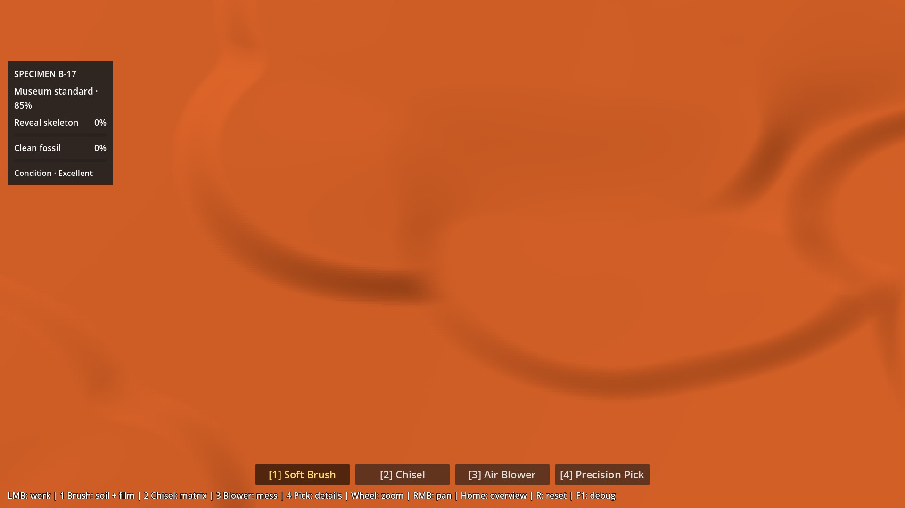
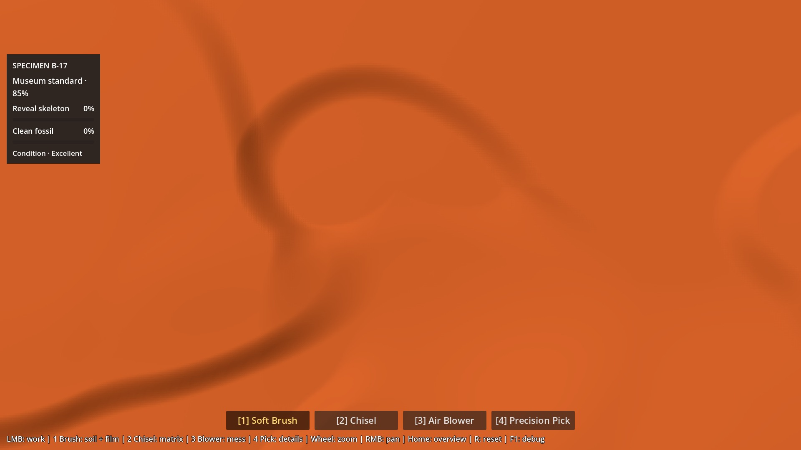
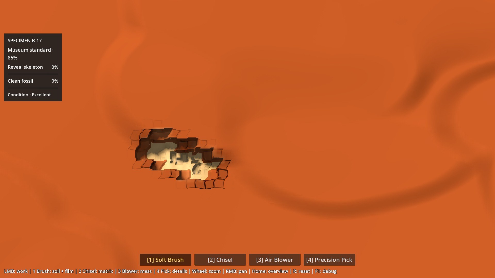

# P6A1.6 — B : affleurements sur substrat continu

2026-10-06. Correction ciblée après le [B polygonal](P6A16_STRUCTURED_MATRIX_REPORT.md) : Antoine reconnaît la meilleure lecture des niveaux, mais refuse l’effet de toile découpée / puzzle. Le [statut canonique](../brain/status.md) porte la gate courante. Ce rapport décrit une proposition à revoir, pas une fondation approuvée.

## Correction

**A est inchangé. B contient quatre affleurements principaux, deux épaulements imbriqués et deux poches sur un substrat continu.** Les surfaces basses se prolongent entre les masses. Chaque masse possède un front plus franc et un côté qui se raccorde progressivement au substrat ; les deux épaulements interrompent les fronts des masses centrale et est.

Le vrai heightfield porte ces volumes. Shader, texture, patine, lumière, caméra, outils, Soil mince et Bone Film sont conservés. Aucune microtexture ou nouvelle géométrie statique.

## Construction et amplitudes

Source : [`natural_matrix_profile.gd`](../../scripts/p6a/natural_matrix_profile.gd). [Paramètres complets](evidence/p6a16-outcrops/parameters.json).

- Substrat continu : décalage initial de **−10 mm** par rapport au dessus Clay de A ; l’interface Clay/Sandstone inférieure reste exactement celle de A.
- Chaque masse est une union de **2–3 ellipses** (20 lobes au total), avec raccord d’union lissé sur 12 mm. Pas de contour polygonal, de longues droites ni de pavage.
- Front et dos utilisent la même distance radiale elliptique, exprimée en mm par le petit rayon : ce n’est pas une distance euclidienne exacte. Largeur nominale du raccord **19–21 mm** côté front, jusqu’à **85–150 mm** côté fusion ; transition directionnelle progressive. La largeur physique dépend aussi de l’allongement du lobe et de la déformation ci-dessous.
- Faible déformation des coordonnées des frontières : `x′=x+8 sin(y/43)+4 sin((x+y)/77)` ; `y′=y+11 sin(x/61)+3 cos(y/37)`, en mm. Longueurs d’onde ~230–484 mm, déplacement borné à ±12 / ±14 mm ; aucune couche de bruit ajoutée à la hauteur.
- Dessus légèrement bombés (0,5–3 mm) et inclinés (amplitude signée maximale 0,4–1,1 mm), tout en gardant les fronts. Les formes sont interpolées dans l’ordre ; elles n’additionnent pas leurs niveaux en pics. Les poches ont un côté de sortie progressif, sans anneau abrupt complet.
- Les lobes UV ne lisent ni masque ni plafond Bone. La même quantité locale de Soil est translatée sur le nouveau dessus Clay. Aucun clamp sur le fossile.

| Forme | Niveau nominal relatif à A (mm) | Couronne (mm) | Front → fusion (mm) |
|---|---:|---:|---:|
| Affleurement nord-ouest | 0 | 3,0 | 20 → 140 |
| Affleurement central | +1 | 2,8 | 20 → 125 |
| Affleurement est | −0,5 | 3,0 | 21 → 150 |
| Affleurement sud-ouest | −0,8 | 2,8 | 19 → 130 |
| Épaulement sud de la masse centrale | −3,5 | 0,9 | 19 → 85 |
| Épaulement de la masse est | −4 | 0,8 | 19 → 95 |
| Poche nord, sortie douce au sud | −19 | 0,6 | 21 → 130 |
| Poche sud-est, sortie douce à l’est | −17 | 0,5 | 20 → 110 |

Les masses principales émergent nominalement de **9,2–11 mm**, plus leurs couronnes, au-dessus du substrat local. Les poches descendent de 7–9 mm sous ce substrat. Décalage échantillonné total **−19,22 à +4,15 mm** par rapport à A ; géologie existante comprise, matrice **41,12–89,34 mm** au-dessus de la base, contre 58,14–85,68 mm pour A.

**79,6 % de la surface reste sous 6° ; 8,06 % dépasse 15°.** Pente P95 22,30°, maximum 52,97°. Les seuils géométriques du précédent test restent inchangés ; reconstruction 97×61 : erreur RMS **0,214 mm**, sous 0,35 mm. Les faibles pentes incluent les dessus des masses : ce pourcentage n’est pas une mesure de surface libre entre elles.

## Captures de revue

Même caméra et même état initial A/B, à 1×, **patine OFF** :

| A — référence avec Soil mince | B — affleurements avec le même Soil |
|---|---|
|  |  |

Matrice nue, même vue 1×, **patine OFF** :

| A | B |
|---|---|
|  |  |

B à 3×, **front de la masse centrale + zone basse adjacente**, sans patine :



B à 3×, **poche naturelle nord**, sans patine :



Même cadrage de la masse centrale, après **8 impacts du Chisel natif**, sans patine :



Le trajet est déterministe, de `(420,455)` à `(474,477)` en cellules 1024×640. Aucun coup n’est simulé par une coupe manuelle. [Vue d’ensemble après les impacts](evidence/p6a16-outcrops/outcrop-B-1x-after-8-chisel-no-patina.jpg). Les autres fixtures historiques (72 coups Chisel, préparation Pick/Bone et coupe d’interface) restent dans les [preuves graphiques](evidence/p6a16-outcrops/visual.json).

## Bone et budgets de travail

Zéro Bone exposé au départ, zéro inversion sur 655 360 cellules. **32 290 cellules anatomiques et plafonds identiques** à A ; distance minimale matrice/Bone **25,04 mm**. Clay minimum **1,22 mm**, restant positive. Soil 0–2 mm inchangé ; Brush ne creuse pas la matrice. Sandstone au-dessus de Bone exactement inchangée : P95 **17,12 mm**, maximum **21,49 mm**.

Oracle de travail conservé : `Clay ×3 + Sandstone ×5,333…`, sans traduction en secondes.

| Population | A médiane / P90 / P95 / max | B médiane / P90 / P95 / max | Écart médiane |
|---|---|---|---:|
| Global | 147.28 / 170.32 / 175.70 / 199.65 | 143.33 / 171.26 / 176.71 / 202.93 | -2.7 % |
| Skull | 150.49 / 173.70 / 178.96 / 195.84 | 149.81 / 164.36 / 169.36 / 187.78 | -0.5 % |
| Spine | 133.41 / 157.40 / 162.58 / 182.74 | 132.54 / 155.74 / 161.00 / 178.21 | -0.6 % |
| Ribs | 158.72 / 175.09 / 180.19 / 199.65 | 160.84 / 179.65 / 185.30 / 202.93 | +1.3 % |
| Hind Limb | 134.73 / 151.30 / 154.65 / 167.68 | 126.46 / 142.64 / 146.82 / 166.40 | -6.1 % |

Le travail médian global baisse de **2,7 %**. Le budget global P95 ≤180 / maximum ≤205 reste respecté (**176,71 / 202,93**). Aucun indicateur anatomique n’augmente de plus de 10 %. Les Ribs ont un P95 de 185,30, soit +2,8 % ; le plafond absolu de 180 porte sur la population globale, comme dans le test existant. L’absence de surcharge ne prouve pas une durée ou un confort identiques : Hind Limb reste ~6,1 % plus léger en médiane.

## Vérification et performances

**79 contrôles géométriques, 50 graphiques et 84 benchmark : zéro échec final.** P0–P5 : **2 243 assertions**, replays inclus ; Material Lab 220 ; Soil Lab 64 + 24 graphiques. Import et export sans erreur ni fuite signalée. [Détail des suites](evidence/p6a16-outcrops/regression.json).

Les 79 contrôles existants et leurs seuils sont conservés. Ils vérifient notamment les cartes Bone/plafonds, le Brush, les outils verrouillés, les resets, les fixtures, la progression/archive P5 et une reconstruction identique sans `FossilField`. La passe graphique ajoute les vues demandées et les huit impacts natifs. Une première tentative avait détecté un cadrage dérivé après le zoom ; le test arrête désormais la transition et synchronise sa cible avant de copier A sur B. Les captures livrées proviennent du retest réussi, sans modification de la caméra de production.

**16 639 rayons GPU/CPU** : erreur maximale **0,00887 mm**, après tolérance spatiale historique ±0,01 texel sur deux rayons (maximum brut 0,01942 mm). Oracle natif indépendant : **0,000112 mm** sur les 16 rayons successivement les plus défavorables. Seuils inchangés. [Résultats géométriques](evidence/p6a16-outcrops/tests.json) · [Oracles graphiques](evidence/p6a16-outcrops/visual.json).

Machine : Ryzen 7 9800X3D / RTX 5080 / NVIDIA 610.88, Godot 4.7.2 Compatibility, 1920×1080, cap 240 FPS / physique 60 Hz. 28 cas A/B, mêmes poses, 45 frames de chauffe puis 180 ticks physiques chacun. Ces mesures courtes sur une seule machine ne constituent pas une moyenne statistique multi-runs.

| Zoom / usage | Frame P95 A / B (ms) | GPU moyen A / B (ms) | Édition CPU P95 A / B (ms) |
|---|---:|---:|---:|
| 1× départ au repos | 4.329 / 4.319 | 0.957 / 0.970 | 0.000 / 0.000 |
| 1× matrice au repos | 4.330 / 4.323 | 0.988 / 0.973 | 0.000 / 0.000 |
| 1× Brush Soil | 8.465 / 8.494 | 0.946 / 0.949 | 4.209 / 4.216 |
| 1× Chisel | 4.640 / 4.657 | 0.964 / 0.986 | 5.063 / 4.919 |
| 1× Pick | 4.582 / 4.597 | 0.986 / 0.984 | 1.453 / 1.403 |
| 1× Blower | 6.835 / 6.759 | 0.989 / 0.962 | 0.484 / 0.503 |
| 1× Brush Bone Film | 9.992 / 9.809 | 0.982 / 0.980 | 4.117 / 3.763 |
| 3× départ au repos | 4.301 / 4.306 | 0.529 / 0.517 | 0.000 / 0.000 |
| 3× matrice au repos | 4.330 / 4.308 | 0.551 / 0.550 | 0.000 / 0.000 |
| 3× Brush Soil | 8.410 / 8.429 | 0.525 / 0.527 | 4.315 / 4.146 |
| 3× Chisel | 4.627 / 4.689 | 0.557 / 0.564 | 5.101 / 5.091 |
| 3× Pick | 4.562 / 4.603 | 0.572 / 0.567 | 1.404 / 1.426 |
| 3× Blower | 6.980 / 6.850 | 0.564 / 0.568 | 0.504 / 0.530 |
| 3× Brush Bone Film | 9.708 / 9.805 | 0.564 / 0.567 | 3.711 / 3.825 |

Écart GPU moyen absolu maximal par paire : **0,028 ms**. Frame P95 maximale **9,992 ms** ; maximum isolé **13,682 ms**. CPU de rendu P95 **0,350–0,426 ms** ; picking P95 au plus **0,136 ms**. Le cap 240 reste configuré, sans garantie de 4,167 ms constantes pendant les outils. [Mesures complètes](evidence/p6a16-outcrops/benchmark.json).

Construction initiale des caches A/B : **1.885 s**, une seule fois ; **20 MiB** de caches comme avant. Aucun shader, mesh, texture, asset ni draw call supplémentaire pour ces formes. Aucun calcul géologique par frame ; copies des caches au reset. La composition et ses amplitudes restent éditables dans un seul tableau ; le coût d’itération est surtout la revue visuelle et la vérification des budgets, sans nouvelle chaîne d’assets.

Reproduction complète :

```powershell
.\tests\check_p6a16.ps1 -GodotBin "C:\Users\antoi\Downloads\Godot_v4.7.2-stable_win64.exe\Godot_v4.7.2-stable_win64_console.exe" -Regression -Graphical -Benchmark
```


## Retest et limites

Lancer `./Launch-Natural-Matrix-Lab.ps1`, ou `scenes/p6a16_natural_matrix_lab.tscn` dans Godot puis F6. **F8** compare A/B en conservant le cadrage (la fixture est réinitialisée), **F9** montre la matrice nue. Désactiver la patine dans le panneau, masquer celui-ci avec H ; molette jusqu’à 3× et RMB pour se déplacer. R recommence, Home rétablit la vue. Le bouton B s’appelle « Affleurements + Soil mince ».

Revoir d’abord les volumes sans patine à 1×, puis une jonction masse/substrat à 3× ; effectuer quelques coups Chisel sur le front et poursuivre au Pick. La lecture est-elle celle de masses émergentes, avec des passages bas, ou encore celle de formes dessinées ? Les raccords restent-ils confortables à travailler ?

**Mon appréciation : ce B répond mieux au problème de pavage**, grâce aux contours courbes, aux dos fondus et aux épaulements qui interrompent les fronts. Les grands dessus et certains arcs peuvent encore paraître trop lisses/ronds avec ce matériau uniforme. Les captures les montrent volontairement sans patine ; leur crédibilité minérale reste à décider humainement. Le rectangle externe, le rendu de prototype et le crénelage des coupes Chisel à 3× ne sont pas corrigés dans cette passe. Aucune validation artistique ni canonisation. Arrêt après livraison pour le verdict d’Antoine.
