# P6A1.6 — Correction B : matrice structurée

> **Verdict humain ultérieur : non validé.** Les niveaux se lisent mieux, mais B évoque encore une toile découpée en plaques/polygones. Antoine demande des affleurements émergents sur un substrat continu. Voir la [nouvelle correction et ses preuves](P6A16_OUTCROPS_REPORT.md). Les mesures et captures ci-dessous documentent uniquement la version polygonale `4c05a56`.

2026-10-06. Correction ciblée après le [verdict humain sur le premier B](P6A16_NATURAL_GEOMETRY_REPORT.md). Le [statut du projet](../brain/status.md) conserve la gate courante.

## Ce qui change

**A reste identique : matrice P5 avec le Soil mince accepté. B remplace les lobes souples par dix masses/paliers polygonaux irréguliers qui s’imbriquent.** Des marches courtes relient de larges surfaces peu inclinées ; plusieurs poches restent ouvertes vers le haut. Les contours ont des encoches et des tailles différentes, et certaines masses continuent jusqu’au bord du rectangle pour éviter un pavage régulier d’îlots isolés.

La correction change uniquement les données géologiques initiales du lab. Shader, texture, patine, lumière, caméra, Soil, Bone Film et outils sont inchangés. L’effet visible sans patine vient bien des normales et ombres du **vrai heightfield**. Le rectangle de travail est conservé, sans jacket ni surplomb.

La nouvelle géométrie a une étendue verticale **plus petite** que le premier B (38,54 contre 42,14 mm), mais des raccords plus francs : la correction porte sur la structure, pas sur une augmentation générale de l’amplitude ou du bruit.

## Construction exacte

Source centrale : [`natural_matrix_profile.gd`](../../scripts/p6a/natural_matrix_profile.gd). Paramètres complets, y compris chaque sommet UV : [parameters.json](evidence/p6a16-structured/parameters.json).

1. Reprendre exactement les limites géologiques de A. Initialiser le décalage de surface à **−6 mm**, celui de l’interface Clay/Sandstone à zéro.
2. Parcourir les dix contours dans l’ordre du tableau. Mesurer la distance signée à leur bord en **millimètres physiques**, sur le rectangle 1 100×700 mm.
3. Poids `w = smoothstep(−largeur/2, +largeur/2, distance_signée)`. Interpoler le décalage courant vers le niveau de la forme. Les masses se recouvrent par interpolation, sans additionner des hauteurs en pics. À l’intérieur, le décalage est constant : la faible pente géologique de A demeure, au lieu d’une nouvelle bosse arrondie.
4. Ajouter ces décalages aux limites Clay/Sandstone réelles. Poser exactement la même quantité locale de Soil au-dessus. Les raccords de 18–22 mm restent continus et représentables par le mesh existant ; aucune paroi verticale ou face cachée.

| Ordre / masse | Niveau de surface relatif à A (mm) | Interface relative à A (mm) | Largeur totale du raccord (mm) |
|---|---:|---:|---:|
| 1. Masse nord-ouest | 0 | 0 | 20 |
| 2. Poche centrale ouverte | −17 | −0,6 | 22 |
| 3. Palier nord-est | −9 | −0,3 | 18 |
| 4. Banc ouest | −10 | −0,5 | 20 |
| 5. Plaque centrale | +1 | 0 | 18 |
| 6. Masse est | 0 | 0 | 20 |
| 7. Dalle sud-ouest | +1 | 0 | 18 |
| 8. Cuvette sud | −10 | −0,5 | 20 |
| 9. Socle sud-est | −10 | −0,2 | 18 |
| 10. Replat imbriqué | −3 | −0,2 | 18 |

Les contours sont définis en UV, sans lecture du fossile, sans bruit ni seed et sans clamp sur Bone. Le test reconstruit B à partir d’une géologie sans `FossilField` et obtient les mêmes octets. Les boîtes englobantes des formes sont précalculées une fois pour accélérer le build ; les caches A/B continuent de servir les resets. Pas de reconstruction par frame ni à chaque impact.

## Géométrie, Bone et travail

| Mesure | A | B corrigé |
|---|---:|---:|
| Matrice au-dessus de la base, mm | 58,14–85,68 | 48,14–86,68 |
| Étendue verticale, mm | 27,54 | 38,54 |
| Clay, épaisseur min–max, mm | 11,22–40,98 | 1,42–37,56 |
| Pente médiane / P95 / max | 1,09° / 4,55° / 4,85° | 2,09° / 22,47° / 50,76° |
| Surface sous 6° | 100 % | 85,7 % |
| Surface au-dessus de 15° | 0 % | 9,2 % |
| Distance minimale matrice → Bone, mm | 31,33 | 22,32 |
| Sandstone au-dessus de Bone : P95 / max, mm | 17,12 / 21,49 | 17,08 / 21,49 |

Zéro inversion sur 655 360 cellules ; zéro Bone exposé au départ ; mêmes 32 290 cellules, IDs anatomiques et plafonds. Soil 0–2 mm inchangé, Brush arrêté à la matrice. La couche Clay peut devenir fine localement (1,42 mm), mais reste positive et attachée ; aucun traitement spécial du Brush.

Oracle de travail conservé : **Clay ×3 + Sandstone ×5,333…**, sans interprétation en secondes.

| Population | A médiane / P90 / P95 / max | B médiane / P90 / P95 / max |
|---|---|---|
| Tous les os | 147,28 / 170,32 / 175,70 / 199,65 | 140,97 / 169,63 / 175,21 / 200,67 |
| Skull | 150,49 / 173,70 / 178,96 / 195,84 | 150,49 / 173,70 / 178,96 / 195,84 |
| Spine | 133,41 / 157,40 / 162,58 / 182,74 | 128,29 / 149,07 / 153,63 / 174,83 |
| Ribs | 158,72 / 175,09 / 180,19 / 199,65 | 151,21 / 174,34 / 179,97 / 200,67 |
| Hind Limb | 134,73 / 151,30 / 154,65 / 167,68 | 115,06 / 129,01 / 133,29 / 158,43 |

Médiane globale **−4,3 %** ; Skull inchangé, contrairement à la forte baisse du premier B. Le maximum global augmente de 0,5 %. Budgets P4 maintenus : travail P95 ≤180 / max ≤205 ; Sandstone P95 ≤18 mm / max ≤22 mm. Aucun indicateur anatomique ne dépasse A de plus de 10 %. Cela ne remplace pas un test humain de durée ou d’accessibilité.

## Comparaison visuelle

Mêmes presets et même cadrage exact A/B que la première livraison. Les presets Chisel/Pick utilisent les mêmes actions natives ; leurs résultats reflètent la différence de matrice. Les captures de la première livraison restent dans `evidence/p6a16/` ; celles-ci sont séparées.

| Vue | A conservé | B corrigé |
|---|---|---|
| Départ, Soil et patine actifs | 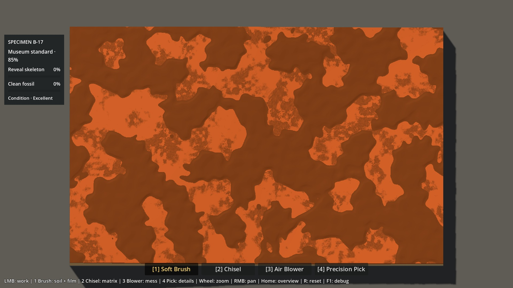 | 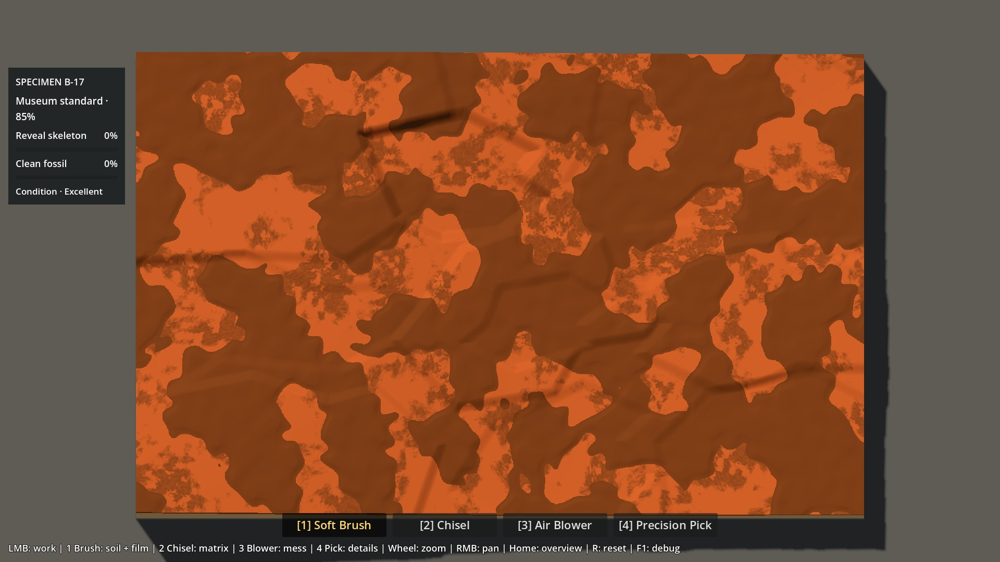 |
| Matrice nue, patine active |  | 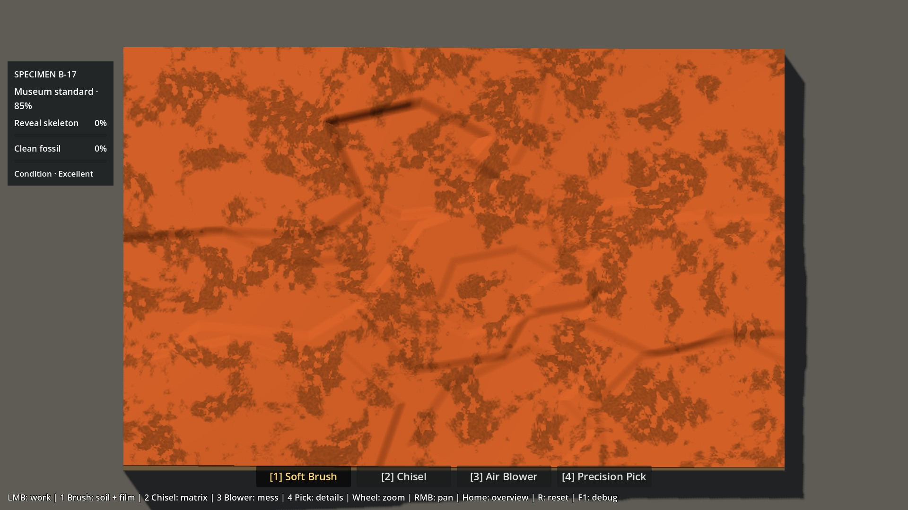 |
| Géométrie seule, patine OFF | 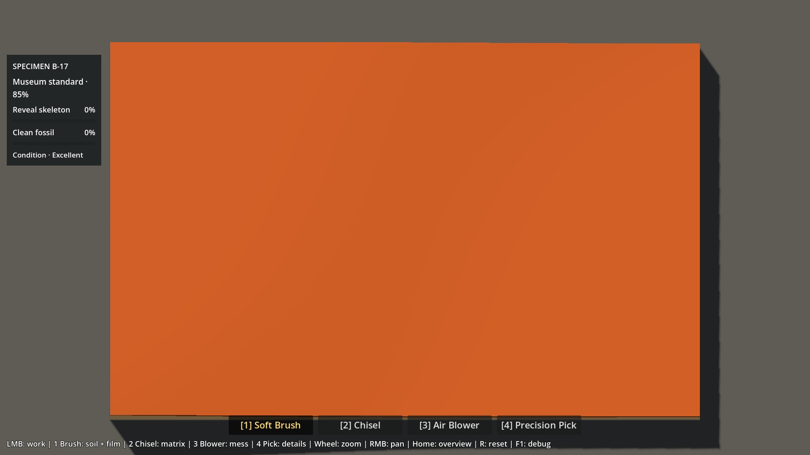 | 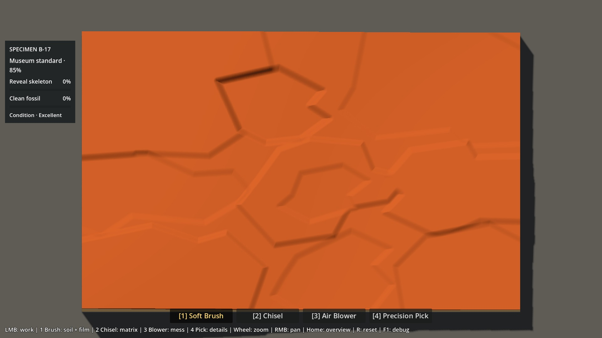 |
| Marches 3×, patine OFF | 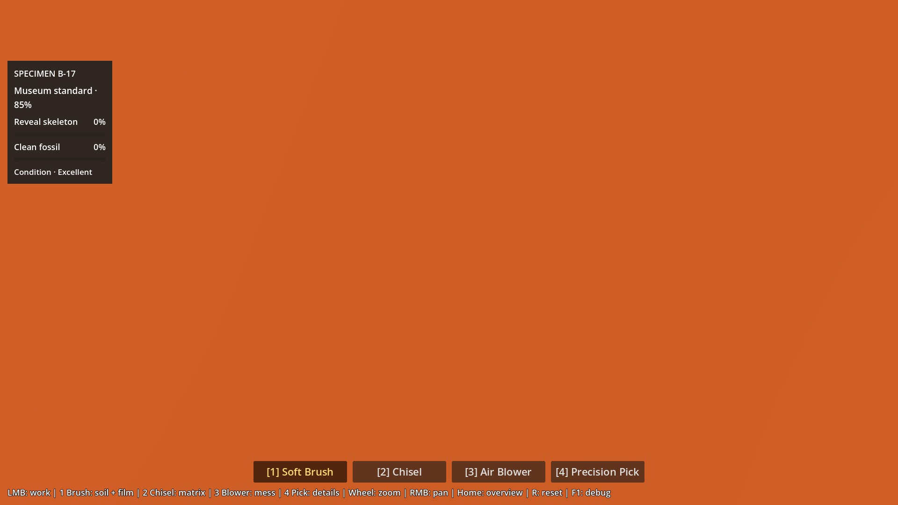 | 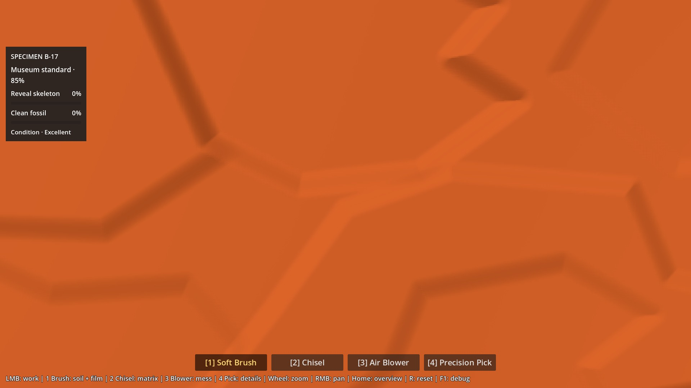 |
| Même trajet Chisel | 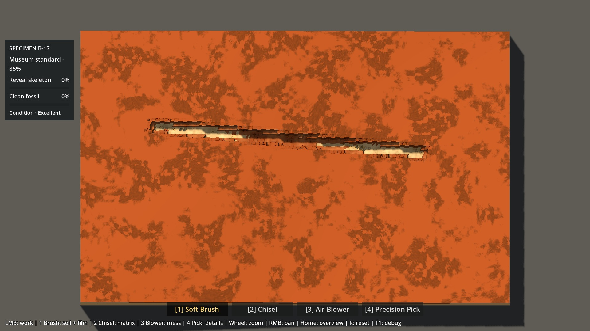 | 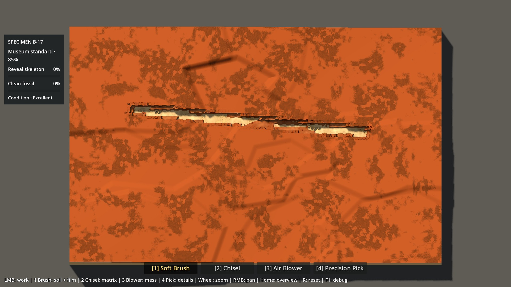 |
| Préparation Bone 3× | 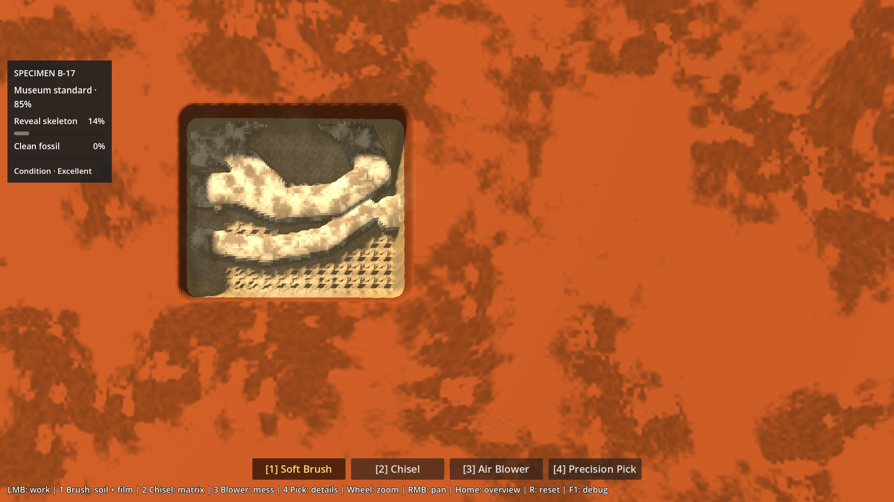 | 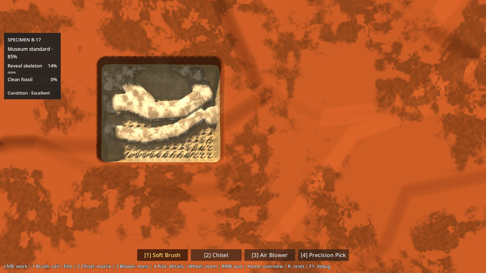 |

Les [23 captures](evidence/p6a16-structured/visual.json) incluent aussi le témoin Clay/Sandstone et les contrôles. PNG originaux dans `work/test-logs/p6a16-structured/`, JPEG de revue versionnés.

## Vérification et performances

**79 contrôles géométriques, 43 graphiques et 84 benchmark : zéro échec.** Régressions P0–P5 : **2 243 assertions**, replays inclus ; Material Lab 220, Soil Lab 64 + 24 graphiques, tous verts. [Détail des suites](evidence/p6a16-structured/regression.json).

Le reset, les cartes fossile/plafonds, le Brush, les fixtures Chisel/Pick, le film, les protections et la progression P5 restent couverts. **16 638 rayons GPU/CPU** : erreur maximale **0,00887 mm**, après tolérance spatiale historique ±0,01 texel pour quatre rayons (brut 0,01942 mm). Oracle natif indépendant : **0,000112 mm** maximum sur les 16 rayons successivement les plus défavorables. Seuils de picking inchangés. [Géométrie](evidence/p6a16-structured/tests.json) · [Oracles graphiques](evidence/p6a16-structured/visual.json).

Un contrôle final des sorties console a détecté 22 ressources retenues à la fermeture de l'import éditeur. Le cache de boîtes englobantes a été rattaché à chaque instance de profil au lieu d'une variable statique de script. Import et 79 contrôles géométriques rejoués sans erreur ni fuite signalée ; données et mesures géométriques identiques avant/après. Ce correctif de durée de vie ne change pas le rendu ni les actions mesurées.

Machine : Ryzen 7 9800X3D / RTX 5080 / NVIDIA 610.88, Godot 4.7.2 stable Compatibility, 1920×1080, cap 240 FPS / physique 60 Hz. Même protocole : 45 frames de chauffe puis 180 ticks physiques par cas ; caméra A copiée exactement sur B, contrôleur natif. 28 cas en tout. Les mesures courtes ne sont pas un test statistique multi-runs.

| Zoom / usage | Frame P95 A / B (ms) | GPU moyen A / B (ms) | Édition CPU P95 A / B (ms) |
|---|---:|---:|---:|
| 1× départ au repos | 4,312 / 4,334 | 0,970 / 0,940 | 0,000 / 0,000 |
| 1× matrice au repos | 4,305 / 4,313 | 0,994 / 1,000 | 0,000 / 0,000 |
| 1× Brush Soil | 8,612 / 8,535 | 0,960 / 0,954 | 4,445 / 4,395 |
| 1× Chisel | 4,629 / 4,706 | 0,970 / 0,996 | 4,994 / 4,857 |
| 1× Pick | 4,586 / 4,617 | 0,956 / 0,989 | 1,373 / 1,367 |
| 1× Blower | 6,845 / 7,029 | 0,976 / 0,967 | 0,477 / 0,474 |
| 1× Brush Bone Film | 9,864 / 10,045 | 0,976 / 0,982 | 3,890 / 4,615 |
| 3× départ au repos | 4,325 / 4,309 | 0,524 / 0,519 | 0,000 / 0,000 |
| 3× matrice au repos | 4,323 / 4,317 | 0,562 / 0,554 | 0,000 / 0,000 |
| 3× Brush Soil | 8,628 / 8,588 | 0,526 / 0,528 | 4,438 / 4,315 |
| 3× Chisel | 4,644 / 4,690 | 0,560 / 0,563 | 4,990 / 4,763 |
| 3× Pick | 4,572 / 4,591 | 0,556 / 0,560 | 1,378 / 1,397 |
| 3× Blower | 6,817 / 6,822 | 0,557 / 0,568 | 0,449 / 0,494 |
| 3× Brush Bone Film | 10,241 / 10,017 | 0,570 / 0,559 | 4,398 / 4,070 |

Construction des caches A/B : **1,584 s** une fois, puis copie au reset. 20 MiB bruts de caches comme avant, aucune texture ou draw call ajouté par le relief, aucun rebuild géologique au repos. Les débris natifs peuvent faire varier les draw calls en action.

Écart GPU moyen absolu maximal par paire : **0,033 ms**. Frame P95 maximale : **10,241 ms** ; maximum isolé : **13,283 ms**. CPU de rendu P95 : **0,350–0,468 ms** ; picking P95 au plus **0,176 ms**. Le cap 240 reste configuré ; il ne garantit pas une frame constante de 4,167 ms pendant les outils. [Mesures complètes, états et cadrages](evidence/p6a16-structured/benchmark.json).


Les critères géométriques ont été adaptés **explicitement au retour humain** : la limite de pente de 40° du relief souple est remplacée par 60° pour les marches (mesure réelle 50,76°), avec de larges intérieurs peu inclinés (>55 % sous 6°) et des raccords lisibles (>8 % au-dessus de 15°). Ce seuil numérique n’est pas une validation d’accessibilité humaine. L’oracle de fréquence utilise désormais 97×61 points (~11 mm), car la grille 33×21 (~34 mm) effaçait les raccords de 18–22 mm demandés. L’exigence d’erreur RMS <0,35 mm est conservée : **0,256 mm** mesuré. Les garde-fous Bone, interfaces, travail, outils, reset, progression et précision du picking ne sont pas relâchés.

Commande de reproduction :

```powershell
.\tests\check_p6a16.ps1 -GodotBin "C:\Users\antoi\Downloads\Godot_v4.7.2-stable_win64.exe\Godot_v4.7.2-stable_win64_console.exe" -Regression -Graphical -Benchmark
```

## Retest ciblé et limites

```powershell
.\Launch-Natural-Matrix-Lab.ps1
```

Scène inchangée : `res://scenes/p6a16_natural_matrix_lab.tscn`. Le bouton B porte maintenant le nom **« Matrice structurée + Soil mince »**.

1. **F8** au départ : comparer A/B avec Soil, puis brosser quelques zones.
2. **F9**, puis **F8** : comparer la matrice nue, d’abord avec patine puis sans. Vérifier la lecture des niveaux dès 1× ; zoomer sur une marche à 3×.
3. Essayer le trajet Chisel et continuer librement sur une marche avec Chisel/Pick ; vérifier que les poches restent confortables à travailler. R recommence, Home restaure la vue, H masque le panneau.

Verdict attendu : **les masses et marches se lisent-elles immédiatement ; semblent-elles minérales plutôt que dessinées/découpées ; restent-elles agréables à fouiller ?** Choisir A, B corrigé, ou préciser une correction restante. Les dix questions générales du [brief](P6A16_NATURAL_GEOMETRY_BRIEF.md#human-review-questions) restent pertinentes.

Les contours restent une composition polygonale de prototype : certaines grandes faces peuvent encore paraître trop régulières. La patine conserve son aspect de test ; aucune matière, lumière ou silhouette finale n’a été produite. Une seule machine et des séquences courtes ont été mesurées, pas une session complète. Les pentes plus franches imposent une vraie revue à la souris ; les seuls tests techniques ne suffisent pas à les approuver. B corrigé reste une proposition, sans canonisation ni démarrage de P6A2.
