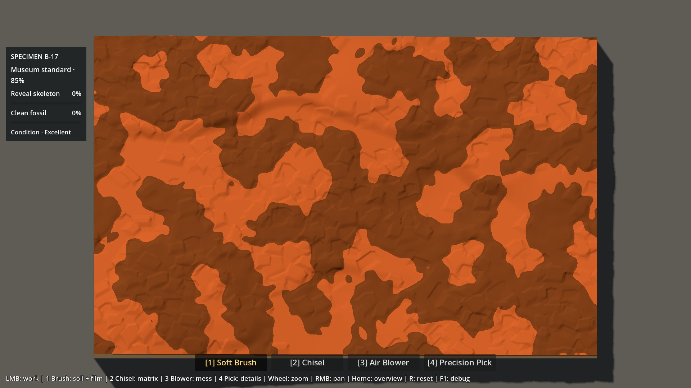
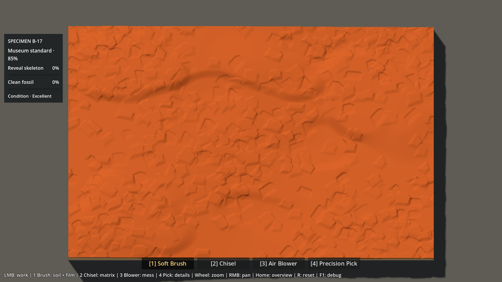
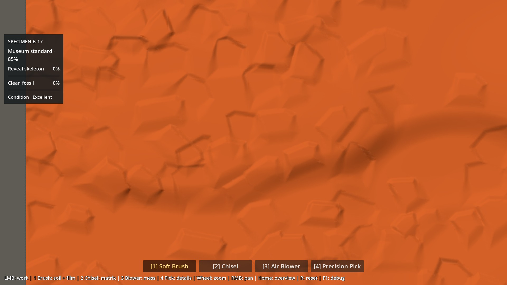
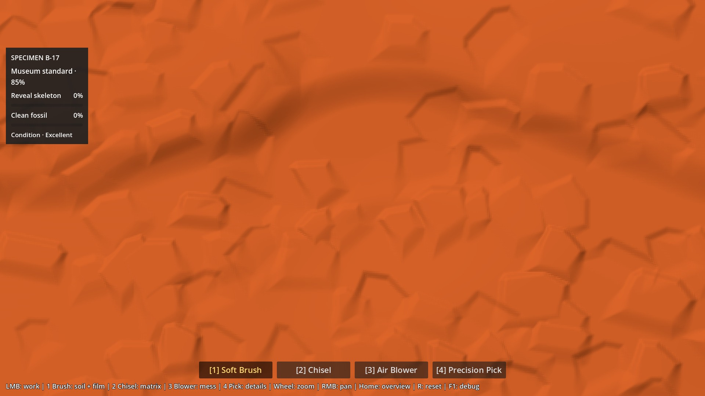
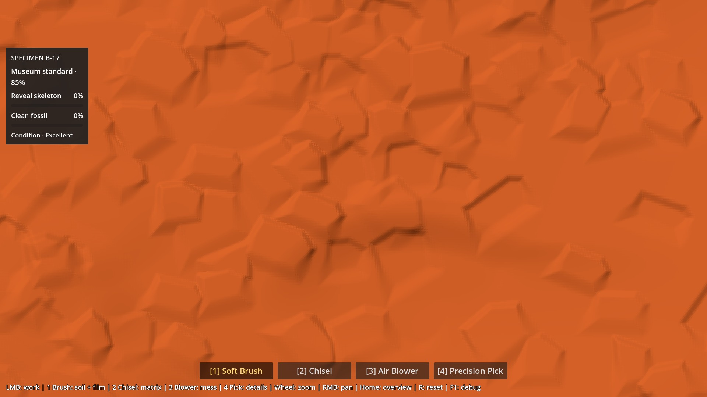
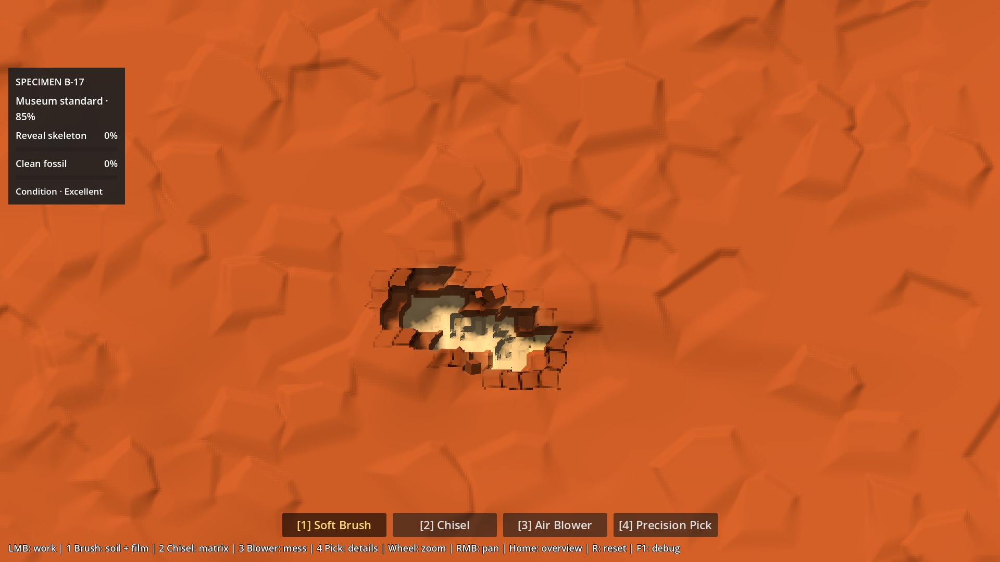

# P6A1.6 — Correction finale ciblée : macro + grammaire de surface méso

2026-10-06. Le dernier retour d’Antoine demande de tester la nature « petites unités minérales excavables » dès l’état initial. Les macroformes du [B précédent](P6A16_OUTCROPS_REPORT.md) ne suffisent pas : ce candidat ne constitue pas une fondation validée. Le [statut du dépôt](../brain/status.md) porte la gate courante.

## Ce qui change

**B combine maintenant un champ macro additif avec une structure méso de petits volumes irréguliers, tous inscrits dans le vrai heightfield.** Quatre masses principales positives, deux épaulements et trois poches organisent la composition ; de nombreux petits replats, faces courtes, marches et creux interrompent leurs dessus et les zones intermédiaires.

A reste exactement la référence précédente. Soil mince, patine, matériau, lumière, caméra, outils, Bone et progression P5 restent inchangés. Le test n’ajoute pas de vrais voxels : une seule hauteur par cellule, sans surplomb, dans les cartes RF/RGF et le mesh existants.

## Méthode et amplitudes

Tout est centralisé dans [`natural_matrix_profile.gd`](../../scripts/p6a/natural_matrix_profile.gd) ; [paramètres exportés](evidence/p6a16-surface-grammar/parameters.json).

**Macro :** biais −2 mm, puis somme de lobes signés. Les unions de 1–3 ellipses et la légère déformation de frontière antérieure sont conservées ; leur influence ajoute du relief au lieu d’interpoler toute une région vers un niveau cible. Couronne interne de 20 %, front nominal de 28–34 mm et raccord opposé de 80–110 mm. Les lobes voisins se recouvrent : aucun réseau de frontières ne partitionne le rectangle.

| Forme | Amplitude de contribution macro (mm) |
|---|---:|
| Masse nord-ouest | +12 |
| Masse est | +13 |
| Masse sud-ouest | +11 |
| Masse nord centrale | +10,5 |
| Deux épaulements | +4 / +3 |
| Trois poches (nord-ouest, est, sud) | −10 / −8 / −8 |

Ces amplitudes sont celles des fonctions avant leur influence locale, recouvrement et biais. Macro seul échantillonné : **−11,80 à +12,27 mm** par rapport à A.

**Méso :** empreintes de petits polygones convexes tronqués, décentrés et tournés, de dimensions nominales **22–48 × 18–40 mm**. Le placement part d’un pas de 32 mm, décalé jusqu’à ±11,2 mm par axe ; aucune cellule carrée n’est rendue comme voxel. Une densité à grande échelle regroupe les formes et laisse des intervalles calmes. Les orientations combinent une direction de groupe et une variation locale ; une coupe oblique supplémentaire casse leur symétrie.

Les empreintes s’unissent par maximum positif / minimum négatif, puis les deux champs sont additionnés : pas d’empilement illimité. Contributions positives 1,5–3,6 mm, négatives −1,4 à −2,8 mm ; raccords nominaux de 5–7 mm, jusqu’à 2,4 fois plus larges sur le côté qui s’efface. Les formes se chevauchent et ne dessinent pas toutes un contour fermé uniforme. Les quelques segments droits sont courts, à l’échelle des petites unités ; ils ne tracent plus de grandes plaques.

**444 empreintes** influencent réellement la carte, dont certaines sont rognées par le bord. Contribution méso réellement mesurée **−2,75 à +3,59 mm** ; **49,1 %** de la surface reçoit une variation méso de plus de 0,5 mm en valeur absolue. Aucun bruit haute fréquence, normal map ou nouveau shader ; disposition déterministe fixe, sans framework de seeds. La génération ne lit jamais Bone, même pour limiter une amplitude.

| Mesure réelle, toutes les cellules | A | B |
|---|---:|---:|
| Matrice au-dessus de la base (mm) | 58,14–85,68 | 48,61–98,61 |
| **B relatif à A : minimum / maximum** | — | **−12,88 / +14,91 mm** |
| Clay : épaisseur min / max (mm) | 11,22 / 40,98 | 7,06 / 52,60 |
| Pente médiane / P95 / maximum | 1,09° / 4,55° / 4,85° | 6,16° / 27,87° / 55,74° |
| Surface sous 6° / au-dessus de 15° | 100 % / 0 % | 49,3 % / 22,9 % |

**43,1 %** de B est au-dessus de A, dont **14,8 % au-dessus de +8 mm** ; 5,9 % est sous −6 mm. Il existe donc une vraie émergence positive, malgré un biais de fond légèrement négatif. L’interface inférieure Clay/Sandstone a un décalage de **0 mm partout** ; le dessus Soil/Clay reçoit le champ macro + méso. Le Soil conserve exactement sa quantité locale 0–2 mm au-dessus de ce nouveau dessus, sans remplissage des poches.

## Preuves visuelles

Toutes les vues suivantes sont **patine OFF**, avec la caméra et la lumière de production inchangées.

| Départ A, Soil mince | Départ B, même Soil |
|---|---|
|  |  |

B matrice nue, 1× :



| Masse positive nord-ouest, 3× | Poche adjacente, 3× |
|---|---|
|  |  |

Structure méso à 3×, puis **même caméra après 8 coups Chisel natifs** entre `(420,455)` et `(474,477)` sur la carte 1024×640 :

| Avant toute excavation | Après 8 impacts |
|---|---|
|  |  |

[30 captures et oracles](evidence/p6a16-surface-grammar/visual.json), incluant A matrice nue, trajet Chisel historique, préparation Pick/Bone et interface. Les preuves précédentes restent dans leurs dossiers historiques.

## Bone et travail

**Zéro Bone exposé au départ, zéro inversion, mêmes 32 290 cellules anatomiques, IDs et plafonds.** Distance minimale matrice/Bone **20,73 mm** ; interface Sandstone/Bone exacte, épaisseur Sandstone P95 **17,12 mm**, maximum **21,49 mm**. Brush stoppé à la matrice, outils P4 et progression P5 conservés.

Oracle existant : `Clay ×3 + Sandstone ×5,333…`, sans conversion en durée.

| Population | A médiane / P90 / P95 / max | B médiane / P90 / P95 / max | Écart médiane |
|---|---|---|---:|
| Global | 147.28 / 170.32 / 175.70 / 199.65 | 140.79 / 167.75 / 173.41 / 200.50 | -4.4 % |
| Skull | 150.49 / 173.70 / 178.96 / 195.84 | 146.69 / 171.86 / 176.83 / 195.50 | -2.5 % |
| Spine | 133.41 / 157.40 / 162.58 / 182.74 | 128.86 / 150.63 / 156.18 / 179.06 | -3.4 % |
| Ribs | 158.72 / 175.09 / 180.19 / 199.65 | 152.24 / 172.64 / 177.83 / 200.50 | -4.1 % |
| Hind Limb | 134.73 / 151.30 / 154.65 / 167.68 | 127.53 / 143.53 / 146.84 / 162.32 | -5.3 % |

Le budget global reste **P95 173,41 ≤180 ; max 200,50 ≤205**. Aucun indicateur anatomique n’augmente de plus de 10 %. Médiane globale **−4,4 %** ; ces chiffres ne prouvent pas une durée ou un agrément identiques. Les masses ont été distribuées géométriquement en UV ; Bone sert exclusivement à la validation après construction.

## Validation et coût

**83 contrôles géométriques, 51 graphiques et 84 benchmark : zéro échec.** Régressions P0–P5 : **2 243 assertions**, replays compris ; Material Lab 220, Soil Lab 64 + 24 graphiques. Import/export sans erreur ni fuite signalée. [Détail des suites](evidence/p6a16-surface-grammar/regression.json) · [Résultats géométriques](evidence/p6a16-surface-grammar/tests.json).

Contrôles conservés : Bone et plafonds exacts, ordre des couches, Soil, Brush, outils verrouillés, fixtures, reset déterministe, progression/archive P5 et reconstruction identique sans FossilField. Le méso mesuré directement sur **13286 points de la carte réelle** donne un RMS de **1.418 mm** après retrait du macro : sa présence initiale est vérifiée indépendamment des seuls paramètres.

Picking : **16 639 rayons GPU/CPU**, écart maximal **0,00887 mm**, avec la tolérance spatiale historique ±0,01 texel pour trois rayons (brut 0,01942 mm). Oracle indépendant des triangles natifs : **0,000112 mm** maximum sur 16 rayons successivement défavorables. Aucun seuil de picking assoupli.

Machine : Ryzen 7 9800X3D / RTX 5080 / NVIDIA 610.88, Godot 4.7.2 Compatibility, 1920×1080, cap 240 FPS / physique 60 Hz. **28 cas A/B à 1×/3×** : départ/matrice au repos, Brush, Chisel, Pick, Blower, nettoyage du film Bone ; mêmes cadrages, 45 frames de chauffe puis 180 ticks physiques. Extraits :

| Usage | Frame P95 A / B (ms) | GPU moyen A / B (ms) | Édition CPU P95 A / B (ms) |
|---|---:|---:|---:|
| 1× matrice au repos | 4.313 / 4.312 | 0.958 / 1.000 | 0.000 / 0.000 |
| 1× Chisel | 4.675 / 4.819 | 0.986 / 1.058 | 5.080 / 5.153 |
| 3× matrice au repos | 4.309 / 4.333 | 0.554 / 0.635 | 0.000 / 0.000 |
| 3× Chisel | 4.646 / 4.655 | 0.581 / 0.574 | 5.063 / 5.020 |
| 3× Brush Bone Film | 9.963 / 9.966 | 0.579 / 0.571 | 4.073 / 4.045 |

Frame P95 maximale **10,266 ms**, maximum isolé **14,560 ms** ; écart GPU moyen maximal par paire **0,089 ms**. GPU moyen 0,535–1,102 ms, CPU de rendu P95 0,354–0,477 ms, picking P95 au plus 0,139 ms. [28 mesures complètes](evidence/p6a16-surface-grammar/benchmark.json). Une seule séquence courte par cas sur cette machine : pas de preuve statistique ni de 240 FPS constants pendant les outils.

Construction unique A/B : **1.908 s**. Caches persistants 20 MiB comme avant ; le build utilise deux tableaux méso temporaires (5 MiB), libérés ensuite. Pas de calcul géologique par frame, de texture GPU ou de draw call ajouté. Aucun asset à produire : les paramètres restent dans un profil, avec un coût d’itération surtout consacré à la revue visuelle et aux budgets.

Reproduction des tests existants étendus :

```powershell
.\tests\check_p6a16.ps1 -GodotBin "C:\Users\antoi\Downloads\Godot_v4.7.2-stable_win64.exe\Godot_v4.7.2-stable_win64_console.exe" -Regression -Graphical -Benchmark
```


Adaptation explicite au nouveau test de grammaire : l’ancien critère « plus de 55 % sous 6° » décrivait des macroformes avec de grands dessus calmes. Le méso demandé multiplie les petites faces : le garde-fou est désormais **plus de 35 % sous 6°** (mesure 49,3 %), toujours avec plus de 8 % de faces au-dessus de 15°. Pente maximale <60° et tous les seuils Bone, interfaces, travail, outils et picking restent inchangés. L’oracle 97×61 / RMS <0,35 mm isole désormais explicitement le **macro** (mesure 0,105 mm). Le méso est contrôlé séparément, notamment par soustraction du macro sur la carte de hauteur réelle avant tout outil : il ne peut pas être validé uniquement par les paramètres du générateur.

## Revue humaine

Depuis la racine du dépôt :

```powershell
.\Launch-Natural-Matrix-Lab.ps1
```

Scène exacte : `res://scenes/p6a16_natural_matrix_lab.tscn` (F6 dans Godot). Bouton B : « Macro + petites unités + Soil mince ».

1. Désactiver la patine, comparer A/B avec **F8** au départ ; **F9** pour retirer le Soil.
2. À 1×, vérifier la hiérarchie masses / poches / intervalles. À 3×, examiner un dessus et la jonction avec une poche ; **H** masque le panneau, RMB déplace la vue.
3. Donner quelques coups Chisel au milieu des petites unités, puis poursuivre au Pick. Juger si la structure initiale et la coupe parlent le même langage de matière, et si la fouille reste agréable. **R** recommence ; **Home** restaure la vue.

**Limites :** certains petits contours restent anguleux et peuvent encore évoquer des plaquettes posées ; leurs faces sont moins abruptes que les coupes Chisel profondes. Le crénelage du rendu existant demeure visible à 3×. L’échelle des unités, leur densité et le naturel de leur regroupement sont précisément l’objet de cette revue, pas des choix canonisés. Aucune matière finale ne masque ces limites. Arrêt après cette correction pour verdict humain ; aucun démarrage de P6A2, preflight ou jacket.
