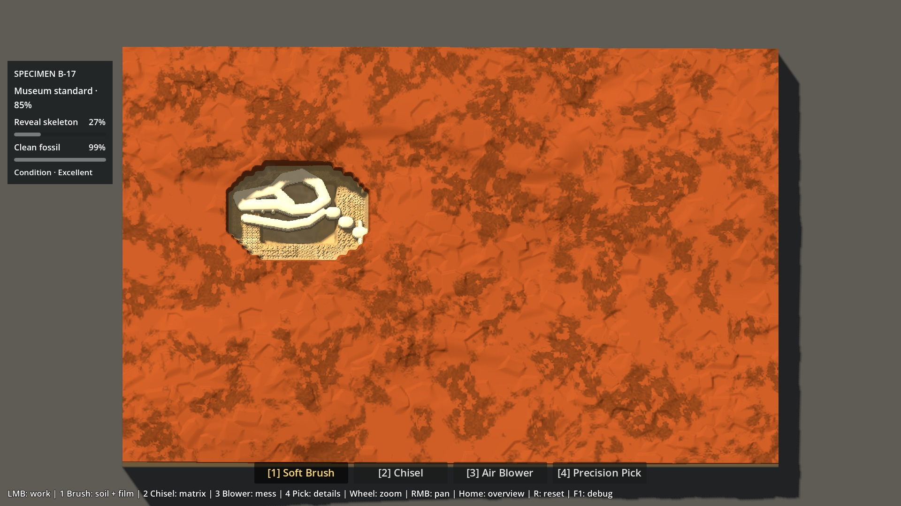
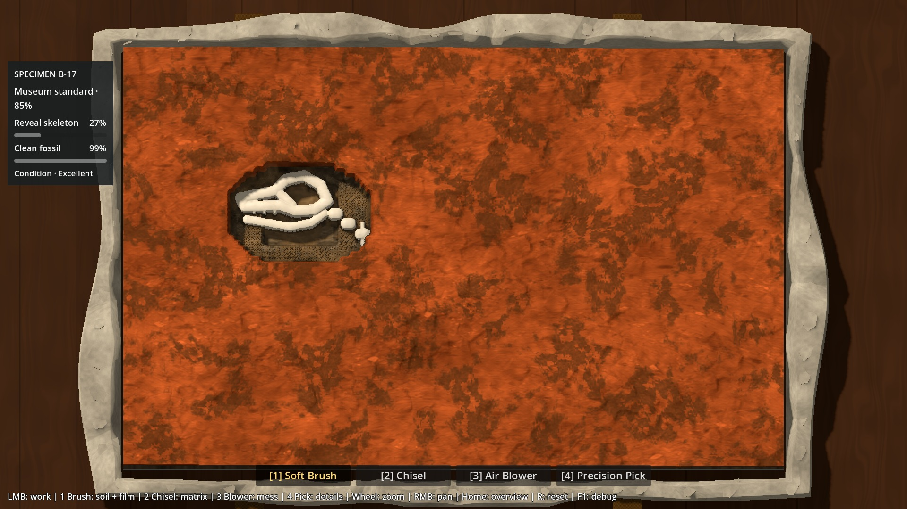

# P6A2 — Hero Lookdev / Target Match

Livraison du 7 octobre 2026, sur GO explicite d’Antoine après preflight READY.
**Hero Patch jouable et mesuré ; recommandation de l’agent : correction ciblée.**
Les matières, Bone sale/propre et le support plâtré progressent nettement par
rapport au témoin B. Le jacket garde cependant une lecture de cadre, et le
traitement à 3× conserve des limites de prototype. Ne pas confondre cette
livraison technique avec l’acceptation artistique d’Antoine.

La gate courante et la prochaine action autorisée sont dans
[status.md](../brain/status.md). Aucune promotion vers les scènes de production.

## 1. Architecture et baseline exacte

`scenes/p6a2_hero_patch.tscn` hérite de
`scenes/p6a16_natural_matrix_lab.tscn`. Son unique contrôleur d’assemblage,
`scripts/p6a/hero_patch.gd`, sélectionne **B / candidat 1** explicitement au
démarrage. Le lab historique reste inchangé, avec son propre A/B.

Base de branche avant cette livraison : `fe58e7c` (preflight). Géométrie héritée :
`scripts/p6a/natural_matrix_profile.gd`, B macro + méso livré en `26f3552`.
P6A1 est clos assez pour avancer, pas proclamé géométrie finale parfaite.
**Clay surface breakup grammar reste différé et n’a pas été implémenté.**

Le Hero conserve sans duplication :

| Autorité | Sources inchangées |
|---|---|
| Hauteurs, couches, résistance, édition | `working_surface.gd`, `stratigraphy.gd`, `config/` |
| Maillage dynamique, uploads, picking | `excavation_block.gd`, `relief_surface.gd`, vertex de `surface_debug.gdshader` |
| Bone, plafonds, Condition, exposition, Film | `fossil_field.gd`, `fossil_state.gd`, `bone_surface_film.gd` |
| Outils, fracture, débris, caméra | `tool_controller.gd`, `material_fracture.gd`, `loose_debris.gd`, `precision_zoom.gd` |
| Progression / archive | `preparation_session.gd`, `preparation_rules.gd`, `preparation_ui.gd` |
| Soil mince / dépôts de contact | `soil_foundation_profile.gd`, `soil_foundation_lab.gd`, `p6a15_contact_deposits.gdshaderinc` |

Les chemins abrégés sont sous `scripts/`, sauf les scripts de fondation sous
`scripts/p6a/` et les shaders sous `shaders/`. Aucun de ces fichiers n’est modifié.
Le déplacement vertex est identique à celui du témoin. Le shader Hero est
composé localement depuis le shader Soil, avec les hooks assertés existants.
Un changement futur d’un hook doit donc être adapté explicitement.

**F8** change uniquement le look dans le même état de fouille : shader/palette,
jacket, table, éclairage et couleurs des feedbacks. Aucune réinitialisation,
aucun mouvement de caméra. Le panneau technique est caché au départ (**H**).
L’UI de progression P5 et les quatre outils restent natifs.

## 2. Références utilisées

Les **six images locales canoniques ont été inspectées directement** avant
l’implémentation, sans remplacement. Hiérarchie : gameplay/mécaniques >
`01-gameplay-target.jpg` > `02-material-closeup.jpg` > `00-style-north-star.jpg`
> supports > ancien board.

- 01 : séparation orange / matrice sombre / ivoire, qualité du bloc, jacket.
- 02 : réponse tactile et différence Clay, Sandstone, Soil, Bone sale/propre.
- 00 : chaleur et travail artisanal de préparation, sans copier l’atelier.
- 03 : silhouette et rebord de plâtre, sans intake.
- 04 : continuité de lecture pendant la préparation, sans reprendre l’infographie.
- 05 : table limitée et ambiance de travail, sans room dressing.

Pack : `docs/visual-references/p6a2/`. Rôles détaillés dans
[P6A2_VISUAL_TARGETS.md](../visual-references/P6A2_VISUAL_TARGETS.md).
Aucune anatomie, géométrie fictive ou texture extraite des concepts.

## 3. Premier jacket Blender réel

Blender **5.2.2 LTS**, portable validé au preflight :
`C:\Users\antoi\AppData\Local\Programs\ArchaeologyGameTools\blender-5.2.2-windows-x64\blender.exe`.

- Source : `art/source/p6a2/meshes/b17_jacket.blend`.
- Construction : `tools/p6a2/build_hero_assets.py`, composition déterministe,
  indépendante du fossile et des données de fouille.
- Runtime : `assets/p6a2/static/b17_jacket.glb`.
- 256 échantillons autour du contour × six anneaux ; largeur/hauteur variables,
  encoches, rebords adoucis par bevel, 72 écailles de plâtre, quatre tabs de toile.
- Cinq meshes, deux identités de matériau ; **11 790 triangles** à pleine résolution.
- UV exportés, normales sortantes ; shaders Godot statiques en coordonnées locales.
- Une unité = un mètre. Blender Z-up/+Y avant → Godot Y-up/−Z avant ; import 1:1.
  GLB Y-up, modifiers/normales/UV/matériaux, sans animation/caméra/lumière.

La coque est une sœur statique du bloc, sans collision, script d’édition ou
destruction. Tous ses sommets sont hors de l’empreinte dynamique XZ 1.1 × 0.7 m.
**132 rayons sur les quatre bords au fond de fouille : zéro occlusion** par la
coque avec la caméra actuelle. Le dégagement avant tient compte de son angle.
Ce contrôle est un échantillonnage des bords, pas une preuve exhaustive de
toutes les silhouettes possibles.

Le `.blend` rouvert dans un autre processus produit le GLB **octet-identique** :
SHA256 `acdd618c1b2f627b7d370d8eec036456ed3c8735927f624894a669c6ccad60bb`.

```powershell
.\tools\p6a2\Export-Hero.ps1             # exporter le .blend sauvegardé
.\tools\p6a2\Export-Hero.ps1 -Regenerate # reconstruire source + cartes + GLB
```

`-Regenerate` remplace intentionnellement la source scriptée ; ne pas l’utiliser
pour exporter une future retouche manuelle. Provenance et conventions :
[art/source/p6a2/README.md](../../art/source/p6a2/README.md).

## 4. Matières locales

Approche : palette contrôlée + source peinte existante + quatre cartes de données
propres aux matériaux + faible variation shader. **Aucun déplacement visuel**.
L’atlas P6A existant est utilisé en valeur, une fois par quadrant avec inset,
sans répétition. Les quatre PNG de données couvrent chacun le bloc entier.

| Matière | Traitement Hero |
|---|---|
| Soil | Terre chaude brune, détail granulaire atténué, très mate (roughness de base 0.98). Épaisseur/couverture de fondation inchangées. |
| Clay | Terracotta orange, valeur peinte/marks étirés et roughness 0.87 ; dépôts irréguliers P6A1.5 intégralement conservés. |
| Sandstone | Brun minéral désaturé, détail angulaire, roughness 0.91. La poussière Stone est également brunie pour ne plus ressembler à Bone. Masques/quantités de poussière inchangés. |
| Bone | Ivoire chaud, variation faible, roughness propre 0.49 ; Film brunit et matifie. Forme, densité, bits, carte et comportement du Film natif inchangés. |
| Jacket | Plâtre chaud presque neutre, variation large, stries fines et roughness 0.92 ; toile mate sur les quatre tabs. |

Cartes RGBA : R variation large, G microdétail, B roughness, A inclusions.
Le bump est dérivé des données et de la valeur peinte, amplitude nominale
**0.12 mm** pour matrice/Soil et **0.025 mm** pour Bone, avec inclinaison
cosmétique plafonnée à ~11°. Pas de silhouette ou profondeur supplémentaire.
Le plafond évite les liserés parasites aux changements de matériau.

Sur Bone seulement, normales centrées calculées depuis le **vrai heightfield**
pour calmer les facettes du dessus. Elles ne déplacent pas les triangles, ne
modifient pas le picking et ne lissent pas les plafonds. Les flancs quantifiés
restent visibles à 3×. L’occlusion locale lit quatre voisins réels du working map,
à sept texels ; elle ajoute au plus 27 % d’assombrissement dans les creux.

Les couleurs des particules et miettes persistantes suivent les matériaux du
Hero. Seules leurs couleurs d’instance changent, jamais leurs règles/positions.

Pas de nouveau besoin ImageGen pour cette livraison. L’atlas hérité reste une
source générée de spike, pas un matériau final validé. Aucun outil optionnel
installé et aucune bibliothèque de textures inutiles créée.

## 5. Lumière et cadrage limité

Une lumière directionnelle existante réorientée localement à (−52°, −135°, 0),
énergie 0.65, teinte chaude modérée ; ambiance 0.45, légèrement chaude.
Ombres actives et faible occlusion de hauteur donnent la lecture des cavités.
La couleur de Bone/plâtre a été refroidie depuis le premier essai trop jaune.

Table existante habillée d’un shader de bois brun, veines longues et joints
discrets. Pas de lampe géométrique, accessoire décoratif, atelier complet,
nouvelle caméra, DOF ou post-effet cinématique. La caméra/zoom/pan restent
exactement ceux de gameplay. Le petit dégagement disponible à 1× limite
volontairement la place du décor.

## 6. Boucle de target match et comparaisons

| Écart constaté face à 01 / 02 / 00 | Correction effectuée | Limite restante |
|---|---|---|
| Premier essai trop plat / variation douce seulement | Valeur peinte du Material Lab ajoutée aux cartes de données, familles de marques différentes | Détail encore doux à 3×, pas des textures finales calibrées |
| Bone et plâtre trop lumineux/jaunes | Énergie/palettes abaissées, teintes plus neutres | Bone garde peu de caractère propre hors Film |
| Stone/poussière proches de l’ivoire | Palette Stone et poussière brunes | Les miettes natives restent facettées |
| Coque moulée trop régulière | Épaisseur/hauteur variables, encoches et écailles | Lecture de cadre encore trop présente ; certaines écailles évoquent du papier polygonal |
| Table/lumière grises du témoin | Bois brun, éclairage chaud modéré | Évocation du laboratoire limitée au support, volontairement sans props |
| Bump créant des bords trop forts | Gradient cosmétique borné | Grille de géométrie visible, sans réouverture de P6A1.6 |

Le rendu final n’atteint pas encore la qualité de blocs plâtrés organiques et
de matière sculptée du concept. Le gain est réel sur séparation, chaleur et
lecture Bone sale/propre ; il ne suffit pas à déclarer la direction approuvée.

**Avant, même géométrie B et même état :**



**Après, Hero :**



## 7. Continuité des états réels

Chaque paire avant/après conserve caméra, heightfield, couches, Bone, Film,
fracture/débris et progression. Les presets sont des états contrôlés indépendants,
pas une prétendue capture chronologique d’une partie humaine complète.

| État | Témoin B | Hero | Hero 3× |
|---|---|---|---|
| A — départ Soil | [avant](evidence/p6a2-hero/baseline-reset.jpg) | [après](evidence/p6a2-hero/hero-reset.jpg) | [détail](evidence/p6a2-hero/hero-reset-3x.jpg) |
| B — Soil partiellement brossé | [avant](evidence/p6a2-hero/baseline-part-brushed.jpg) | [après](evidence/p6a2-hero/hero-part-brushed.jpg) | [détail](evidence/p6a2-hero/hero-part-brushed-3x.jpg) |
| C — matrice travaillée | [avant](evidence/p6a2-hero/baseline-excavated.jpg) | [après](evidence/p6a2-hero/hero-excavated.jpg) | [détail](evidence/p6a2-hero/hero-excavated-3x.jpg) |
| D — première Bone sale | [avant](evidence/p6a2-hero/baseline-dirty-bone.jpg) | [après](evidence/p6a2-hero/hero-dirty-bone.jpg) | [détail](evidence/p6a2-hero/hero-dirty-bone-3x.jpg) |
| E — Bone davantage préparée | [avant](evidence/p6a2-hero/baseline-cleaner-bone.jpg) | [après](evidence/p6a2-hero/hero-cleaner-bone.jpg) | [détail](evidence/p6a2-hero/hero-cleaner-bone-3x.jpg) |

Compléments : [jacket/cœur à 3×](evidence/p6a2-hero/hero-jacket-integration-3x.jpg),
[interface Stone diagnostique](evidence/p6a2-hero/hero-stone-interface-3x.jpg).
Cette dernière est la coupe diagnostique héritée, pas une nouvelle géologie.

B utilise trois rangées de trois passages Brush natifs ; C, le preset matrice nue suivi de 120
impacts Chisel ; D, la fenêtre Pick native héritée ; E élargit cette fenêtre par
Pick puis Brush. E révèle ~27 % du fossile et nettoie ~99 % de la Bone exposée,
Condition Excellent : c’est **un patch**, pas un spécimen entièrement terminé.
Les autres régions restent jouables et cachées. Aucun faux mesh de Bone.

Captures GPU 1920×1080 inspectées, PNG conservés dans `work/test-logs/p6a2-hero/`.
Les 17 JPEG versionnés sont des réencodages à qualité 93 %, sans retouche.
L’UI P5 reste visible ; curseur/proxy outil et notification sont cachés seulement
pour la capture afin de comparer le même contenu.

## 8. Performance mesurée

Godot **4.7.2.stable.official.ed1daf0bf**, Compatibility OpenGL 3.3,
NVIDIA RTX 5080 / driver 610.88, AMD Ryzen 7 9800X3D. Fenêtre 1920×1080,
cap 240 FPS, physique 60 Hz. Six usages × deux zooms × témoin/Hero = **24 cas**.
45 frames de chauffe, puis 180 ticks de physique (3 secondes) par cas.
Le contrôleur natif est piloté à 60 Hz sur la même trajectoire de curseur.
Tous les états initiaux **et finaux** des 12 paires sont identiques, caméra aussi.

| Usage / zoom | Frame P95 B → Hero (ms) | GPU moyen B → Hero (ms) | CPU édition Hero moyen / P95 (ms) |
|---|---:|---:|---:|
| Reset 1× | 4.312 → 4.313 | 0.995 → 1.293 | 0 / 0 |
| Brush Soil 1× | 8.385 → 8.420 | 1.016 → 1.322 | 3.830 / 4.134 |
| Chisel 1× | 4.700 → 4.690 | 1.034 → 1.344 | 0.392 / 4.845 |
| Pick près Bone 1× | 6.481 → 6.485 | 1.026 → 1.349 | 0.069 / 0.603 |
| Blower/débris 1× | 6.862 → 6.901 | 1.028 → 1.348 | 0.347 / 0.460 |
| Bone Film 1× | 9.787 → 9.782 | 1.046 → 1.371 | 3.550 / 3.815 |
| Reset 3× | 4.329 → 4.325 | 0.546 → 0.622 | 0 / 0 |
| Brush Soil 3× | 8.424 → 8.460 | 0.574 → 0.643 | 3.845 / 4.211 |
| Chisel 3× | 4.691 → 4.679 | 0.581 → 0.650 | 0.394 / 4.894 |
| Pick près Bone 3× | 6.490 → 6.477 | 0.600 → 0.660 | 0.068 / 0.646 |
| Blower/débris 3× | 6.890 → 6.866 | 0.592 → 0.657 | 0.350 / 0.457 |
| Bone Film 3× | 9.754 → 9.832 | 0.599 → 0.676 | 3.578 / 3.901 |

Surcoût GPU **+0.298 à +0.326 ms à 1×**, **+0.060 à +0.077 ms à 3×**.
Le jacket et la table sont visibles à 1× ; le zoom focalisé réduit leur couverture.
Draw calls : reset **42 → 52** à 1× ; **42 → 45** à 3×. Les usages actifs
gardent respectivement ~+10 et ~+3 draws, ombres incluses. Picking P95 Hero
0.061–0.125 ms. Les mesures CPU de rendu et distributions complètes sont dans
[benchmark.json](evidence/p6a2-hero/benchmark.json).

Les frames moyennes suivent le cap (~4.160 ms). **Ce n’est pas une preuve de
240 FPS stables pendant chaque édition** : les P95 à 8–10 ms existaient déjà
dans le témoin ; aucun retuning du noyau n’a été fait pour les masquer. Les
différences de quelques centièmes de milliseconde CPU ne prouvent pas une
optimisation/régression. Séquences courtes sur un seul PC haut de gamme, sans
prétendre à un benchmark toutes machines ou une garantie de stutter maximal.

Vérification des usages : Brush change les hauteurs ; Chisel crée fracture,
poussière/exposition et 45 miettes ; Blower réduit les miettes de 221 à 183 ;
Film passe de 0 à ~49.89 % de propreté. Pick près Bone conserve ses protections.

## 9. Budgets d’assets

| Ressource | Budget |
|---|---:|
| Jacket complet | 11 790 triangles, 5 meshes ; plafond de contrôle 20 000 |
| Source `.blend` | 337 066 octets |
| GLB | 405 984 octets |
| Quatre cartes RGBA8 1024×640 + mips | ~13.33 MiB décompressés |
| Atlas hérité 1254² + mips | ~8 MiB conservateurs RGBA8 |
| Total des textures artistiques utilisées | ~21.33 MiB conservateurs |

Le moniteur Godot indique **50.47–50.64 MiB de textures totales** dans cette
session, incluant les textures dynamiques et les assets préchargés. F8 garde
les ressources Hero chargées pour la comparaison : sa différence mémoire
ne mesure donc **pas** l’allocation isolée du Hero. Pas de textures 4K, pas
de génération au fil des coups, pas de second mesh de fouille.

## 10. Validation et reproductibilité

- Import final Godot sans erreur script/shader/import.
- **18 contrôles fonctionnels** : B au départ/reset, états identiques après
  Brush/Chisel/Pick/Film/Blower, vertex et pattern Film inchangés, coque sans
  collision/intrusion, occlusion des bords, seuils P5/Archive, 240/60.
- Picking contre oracle indépendant de triangles natifs : **48 rayons**,
  reset et Bone, 1×/3× ; erreur maximale **0.00000745 mm**, seuil 0.005 mm.
- **22 contrôles visuels** : 17 captures et cinq comparaisons d’état avant/après F8.
- **72 contrôles benchmark** : timings valides, caméra identique, Bone immuable.
  L’export des preuves vérifie aussi états/poses des 12 paires.
- Régression P5 existante : **128 contrôles, zéro échec**.
- Export depuis le `.blend` rouvert identique au GLB généré.

Preuves : [tests.json](evidence/p6a2-hero/tests.json),
[visual.json](evidence/p6a2-hero/visual.json),
[benchmark.json](evidence/p6a2-hero/benchmark.json),
[assets.json](evidence/p6a2-hero/assets.json).

```powershell
$godot = 'C:\Users\antoi\Downloads\Godot_v4.7.2-stable_win64.exe\Godot_v4.7.2-stable_win64_console.exe'
& $godot --headless --path . --editor --quit
& $godot --headless --path . --script tests/run_p6a2_hero.gd -- tests
& $godot --path . --script tests/run_p6a2_hero.gd -- visual
& $godot --path . --script tests/run_p6a2_hero.gd -- benchmark
& $godot --headless --path . --script tests/run_p5_tests.gd
& $godot --headless --path . --script tests/export_p6a2_hero_evidence.gd
```

Les premières previews lancées dans le sandbox ont signalé l’accès refusé aux
logs/cache utilisateur. Les runs finaux avec accès normal ont zéro erreur ;
aucun contournement dans le code jeu. Logs temporaires sous `work/test-logs/`.

## 11. Retest humain

Depuis la racine : **`.\Launch-P6A2-Hero-Patch.ps1`**.
Alternative : ouvrir `scenes/p6a2_hero_patch.tscn` dans Godot 4.7.2 puis F6.
Le lanceur accepte `-GodotBin` si l’exécutable a été déplacé.

1. Observer le départ, puis **F8** pour comparer avec B au même endroit.
2. **1 Brush**, clic gauche : dégager Soil ; comparer les dépôts sur Clay.
3. **2 Chisel** : travailler la matrice ; **3 Blower** : évacuer les débris.
4. **4 Precision Pick** autour de Bone, puis Brush pour Film. Vérifier la
   transition sale → propre et le contraste avec Sandstone.
5. Molette **1×–3×**, bouton droit pour pan, **Home** pour la vue entière.
   Vérifier notamment le bas et les angles du jacket.
6. **H** donne les presets techniques hérités : intact, matrice nue, Chisel,
   Bone Pick, coupe d’interfaces ; **F9** donne la matrice nue, **R** réinitialise B.
   Fermer H pour le jugement visuel. Les presets peuvent remettre la fouille
   à zéro ; F8 ne le fait jamais.
7. Comparer aux 01/02/00 canoniques, puis répondre aux 13 questions ci-dessous.

## 12. Limites, placeholders et recommandation

**Recommandation : correction ciblée, à arbitrer par Antoine.** Conserver pour
la revue la séparation des matières, le Bone moins blanc, l’isolation et la
chaîne Blender. Ne pas canoniser ce look ni affirmer qu’il atteint déjà 01/02.

- Le jacket fait encore trop cadre rectangulaire malgré sa silhouette/épaisseur
  irrégulières. Ses écailles restent trop polygonales, parfois proches de papier.
  C’est la faiblesse artistique prioritaire à discuter dans le verdict humain.
- À 3×, Soil paraît parfois composé de grains trop gros ; la valeur peinte
  reste douce et peut évoquer une image plaquée. Aucun motif répété en grille,
  mais cela ne prouve pas une lecture parfaitement naturelle.
- Clay conserve le rythme de patine et la géométrie B provisoires ; certains
  bords/débris et flancs Bone montrent la grille. **Pas de correction de grammaire
  Clay incluse** et pas de lissage autoritaire pour cacher cette limite.
- Bone propre a encore un dessus assez lisse ; son identité vient surtout de
  l’ivoire, du relief existant et de sa différence avec Film/Stone.
- L’ambiance est chaude, mais pas encore l’illustration artisanale du concept.
  L’absence de props est volontaire. Le bois procédural, la toile et le plâtre
  sont des premiers traitements, pas des assets d’atelier finalisés.
- HUD P5, feedbacks géométriques, cadrage, source atlas et tous ces matériaux
  restent des placeholders/prototypes soumis à revue, pas une UI/art pass finale.

Cette livraison ne modifie pas les outils, Bone, résistance, épaisseur Soil,
fragments, progression, caméra ou limites d’excavation. Aucun jacket destructible,
anatomie redessinée, deuxième famille de bloc, musée/intake/NPC, génération de
spécimens, audio, P6B ou full workshop. Pas de Meshy/Tripo/Krita/Photoshop.
Les modifications utilisateur préexistantes de `project.godot` et le UID non
suivi `tests/export_p6a_evidence.gd.uid` sont préservés et exclus de la livraison.

## 13. Questions du verdict humain

1. Est-ce enfin matériellement plus proche du concept art ?
2. Clay / Sandstone / Bone sont-ils distinguables sans UI ?
3. Le jacket en plâtre donne-t-il l’impression d’un vrai bloc préparé sur le terrain ?
4. La scène est-elle chaleureuse/cozy sans nuire à la lisibilité ?
5. L’excavation reste-t-elle visuellement cohérente lorsque la matière disparaît ?
6. Bone sale et Bone propre se lisent-ils correctement ?
7. Quelque chose paraît-il manifestement répété, procédural ou « papier peint » ?
8. Le jacket statique s’intègre-t-il naturellement au cœur dynamique ?
9. Le cadrage limité par l’établi suffit-il, ou distrait-il ?
10. À 3×, les matières tiennent-elles encore ?
11. Quelque chose induit-il en erreur sur ce qui peut réellement être excavé ?
12. Est-ce une fondation crédible pour P6B ?
13. Verdict : **accepter la direction Hero P6A2 / correction ciblée / rejeter-repenser** ?
