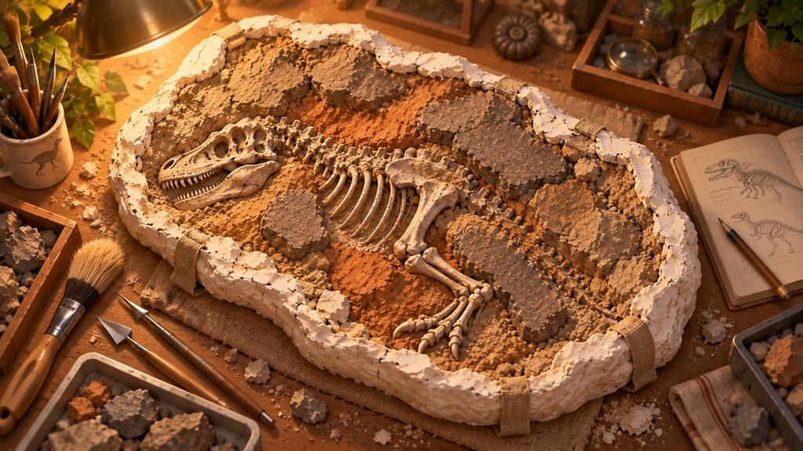
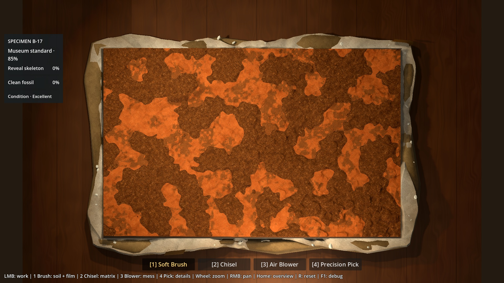
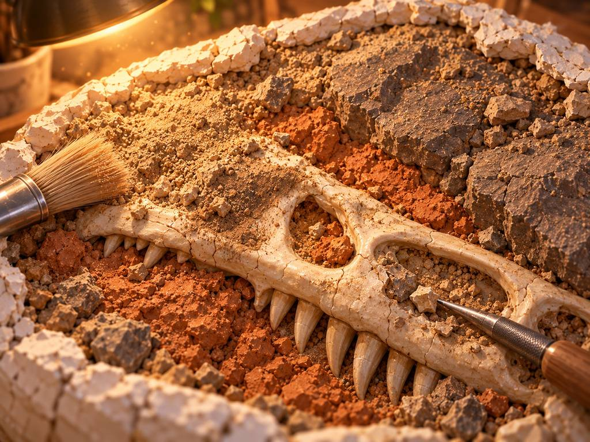
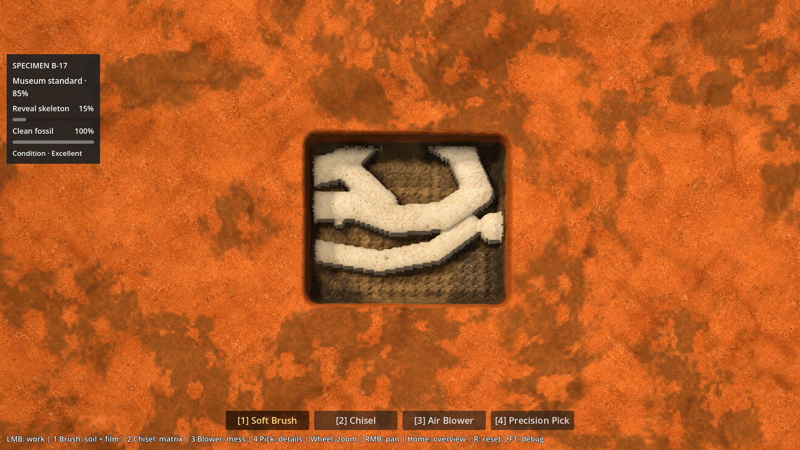

# P6A2 — correction ciblée : coque, sources v02, lampe locale

**Date : 7 octobre 2026.** Rapport de cette proposition corrective, pas validation
artistique. Gate et prochaine action : [statut canonique](../brain/status.md).
La livraison `a9d47b6` et son rapport restent des preuves historiques intactes.

## Retour humain et périmètre

Antoine a validé la chaîne technique et rejeté le look initial. Cette passe
conserve `scenes/p6a2_hero_patch.tscn`, son contrôleur mince et l’héritage du lab
P6A1.6 B. Aucun moteur de fouille dupliqué, aucune nouvelle géométrie de matrice,
aucun tuning P4/P5. Aucun accessoire secondaire ajouté. Clay surface breakup
grammar reste différé. Le témoignage technique B reste disponible par F8.

La demande précise de cinq sources a été rédigée dans
[P6A2_IMAGEGEN_SOURCE_REQUEST.md](P6A2_IMAGEGEN_SOURCE_REQUEST.md), puis satisfaite
par le set sélectionné de l’orchestrateur, commit externe `5a3d340`. Ce commit
a été récupéré par fast-forward en conservant les modifications locales.
Antoine a explicitement autorisé l’intégration de ce set.

## 1. Coque statique Blender

Source `art/source/p6a2/meshes/b17_jacket.blend`, export
`assets/p6a2/static/b17_jacket.glb`. Blender 5.2.2 LTS ; générateur original
`tools/p6a2/build_hero_assets.py`, export depuis la source sauvegardée et rouverte
via `tools/p6a2/Export-Hero.ps1`. Réexport vérifié octet-identique ; empreintes
et tailles dans `art/source/p6a2/meshes/jacket_manifest.json`.

La coque initiale à larges pièces arrondies est remplacée par un corps de
plâtre à contour extérieur asymétrique, largeur réduite et variable, changements
de plan plus francs, 23 érosions locales, quatre épaules fortement amincies,
38 éclats solides et deux bandes de toile extérieures. Le support sale reste
visible là où le plâtre supérieur se réduit. Normales de cassure, UV et couleurs
de sommets exportées ; trois meshes / **6 400 triangles**, contre 11 790 / cinq
meshes auparavant. GLB 320 216 octets ; source .blend 262 763 octets.

**Pourquoi cela réduit-il le cadre ?** Les larges moulures pâles et régulières
ont disparu ; la largeur et la continuité claire varient, les cassures angulaires
et le support apparent évoquent davantage une enveloppe abîmée. Le plâtre porte
sa propre nouvelle source crayeuse, plus grise que l’ivoire Bone.

**Mais je ne peux pas affirmer que le cadre a entièrement disparu.** La limite
intérieure du cœur reste un rectangle net, surtout au bord proche de la caméra ;
une ligne sombre de paroi/contact y reste visible. La coque est encore trop
régulière par rapport à 01/03, et sa masse latérale se lit peu à 84°. C’est la
principale réserve de cette livraison, explicitement visible dans les preuves.
Une validation technique ne vaut pas acceptation de son identité physique.

Aucune collision, aucun script de fouille sur le GLB, aucun déplacement du cœur,
aucun recouvrement volontaire de l’aire jouable. Les sommets restent hors de
±0.55 m / ±0.35 m ; les faces dégagent aussi les rayons de caméra jusqu’au fond
Y=0.018 m. Les angles de l’empreinte sont explicitement échantillonnés pour éviter
qu’un triangle coupe un coin. Le petit recul de la lèvre avant protège le picking
jusqu’au fond ; il contribue aussi à la limite visuelle de contact décrite ci-dessus.

## 2. Remplacement complet de la source matière rejetée

**Le Hero ne charge plus l’atlas Material Lab, ni ses quatre anciennes cartes
surface_data.** Ces fichiers et leur provenance restent historiques. Ils ne
fondent aucun nouveau matériau Hero. Les nouvelles sources sont les cinq
`art/source/p6a2/images/p6a2_*_albedo_source_v02.jpg`.

Les cinq images ont été inspectées directement. Ce sont des miroirs JPEG de
qualité 95, **1254 × 1254**, pas les PNG originaux et pas de vrais 2048².
Leurs limites, la sélection et les SHA des PNG hors dépôt restent consignés dans
[le README de sélection](../../art/source/p6a2/images/README.md) et
[les prompts](../../art/source/p6a2/images/P6A2_IMAGEGEN_PROMPTS.md).
Aucun remplacement des fichiers source reçus.

`tools/p6a2/prepare_textures.gd` produit cinq PNG RGB8 1024² par réduction Lanczos,
sans upscale ni retouche. Les SHA des JPEG réellement disponibles et des dérivés
sont dans `art/source/p6a2/images/runtime_manifest.json`. Import lossless,
mipmaps, samplers couleur et filtrage anisotrope.

| Matière | Traitement local Hero | Lecture recherchée |
|---|---|---|
| Soil | Source granulaire ×0.68, roughness 0.98 | Terre sombre, meuble et superficielle ; hauteur/couverture natives |
| Clay | Source terracotta ×0.58, roughness 0.89 | Grain fin compact, sans ancien marbrage peint |
| Sandstone | Source ×0.56, désaturation 32 %, roughness 0.94 | Minéral brun/gris plus sombre, distinct de Clay et Bone |
| Bone | Désaturation 20 %, gains RGB 0.55/0.58/0.65, roughness propre 0.73 | Ivoire ancien moins jaune/brillant ; texture poreuse |
| Plâtre | Source crayeuse triplanaire, teintes de sommets gris chaud et salissures localisées, roughness 0.96 | Différent de Bone, support abîmé et mat |

Ces gains sont calibrés sous cette lampe dans Compatibility ; ce ne sont pas
des constantes physiques ou des corrections appliquées aux originaux.

Les albedos suivent la **position réelle** de la surface : projection triplanaire
à échelle nominale 24 cm, poids selon la normale géométrique. Cela évite d’étirer
un échantillon vu du dessus le long d’une paroi excavée. Chaque projection du cœur
mélange deux lectures de la même source, décalées/tournées (24 cm et ~26.4 cm),
pour atténuer la répétition. Ce mélange ne fabrique ni grain ni nouveau relief.
Les axes presque absents ne sont pas échantillonnés. Plâtre : trois projections
simples à 24 cm. Pas de déplacement visuel ni de normal map dérivée de l’albedo.

La normale Bone centrée sur les hauteurs réelles et l’accentuation de cavité
locale de la première livraison sont conservées ; pas d’ajout de bruit pour
compenser une mauvaise source. Patine Soil→Clay par dépôts irréguliers native,
jamais de bande de contact uniforme. Le code d’occupation, masque, densité et
pattern Bone Film est inchangé ; seule sa couleur/réponse matière reste locale.
Les couleurs des débris sont accordées à la nouvelle palette, leurs règles intactes.

## 3. Véritable lampe de préparation

La première livraison n’avait qu’un directionnel réchauffé. Cette version ajoute :

- **SpotLight3D PreparationLamp**, position (−0.45, 0.80, −0.30) m, visée
  (−0.06, 0.04, −0.01), énergie 1.20, couleur (1, 0.94, 0.83), portée 1.9 m,
  angle 50°, atténuation 1.1 / angulaire 1.3, ombres activées ;
- **OmniLight3D WorkbenchBounce**, position (0.12, 0.18, 0.65), énergie 0.30,
  portée 1.2 m, sans ombre : léger rebond pour les parois avant ;
- directionnel réduit à 0.20 et ambiant à 0.30. Le Spot domine les ombres,
  le côté supérieur gauche et la chute lumineuse sur l’établi. Ni DOF ni
  nouvelle lampe géométrique ; c’est l’effet lumineux qui est testé.

F11 bascule cette paire locale contre le témoin directionnel (énergie 0.65,
ambiant 0.45), à fouille et caméra identiques. F11 évite le raccourci F7 de tuning
déjà utilisé par les outils. Le test passe par le vrai routage d’entrée et
vérifie que le rayon d’outil ne change pas.

**Bug visuel résolu : ombre périmée après excavation.** La texture de hauteur
change sans transformer le MeshInstance ; dans cette configuration le cache
local pouvait garder l’ombre de la surface intacte. Le contrôleur Hero observe
le compteur d’upload de hauteur existant et invalide les ombres du Spot lors
d’une modification, dans le même tick. Il n’écrit aucune donnée gameplay et
ne rafraîchit pas la shadow map pour un simple nettoyage du Film.
Comparaison après creusement contre un Spot nouvellement instancié : 102 480
pixels échantillonnés, erreur RGB moyenne et maximale **0**.

## 4. Comparaison directe avec les cibles

| Référence canonique | Capture de cette proposition |
|---|---|
|  |  |
|  |  |

01 : enveloppe irrégulière et ombre portée plus présentes ; intérieur encore
beaucoup plus rectangulaire et moins composé que la cible. Le lampadaire n’est
pas copié ; la provenance lumineuse supérieure gauche est portée par le Spot.
02 : nouvelles textures granulaires/poreuses, séparation Clay/Stone/ivory,
plâtre proprement différent. Le rendu reste moins tactile et moins riche en
volumes fracturés que le concept ; les bords du heightfield sont visibles à 3×.
00 : chaleur et table plus sombre autour de l’objet, sans chercher son décor.
Aucune anatomie, composition ou géométrie fictive de concept substituée à B-17.

Itérations examinées : retrait de l’atlas → premiers aplats de contrôle ; coque
à bandes rejetée localement puis corps cohérent ; correction du cache d’ombre ;
sources v02 trop lumineuses puis gains calibrés ; plâtre trop jaune puis gris
plus neutre ; projection verticale étirée puis triplanaire. Seuls le résultat
retenu et les preuves historiques pertinentes sont versionnés, pas les essais rejetés.

## 5. Preuves et continuité de progression

[Galerie complète](evidence/p6a2-correction/README.md), 25 captures GPU réelles,
sans retouche. Même état/caméra pour chaque paire témoin B/Hero à 1× et 3×.
Les presets restent des témoins techniques jouables, pas une simulation de la
durée d’une session humaine.

- [Reset 1×](evidence/p6a2-correction/hero-reset.jpg) et
  [partiellement brossé](evidence/p6a2-correction/hero-part-brushed.jpg).
- [Matrice excavée](evidence/p6a2-correction/hero-excavated.jpg),
  [premier Bone sale](evidence/p6a2-correction/hero-dirty-bone.jpg),
  [préparation avancée](evidence/p6a2-correction/hero-cleaner-bone.jpg).
- [Clay 3×](evidence/p6a2-correction/clay-source-3x.jpg),
  [Sandstone 3×](evidence/p6a2-correction/sandstone-source-3x.jpg).
- [Film sale](evidence/p6a2-correction/bone-film-dirty-3x.jpg) /
  [Film nettoyé](evidence/p6a2-correction/bone-film-clean-3x.jpg) : même géométrie,
  Brush natif seul, Cleanliness des zones exposées de 0 à 100 % ; pas 100 % d’Exposure.
- [Contact jacket/matrice](evidence/p6a2-correction/hero-jacket-integration-3x.jpg).
- [Bloc entier / lampe](evidence/p6a2-correction/full-block-overview-task.jpg) /
  [même vue / directionnel](evidence/p6a2-correction/full-block-overview-directional.jpg).

La vue documentaire du bloc entier utilise temporairement une taille caméra
1.05 dans le harness, au même angle 84°. Le 1× jouable reste 0.85, le zoom/pan
et Home sont inchangés ; cette vue documentaire n’est pas étiquetée 1×.
Le témoin Sandstone élargi est obtenu par **504 impacts Chisel natifs**, centres
fossiles évités, puis Blower ; la périphérie de l’outil révèle un peu de Bone
réel. L’ancien preset 4, coupe diagnostique synthétique, est aussi conservé
et clairement distinct de cette excavation native.

## 6. Validation technique et budgets

Godot 4.7.2 stable `ed1daf0bf`, Compatibility/OpenGL 3.3, NVIDIA 610.88,
RTX 5080 / Ryzen 7 9800X3D, 1920×1080, cap 240 FPS / physique 60 Hz.

- Import GLB/textures/shaders sans erreur ; source Blender réexportable.
- 24 contrôles fonctionnels : B explicite, mêmes états byte à byte après les
  actions natives, quatre nouvelles textures du cœur réellement chargées,
  vertex et pattern Film identiques, 85/85 et 95/95 / Archive / reset conservés.
- Aucun sommet statique dans le cœur ; **0 occlusion sur 132 rayons de bord**.
  Oracle de picking : 48 rayons, départ/Bone, 1×/3×,
  écart maximal 0.00000745 mm.
- 35 contrôles visuels : 25 captures, comparaisons d’état, cache d’ombre,
  touche F11 et nettoyage Brush à géométrie identique.
- Mesure : 24 cas (12 paires témoin/Hero), 180 ticks actifs par cas après
  stabilisation, outils natifs inchangés ; résultats et hashes dans
  [benchmark.json](evidence/p6a2-correction/benchmark.json).

Les nouveaux albedos runtime occupent 11 092 511 octets PNG sur disque.
Budget théorique RGB8+mips : 20 MiB ; estimation conservatrice RGBA8+mips :
26.67 MiB. Les miroirs source ne sont pas chargés au runtime. Pas de nouveau
sampler normal/height. Les textures dynamiques de gameplay restent inchangées.

| Zoom / cas | Frame P95 B → Hero (ms) | GPU moyen B → Hero (ms) | CPU édition P95 B → Hero (ms) | Draw calls moyens B → Hero |
|---|---:|---:|---:|---:|
| 1× reset | 4,33 → 4,31 | 0,99 → 1,97 | 0,00 → 0,00 | 42,0 → 71,0 |
| 1× brush_soil | 8,45 → 8,43 | 1,01 → 2,07 | 4,27 → 4,28 | 42,0 → 71,0 |
| 1× chisel | 4,70 → 4,67 | 1,02 → 2,04 | 4,79 → 4,78 | 32,1 → 50,8 |
| 1× pick_near_bone | 6,47 → 6,48 | 1,02 → 2,05 | 0,60 → 0,60 | 33,0 → 51,0 |
| 1× blower_debris | 6,84 → 6,89 | 1,03 → 2,03 | 0,46 → 0,44 | 31,2 → 48,5 |
| 1× bone_film | 9,72 → 9,81 | 1,04 → 2,09 | 3,73 → 3,90 | 46,0 → 76,0 |
| 3× reset | 4,33 → 4,31 | 0,55 → 1,01 | 0,00 → 0,00 | 42,0 → 71,0 |
| 3× brush_soil | 8,38 → 8,44 | 0,56 → 1,09 | 4,00 → 4,18 | 42,0 → 71,0 |
| 3× chisel | 4,70 → 4,67 | 0,57 → 1,10 | 4,82 → 4,80 | 32,1 → 50,8 |
| 3× pick_near_bone | 6,48 → 6,48 | 0,59 → 1,10 | 0,59 → 0,58 | 32,7 → 50,7 |
| 3× blower_debris | 6,83 → 6,87 | 0,59 → 1,09 | 0,46 → 0,47 | 31,0 → 48,0 |
| 3× bone_film | 9,76 → 9,80 | 0,59 → 1,12 | 3,74 → 3,94 | 45,7 → 75,7 |

Les 72 contrôles benchmark passent. Le surcoût GPU est net (environ +1 ms à
1×) : textures triplanaires, passes lumineuses et ombre locale sur le vrai
heightfield. Il reste ~2.1 ms de GPU moyen au pire cas mesuré. Reset P95 ~4.31 ms ;
les éditions atteignent ~9.81 ms, comme le témoin. **Le cap 240 ne signifie pas
240 FPS constants pendant l’édition.** Pas de retuning pour masquer ce coût.
Les 12 paires conservent exactement état initial/final et pose caméra.

Le compteur Godot indique ~51.14–51.31 MiB de textures dans ce harness. Les
ressources Hero restent préchargées pendant la vue témoin : ce compteur n’est
pas une mesure différentielle de mémoire B/Hero. Les budgets artistiques plus
haut donnent le coût des cinq nouveaux albedos ; les anciens ne sont plus liés.

## 7. Retest humain et limites

```powershell
.\Launch-P6A2-Hero-Patch.ps1
```

1–4 : outils natifs ; molette 1×–3× ; RMB : pan ; Home : vue ; R : reset.
F8 : Hero / témoin B sans reset ; F11 : lampe locale / directionnel ; H : presets.
Observer le départ, brosser, Chisel, Pick près du Bone, Blower, puis Brush sur
le Film. Les deux nouveaux raccourcis visuels ne modifient pas l’état de fouille.

Réserves explicites :
- le contact intérieur demeure trop rectiligne, la ligne sombre avant reste
  perceptible ; **pas d’affirmation de disparition complète du cadre** ;
- portions de coque encore anguleuses / aspect de feuillet replié plutôt que
  plâtre lourd ; toile très simple ; profondeur latérale limitée par la caméra ;
- Clay sans Soil conserve la patine approuvée, qui peut dominer les variations
  fines à 1×. Sa grammaire géométrique n’est pas retouchée ici ;
- à 3×, escalier Bone et petites faces du heightfield restent visibles.
  Sandstone très fracturé conserve des ombres fortes, sans changer ses règles ;
- les sources JPEG restent des images générées de lookdev, pas des scans PBR
  ni des PNG archivaux. Les raccords sont évalués visuellement, pas garantis
  mathématiquement. Pas de couture dure évidente dans les captures retenues ;
- table/toile/UI restent les placeholders existants ; aucun décor secondaire
  destiné à détourner l’attention des trois priorités.

**Recommandation : revue ciblée de cette correction, avec réserve principale
sur le jacket, plutôt qu’acceptation globale automatique.** Les nouvelles sources
et la vraie lampe constituent des changements concrets ; elles ne prouvent pas
que le niveau de fidélité artistique demandé est atteint. Le prochain verdict
appartient à Antoine. Aucun merge ou P6B n’est déclenché par ce rapport.

## 8. Questions de revue humaine

1. Does this finally feel materially closer to the concept art?
2. Are Clay / Sandstone / Bone distinguishable without UI?
3. Does the plaster jacket make the specimen feel like a real prepared field block?
4. Does the scene feel warm/cozy without harming readability?
5. Does the excavation still feel visually coherent while material is removed?
6. Does dirty vs clean Bone read correctly?
7. Does anything look obviously tiled / procedural / wallpaper-like?
8. Does the static jacket integrate naturally with the dynamic excavation core?
9. Is the limited workbench framing enough, or distracting?
10. At 3×, do materials still hold up?
11. Is anything visually misleading about what can actually be excavated?
12. Does this feel like a credible foundation for P6B?
13. Verdict: accept P6A2 Hero direction / targeted correction / reject or rethink.
