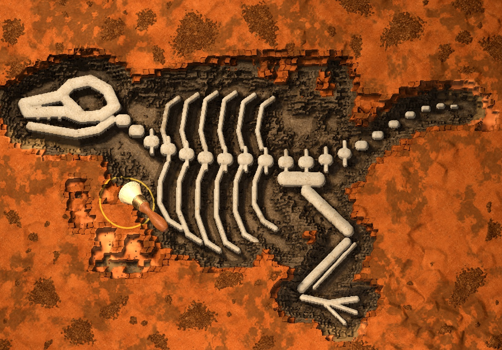

# P6A3 — Friend Playtest Report (2026-10-08)

Status: **informal friend playtest evidence, directional only**.  
This is not the formal V0.1 external playtest wave from the roadmap.

## Sample and high-level signal

Three friends tested the corrected P6A3 playtest build.

Observed behavior:
- all three engaged with the preparation loop enough to either archive or continue pushing completion;
- **one player reached 99% and kept going because they wanted 100%**;
- the other two archived before maxing the specimen.

Human interpretation:
- the core loop is now producing the small "addictive / one more bit" pull Archeo was aiming for;
- optional mastery has real behavioral potential even before a formal achievement system exists;
- this is a small qualitative sample, so it is evidence for direction, not proof of broad retention.

## Feedback — mastery and completion

### 100% must be achievable

Current 99% end states can feel unfair when the specimen is visually complete.

Preferred rule for the next focused pass:
- when the relevant internal completion value reaches **>=99%** and the existing completion guards are satisfied, the player-facing value may resolve to **100%**;
- do not strand a player at 99% because of tiny numerical leftovers that are not meaningfully actionable;
- preserve the hidden-cluster / completion safety guards so display rounding does not hide a genuinely missing region.

Candidate mastery framing:
- Museum Standard remains the normal completion gate;
- Fine Preparation remains the existing optional mastery tier;
- **Perfect Preparation** can later represent true displayed 100/100 plus excellent specimen care, rather than merely more grinding.

This is the first playtest behavior supporting the previously documented mastery-achievement concept.

## Feedback — Bone cleanliness readability

At **94% Cleanliness**, Antoine reports that the Bone can already look fully clean.

Problem:
> a player pursuing 100% should be able to visually locate remaining dirty Bone instead of brushing blindly and wondering what is left.

Direction:
- increase the visual distinction between dirty and clean Bone, especially in the final ~5–10% of cleanup;
- preserve the existing Bone Film gameplay authority; this is a readability/art problem first;
- remaining dirt must stay visible without making otherwise-clean Bone look ugly or permanently stained;
- avoid UI-only compensation if the material itself can communicate the state.

Evidence:

### Brush cleaning feedback on Bone

When Brush removes dust/Film from Bone, the cleaning action should produce a visible material response:
- small localized dust release / particles;
- response synchronized with actual cleaning;
- visually lighter and finer than structural Clay/Sandstone excavation;
- no fake removal where the Bone Film value did not actually change.

Goal:
> make Bone cleaning visibly satisfying and make progress easier to read.

## Feedback — Bone Condition

Condition should become easier to understand during play.

Desired direction:
- keep the qualitative state: Excellent / Good / Fair / Damaged;
- add a clearer visual gauge/bar or equivalent readable presentation;
- Bone itself should progressively show damage corresponding to actual Condition loss.

Possible visual damage language to prototype later:
- subtle micro-cracks / abrasion after minor damage;
- local chips or stronger cracking as damage accumulates;
- avoid turning this immediately into a full destructible-Bone simulation.

Rule:
visual damage must reflect the real Condition state, not become a separate gameplay authority.

## Feedback — Chisel precision presentation

The Chisel crosshair circle feels too large and reduces the feeling of precision.

Requested correction:
- reduce the **visual crosshair circle only**;
- do **not** change the real excavation radius / affected surface for this reason;
- the goal is perceived precision and readability, not hidden retuning.

The current playtest Chisel tuning itself is not reopened by this feedback.

## Feedback — sound

Tool audio remains a weak point and should receive a dedicated production pass.

Direction already clarified:
- target **realistic, satisfying, tactile Foley**;
- do not target literal ASMR aesthetics;
- sounds should remain pleasant under repetition and communicate tool/material differences.

The dedicated sound phase should cover:
- material-specific tool Foley;
- multiple variants / controlled randomization;
- impact + material + debris layering where useful;
- Brush / Blower continuous interaction handling;
- mix balance and fatigue;
- replacement of temporary / rejected P6A3 test sounds.

## Feedback — music

Add a restrained preparation-music layer.

Direction:
- warm, cozy, unobtrusive;
- tools and material Foley remain the foreground;
- music should support focus rather than dominate the preparation loop;
- ideally noticeable by its absence more than by loud presence.

Music belongs with the dedicated Sound Design phase rather than a quick hotfix.

## Feedback — lighting as potential gameplay

Fixed lighting from one side can make some cavities / relief harder to read.

High-value future idea:
> allow the player to reposition or orient the preparation task light to read the surface from different shadow directions.

This should be explored as a dedicated **Interactive Task Light Spike**, not silently added as a settings tweak.

Questions for that spike:
- direct manipulation vs bounded presets;
- how much freedom is useful without becoming fiddly;
- whether changing light angle genuinely improves relief-reading;
- how to keep the cozy validated lighting language;
- whether the visible Tripo lamp can become the physical interaction affordance.

Current task-light art direction remains accepted; this feedback concerns control/readability.

## Near-term sequencing agreed after playtest

Preferred sequence:

1. **P6A3.1 — Playtest Feedback / Mastery Readability**
   - reachable displayed 100%;
   - smaller Chisel crosshair only;
   - clearer Bone Condition presentation;
   - dirty vs clean Bone readability;
   - Bone-cleaning dust feedback.

2. **Dedicated Sound Design & Music Pass**
   - full satisfying Foley direction;
   - material/tool differentiation;
   - variation/layering;
   - restrained preparation music.

3. **Interactive Task Light Spike**
   - movable/orientable lighting as possible gameplay/readability mechanic.

4. New playtest.

These phases must still receive explicit implementation GO. This report does not authorize work by itself.

## Deferred / unchanged

Still not reopened by this playtest:
- jacket / irregular excavation footprint;
- Clay surface breakup grammar;
- final Sandstone retuning;
- new high-power gameplay tool;
- P7 pacing fine tuning;
- P6B;
- museum/meta implementation.
