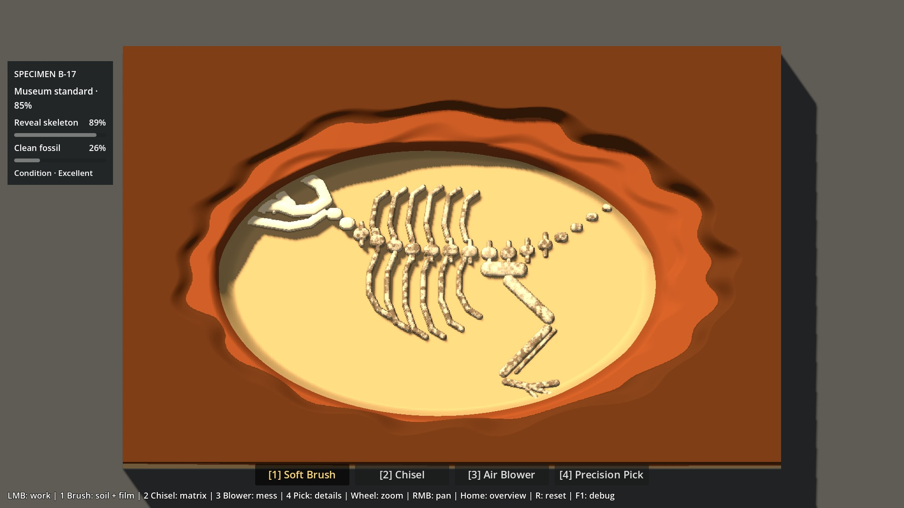
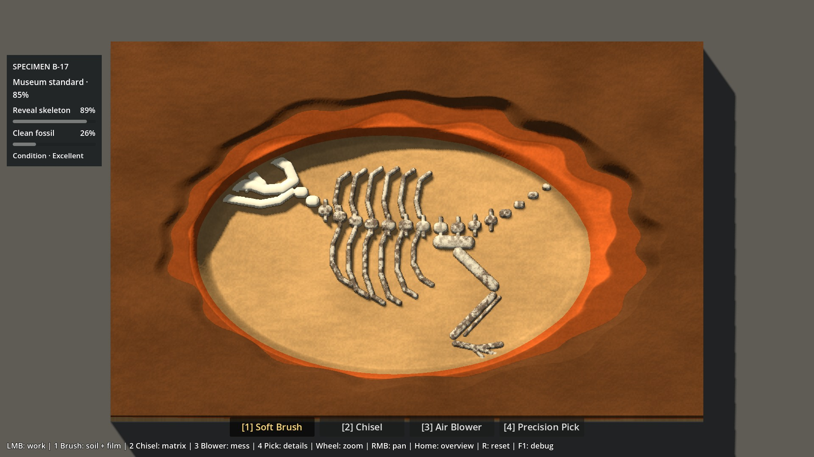
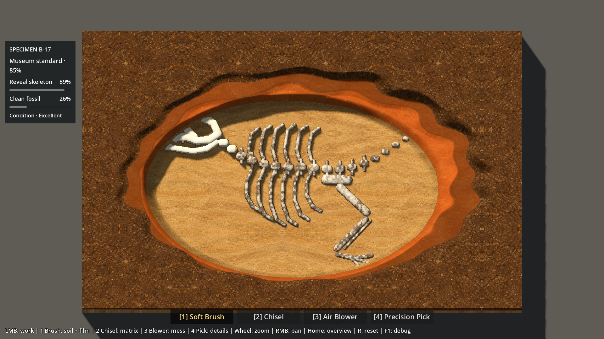

# P6A-1 — Material Lab

> Rapport historique du Material Lab. Les corrections de géométrie sont documentées séparément : [P6A1.6 — affleurements](P6A16_OUTCROPS_REPORT.md). Consulter le [statut canonique](../brain/status.md) pour la revue et la gate courantes.

**2026-10-06 · PR #9 DRAFT · revue Antoine requise.**
Base gameplay : `main@6ae107d9b55718f34f4e18d8317551a5476e41c0`, P5 clos et mergé.

## Résultat et recommandation provisoire

Le vrai B-17 dispose d'un laboratoire jouable séparé, avec quatre rendus, dix
presets et bascule immédiate sur une fouille en cours. **B, textures peintes avec
masques dynamiques, est ma recommandation pour poursuivre l'évaluation.** Il
apporte l'essentiel du gain tactile avec une surface d'édition artistique simple.
C améliore surtout les parois ; son avantage dans la vue presque verticale ne
justifie pas encore d'en faire le pipeline de référence. A reste une solution
économe en assets, mais son grain paraît davantage calculé et ses matériaux plus
uniformes.

Cette appréciation vient de l'inspection des captures et des contrôles techniques,
**pas d'un verdict humain ni d'une validation de fidélité finale**. La scène reste
loin d'un concept fini : silhouette rectangulaire, géométrie osseuse de prototype,
bords encore crénelés à 3×, répétitions du motif peint et éclairage P5 inchangé.
Une texture n'efface pas ces limites. Aucun pipeline n'est canonisé.

**STOP ici.** Éclairage, jackets, Blender/assets statiques, UI finale, hero slice
et P6B ne sont ni commencés ni autorisés par cette livraison.

## Lancer et comparer

- Godot **4.7.2 stable**, Compatibility : ouvrir
  `scenes/p6a_material_lab.tscn`, puis **F6**.
- Autre entrée : `./Launch-Material-Lab.ps1 -GodotBin <Godot.exe>`.
  Le lanceur reconnaît aussi l'installation locale habituelle dans Downloads.
- La scène commence en **P5, B-17 fermé**. F5 continue à lancer la scène P5 normale.
- Choisir P5/A/B/C dans le panneau, ou **F8** pour cycler. Le changement ne recharge
  ni terrain, ni cartes, ni caméra, ni progression. Le geste tenu est annulé pour
  éviter un coup involontaire lors du clic sur le panneau.
- **F9** : état suivant ; **F10** : recharger cet état ; **R** : bloc intact.
  Charger un preset réinitialise la session et la vue : ce sont des fixtures de
  laboratoire explicites, jamais un raccourci du jeu normal.
- **H** masque/réaffiche les commandes de laboratoire. 1–4, molette, RMB, Home et
  le HUD P5 continuent à fonctionner. Les commandes du lab bloquent le picking
  sous leur rectangle, comme les panneaux P5.
- Les options Patina, Stone patina, Bone Film palette et Fine surface normals
  s'appliquent à A/B/C. **P5 reste strictement le shader de référence**.

Revue suggérée : partir du preset09 à 1×, cycler les quatre candidats, passer à
3× et déplacer la vue. Comparer ensuite02 avec/sans patine ;06/07/08 avec/sans
palette du film. Enfin jouer réellement Brush, Chisel, Blower et Pick, en
changeant de candidat **sans recharger** la fouille.

## Implémentation exacte

`p6a_material_lab.tscn` hérite de la scène P5 ; son script hérite du contrôleur de
scène P5. Même `ExcavationBlock`, RF1024×640, géologie, plafonds, squelette,
triangles, skirt, caméra, lumière, picking CPU, ToolController, audio/FX,
fracture, débris et PreparationSession. Aucun fichier de gameplay existant n'est
modifié. La modification locale préexistante de `project.godot` reste hors
livraison ; le runtime conserve240 FPS /60 Hz.

`material_variants.gd` construit trois shaders avec des **insertions bornées et
assertées dans le texte du shader P5**, uniquement dans le laboratoire. La
déformation des sommets, les deltas interpolés d'interface, l'exposition discrète,
la couverture du film et les cracks/dust restent ceux du shader original.
Le shader P5 n'est pas édité. C'est un adaptateur de spike, pas un mécanisme de
production à généraliser : une modification ultérieure des points d'insertion
doit déclencher une révision, pas un remplacement silencieux.

Les mêmes objets ShaderMaterial et ImageTexture restent attachés au bloc. Aucun
rebake, reconstruction de mesh, copie de cartes ou nouveau draw call au changement
de candidat. Les constantes A/B/C permettent au compilateur de supprimer les
branches inutilisées. Les détails de couleur restent attachés aux coordonnées du
bloc ; seule la matière visible change avec les masques de fouille.

| Candidat | Habillage ajouté | Forces | Limites / assets |
|---|---|---|---|
| P5 | Shader original exact | Baseline lisible, coût connu | Aplats, aucun détail peint |
| A | Palette + trois fréquences de bruit déterministe, stries, roughness et micro-bump | Aucun bitmap requis par le shader ; réglage global rapide | Matière plus homogène, contrôle artistique indirect ; le bruit seul n'atteint pas la cible |
| B | Atlas peint, projection UV fixe, contraste/palette calibrés, roughness issue de la luminance, bump dérivé | Meilleur compromis observé : grain distinct, itération par matériau, lecture Bone/Sandstone | Répétitions miroir, étirement sur les murs, texture source encore trop régulière par endroits |
| C | B + variation large échelle + seconde projection sur les parois | Parois moins étirées et moins uniformes | Un échantillon atlas de plus, gain discret à84° ; jacket statique **non testé** pour respecter l'arrêt demandé |

Commun à A/B/C : patine optionnelle, palette du film optionnelle, Bone plus lisse
via une normale centrée sur le **même** heightfield (quatre lectures RF uniquement
sur Bone exposé). Le déplacement, la silhouette et les limites osseuses restent
exacts. Le micro-bump est une perturbation de normale sous le millimètre, jamais
une hauteur de gameplay : Soil0,42 mm, matrice0,18 mm, Bone0,025 mm en amplitude
de calcul. L'option Fine surface normals désactive ce micro-bump ; le lissage des
normales Bone reste commun aux candidats.

### Atlas et coût d'authoring

Un atlas **1254×1254 RGB**, quadrants627×627 (Soil / Clay / Sandstone / Bone),
généré par `imagegen` intégré, puis calibré dans le shader. Il s'agit d'une source
**IA sélectionnée pour le spike**, pas d'une peinture d'artiste validée ni d'un
matériau PBR complet. [Source et provenance](../../assets/p6a/README.md),
[prompt exact](../../assets/p6a/generation-prompt.txt).

Import lossless avec mipmaps, pas de redimensionnement : 3,10 MB PNG ;
budget conservateur de 8 MiB GPU en RGBA8+mipmaps (6 MiB en RGB8 ; allocation
isolée non mesurée). Le lab précharge l'atlas même dans P5/A pour des
bascules immédiates ; les mesures mémoire du lab ne sont donc pas une différence
d'allocation isolée entre pipelines. A n'a pas besoin de cet atlas en dehors du lab.

Une lecture d'atlas pour B, deux pour C, coordonnées miroir dans chaque quadrant
avec marge1,5 % évitant le mélange des matériaux. Échelle de base :une tuile par
25 cm. Pas de normal map ni de roughness map peinte : la roughness et le relief
fin dérivent de la luminance, compromis explicitement limité à cette preuve.
La production devra comparer de vraies tuiles répétables et des cartes dédiées.

Observation d'itération : une génération d'atlas a suffi pour la comparaison ;
les ajustements suivants portent sur la palette, le contraste et les normales
dans le shader. A demande surtout du temps de shader artist ; B demande quatre
surfaces cohérentes et calibrées ; C ajoute projection et contrôle des raccords.
**Estimations de planification, non chronométrées** : B,1–2 jours pour une première
famille de quatre matériaux artistiquement revue, puis0,5–1 jour par variante de
famille ; A,0,5–1 jour d'itération shader sans garantie de résultat peint ; C,
0,5–1 jour supplémentaire de raccords/variation au-delà de B. Ces fourchettes
excluent les assets statiques et demandent validation avec le futur auteur.

## États contrôlés

| Preset | Contenu et préparation |
|---|---|
| 00 Intact | B-17 fermé, RF=1, aucun Bone exposé |
| 01 Worked Soil | Creux superficiel dans Soil, aucune poussière Soil persistante ajoutée |
| 02 Soil→Clay | Plateau au contact exact, petit creux frais de6,12 mm au centre |
| 03 Fresh Clay | Même type de plateau avec11,73 mm de coupe fraîche |
| 04 Sandstone | Sol sous interface Clay/Sandstone, parois Clay, bord Soil |
| 05 Fracture/cavity | Cavité étagée et12 vrais impacts Chisel ; stress,37 miettes initiales et film produits par les systèmes P4 |
| 06 Dirty Bone |28 809 cellules Bone exposées ; film initial0,85 |
| 07 Partly cleaned | Géométrie06 identique ; vrais appels Brush sur crâne et bande centrale,26,33 % Clean |
| 08 Clean Bone | Géométrie06 identique ; nettoyage par API Brush,100 % Clean |
| 09 Material study | Même cavité et nettoyage07, pensée pour comparer simultanément les matériaux et trois états du film |

Les fixtures sculptent le RF réel selon des limites déterministes, plafonnent
chaque cellule sur le Bone canonique et émettent les signaux de première exposition
normaux. Elles ne changent ni la géologie ni les outils. Le joueur peut continuer
chaque état. Les presets ne prétendent pas enregistrer un parcours humain complet.

## Patine et Bone Film

**Soil→Clay :** distance cosmétique sous l'interface calculée à partir du delta
hauteur/interface interpolé sur les triangles P5. Brunissement fort au contact,
fondu de0,20 à2,4 mm vers Clay orange plus frais, modulation douce. Aucun nouveau
volume, matériau gameplay, arrêt d'outil, résistance ou déplacement.

**Clay→Sandstone :** variante désactivée par défaut, plus faible, fondu0,15–1,4 mm.
Elle reste facultative : ne pas déduire de cette option qu'elle est canonisée.

**Film :** couverture originale exacte : même RGBA8 au quart, mêmes bits, bruit,
fréquences, seuils et coefficient d'opacité. Nouvelle teinte brun sombre
`(0.19,0.135,0.105)` et roughness cible0,96 au lieu de0,92 ; palette précédente
disponible par bouton. La couleur/roughness de l'os propre change avec le candidat,
pas la forme du film. Brush enlève le film ; Blower le laisse. Aucun resalissage,
dépôt ni changement de ratios. La palette sépare mieux l'os sale du grès doré
dans les captures ; sa préférence esthétique demande encore le regard d'Antoine.

## Vérification et mesures

Les protocoles sont versionnés dans `tests/run_p6a_lab.gd` et `tests/check_p6a.ps1`.
Les captures sont des lectures du framebuffer Godot, pas des concept arts.

Reproduction :

```powershell
./tests/check_p6a.ps1 -GodotBin <Godot-console.exe> -Regression -Graphical -Benchmark
```

Le banc conserve1080p,240 FPS,60 Hz, la lumière P5 et le même pipeline Compatibility.
Sept charges à1×/3× pour chaque candidat : bloc intact au repos, cavité/Bone au
repos, Brush Soil, Brush Film, Chisel Clay, Pick et Blower sur les vrais débris.
Préparation, chargement/compilation et captures sont hors mesure ;180 ticks de
60 Hz par cas après stabilisation de la caméra et échauffement du shader.

GPU et CPU render proviennent des timers viewport Godot. Le CPU render **exclut
scripts et gameplay** ; les temps d'édition et de picking sont consignés séparément.
Voir les [définitions des timers Godot](https://docs.godotengine.org/en/stable/classes/class_renderingserver.html#class-renderingserver-method-viewport-get-measured-render-time-gpu).
Une valeur GPU nulle serait « indisponible », jamais « gratuit ». Le cap peut
modifier la fréquence GPU ; ces chiffres décrivent cette machine et ce protocole,
pas un budget garanti sur iGPU ou Steam Deck. Aucun choix de renderer différent
n'a été testé.

### Résultats GPU / CPU

Machine : **RTX5080, Ryzen7 9800X3D, pilote OpenGL610.88**.56 scénarios retenus,
224 vérifications finales sans échec. Scène de cavité/Bone au repos :

| Rendu | GPU moyen1× | GPU moyen3× | CPU render moyen1× | CPU render moyen3× | Surcoût GPU moyen / max face à P5,14 cas appariés |
|---|---:|---:|---:|---:|---:|
| P5 |0,981 ms |0,530 ms |0,293 ms |0,298 ms |— |
| A |1,032 ms |0,604 ms |0,291 ms |0,295 ms |+0,044 / +0,075 ms |
| B |1,117 ms |0,598 ms |0,295 ms |0,289 ms |+0,093 / +0,139 ms |
| C |1,142 ms |0,612 ms |0,290 ms |0,294 ms |+0,107 / +0,161 ms |

Toutes charges confondues : P95 de frame maximal **8,357 ms**, pire frame retenue
**11,343 ms** ; intervalles moyens autour de4,16 ms, cohérents avec le cap240.
Aucune régression de fluidité matérielle détectée sur cette machine. L'écart
B/C est très petit ; la préférence B vient surtout de la simplicité et du coût
artistique, pas d'une nécessité GPU démontrée.

CPU d'édition moyen maximal par charge : P5 **3,656 ms**, A3,670, B3,599, C3,613 ;
pire édition isolée6,295 ms. Picking moyen maximal0,112 ms, pic0,348 ms. Ces coûts
du gameplay partagé dominent les actions Brush ; aucun retuning réalisé.
Au repos étudié : **43 draw calls** dans les quatre cas ; compteur vidéo global
**101 330 457 octets** identique, car ressources du lab préchargées. Le chargement
d'un preset sculpte650k cellules et peut faire une pause ; il est hors mesure et
hors jeu normal. La bascule de matériau ne refait pas cette préparation.

Validité des charges : états initiaux, cartes finales, compteurs P5 et pose caméra
égaux à la référence pour les56 cas retenus. Brush Film augmente Clean d'environ
6,09 points sans toucher au heightfield ; Blower passe de37 à0 miettes sans
nettoyer le film ; Chisel et Pick modifient réellement la structure.

**Traçabilité du rejeu :** le passage complet avec pose partagée avait un seul
écart final, Brush Soil3×/C (interruption possible du geste par une notification
native de focus/souris). Le banc protège désormais son geste scripté pendant
l'attente de frame, comme son réglage explicite de focus ; le jeu normal n'est
pas changé. Les8 cas Brush Soil ont été rejoués :32 contrôles sans échec, mêmes
cartes finales que P5. Les48 autres cas sont conservés sans modification.
[Passage complet avec l'écart](evidence/p6a/benchmark-full.json),
[rejeu ciblé](evidence/p6a/benchmark-brush_soil.json),
[réconciliation vérifiée](evidence/p6a/benchmark.json).
`tests/summarize_p6a.py` conserve les deux sources et vérifie les56 cas, sans
modifier une mesure. Reproduction ciblée :

```powershell
Godot --path . --script res://tests/run_p6a_lab.gd -- benchmark brush_soil
python tests/summarize_p6a.py
```

### Contrôles fonctionnels et visuels

- **2 243 contrôles** comptés dans les sorties des suites fonctionnelles P0–P5,
  zéro échec, plus les probes de coût/protection et imports du lanceur existant.
  Ce total inclut les répétitions déterministes prévues par ces suites.
- **220 contrôles du lab**, zéro échec : dix presets, quatre candidats, empreintes
  height/strata/Bone/film/dust/fracture, état P5, caméra/picking, textures partagées,
  replay réel des quatre outils, reload, reset et blocage des clics sous le panneau.
- **172 contrôles graphiques**, zéro échec ;89 PNG produits (80 comparaisons
  preset/candidat/zoom,4 diagnostics de masques,4 avant/après,1 panneau).
- Lecture GPU à3× : les canaux « couche / Bone exposé / couverture Film » sont
  **identiques pixel par pixel** entre P5/A/B/C sur la région mesurée1100×680.
  Le premier essai s'était arrêté avant la fin du zoom ; le test final attend
  réellement la stabilisation. Il n'y a eu aucune correction du motif Film.

Preuves : [tests du lab](evidence/p6a/tests.json),
[contrôles graphiques](evidence/p6a/visual.json),
[régression existante](evidence/p6a/regression.txt),
[mesures brutes](evidence/p6a/benchmark.json).

### Captures pour la revue

Même preset09, même caméra1×, même éclairage et mêmes masques :

| Référence P5 | A procédural |
|---|---|
|  |  |
| **B textures peintes** | **C hybride matériaux** |
|  |  |

- [Commandes du lab](evidence/p6a/lab-controls.jpg).
- Patine : [sans](evidence/p6a/toggle-02-before.jpg) / [avec](evidence/p6a/toggle-02-after.jpg).
- Palette Film : [ancienne](evidence/p6a/toggle-06-before.jpg) / [candidate](evidence/p6a/toggle-06-after.jpg).
- Bone B à3× : [sale](evidence/p6a/state06-B-3x.jpg),
  [partiellement nettoyé](evidence/p6a/state07-B-3x.jpg), [propre](evidence/p6a/state08-B-3x.jpg).
- Les dix états B à1× sont aussi dans `evidence/p6a/state00-B-1x.jpg` à
  `state09-B-1x.jpg`.22 JPEG de revue conservés ; tous les PNG originaux restent
  localement dans `work/test-logs/p6a/` et sont reproductibles avec le banc.

La validation attendue porte sur l'approche de matériau et sa lisibilité en jeu.
Si B paraît trop texturé, si la patine masque l'identité Clay, ou si le film semble
encore ambigu, ce sont des points de retour pour le lab — aucune autorisation
implicite d'ouvrir les tâches suivantes.
