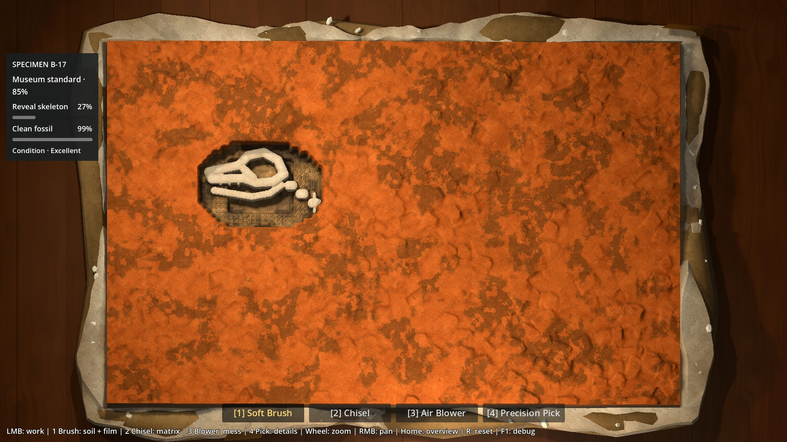

# P6A2 — captures de correction v02

25 captures du vrai rendu Godot, réencodées JPEG qualité 93 sans retouche.
Résultat proposé à la revue humaine ; [rapport et limites](../../P6A2_TARGETED_CORRECTION_REPORT.md).
Sources sélectionnées reçues dans `5a3d340` ; références canoniques inchangées.

## Avant / après et cible

| Hero rejeté a9d47b6 (historique) | Correction v02, même état de préparation |
|---|---|
|  |  |

| Cible 01 | Bloc sous lampe locale (vue documentaire) |
|---|---|
|  |  |

| Cible 02 | Nouveau Bone, Brush seul sur le Film |
|---|---|
|  |  |

Ne pas confondre la comparaison visuelle et une reproduction littérale des
volumes/anatomies des concepts. La frontière intérieure rectangulaire et les
bords du heightfield restent des limites visibles de la proposition.

## États à 1× et 3×

| État | Témoin B 1× | Hero 1× | Hero 3× |
|---|---|---|---|
| Reset | [B](baseline-reset.jpg) | [Hero](hero-reset.jpg) | [Détail](hero-reset-3x.jpg) |
| Brush partiel | [B](baseline-part-brushed.jpg) | [Hero](hero-part-brushed.jpg) | [Détail](hero-part-brushed-3x.jpg) |
| Matrice excavée | [B](baseline-excavated.jpg) | [Hero](hero-excavated.jpg) | [Détail](hero-excavated-3x.jpg) |
| Bone sale | [B](baseline-dirty-bone.jpg) | [Hero](hero-dirty-bone.jpg) | [Détail](hero-dirty-bone-3x.jpg) |
| Préparation avancée | [B](baseline-cleaner-bone.jpg) | [Hero](hero-cleaner-bone.jpg) | [Détail](hero-cleaner-bone-3x.jpg) |

## Matières et contact

- [Clay 3×](clay-source-3x.jpg).
- [Sandstone 3×, Chisel natif](sandstone-source-3x.jpg) ;
  [ancien témoin 4, coupe diagnostique](hero-stone-interface-3x.jpg).
- [Bone sale](bone-film-dirty-3x.jpg) / [Bone nettoyé](bone-film-clean-3x.jpg) :
  même géométrie, seulement Brush sur le Film, contrôle byte à byte.
- [Contact jacket/matrice 3×](hero-jacket-integration-3x.jpg).

## Éclairage contrôlé

- À 1× : [lampe locale](full-block-task-light.jpg) /
  [témoin directionnel](full-block-directional-debug.jpg).
- Bloc entier : [lampe locale](full-block-overview-task.jpg) /
  [même pose, directionnel](full-block-overview-directional.jpg).

Bloc entier = taille caméra 1.05 dans le harness documentaire. Cela ne change
pas le 1× jouable 0.85, ni les limites/mécaniques de zoom/pan. Aucun changement
de caméra entre les deux images d’une paire.

## Mesures et reproduction

[Tests](tests.json), [contrôles visuels](visual.json), [benchmark](benchmark.json).
Godot 4.7.2, RTX 5080, Compatibility, viewport 1920×1080.

```powershell
# Remplacer $GodotBin par le chemin Godot 4.7.2 du preflight.
& $GodotBin --headless --path . --script tests/run_p6a2_hero.gd -- tests
& $GodotBin --path . --script tests/run_p6a2_hero.gd -- visual
& $GodotBin --path . --script tests/run_p6a2_hero.gd -- benchmark
& $GodotBin --headless --path . --script tests/export_p6a2_hero_evidence.gd -- --correction
```
